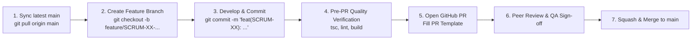

# AbangCebuAI Git Branching & Collaboration Guidelines

## 1. Branch Naming Standards
All team members must branch off an up-to-date `main` branch. Every branch must be prefixed with the change type and reference its corresponding Jira ticket key (`SCRUM-<id>`):

| Branch Type | Prefix & Format | Example |
| :--- | :--- | :--- |
| **New Feature** | `feature/SCRUM-<id>-<short-description>` | `feature/SCRUM-54-users-profiles-schema` |
| **Bug Fix** | `fix/SCRUM-<id>-<short-description>` | `fix/SCRUM-88-map-marker-offset` |
| **Documentation** | `docs/SCRUM-<id>-<short-description>` | `docs/SCRUM-49-git-collaboration-guide` |
| **Chores / Tooling** | `chore/SCRUM-<id>-<short-description>` | `chore/SCRUM-51-env-secrets-config` |
| **Hotfix (Prod)** | `hotfix/SCRUM-<id>-<short-description>` | `hotfix/SCRUM-99-session-token-expiry` |

> [!TIP]
> Naming your branch with the Jira key (e.g., `feature/SCRUM-54-...`) ensures that **every commit pushed to that branch automatically links to the Jira ticket in real-time**!

---

## 2. Commit Message Standards (Conventional Commits)
Write concise, descriptive commit messages adhering to the Conventional Commits specification, tagged with your Jira ticket:

### Format:
```text
<type>(<ticket-id>): <short imperative description>
```

### Examples:
```bash
# Feature commit
git commit -m "feat(SCRUM-54): define profiles table schema and migration"

# Bug fix commit
git commit -m "fix(SCRUM-88): resolve WebGL canvas resize on mobile viewports"

# Documentation commit
git commit -m "docs(SCRUM-49): establish PR template and peer review guidelines"

# Chore commit
git commit -m "chore(SCRUM-51): configure gitignore for local supabase env files"
```

---

## 3. Developer Workflow Lifecycle



### Step 1: Start from Clean `main`
```bash
git checkout main
git pull origin main
```

### Step 2: Create Your Feature Branch
```bash
git checkout -b feature/SCRUM-54-users-profiles-schema
```

### Step 3: Run Local Validation Before Creating a PR
Never open a Pull Request with failing TypeScript or lint errors. Always run:
```bash
pnpm tsc --noEmit   # Must pass with 0 errors
pnpm lint           # Must pass with 0 errors/warnings
pnpm build          # Must pass clean production build
```

### Step 4: Push Branch to GitHub
```bash
git push -u origin feature/SCRUM-54-users-profiles-schema
```

---

## 4. Cross-Functional Peer Review Guidelines

To maintain production stability across our frontend, Supabase database, and QA tracks:

### Mandatory PR Requirements:
1. **GitHub PR Template**: Every PR must fill out the `.github/pull_request_template.md` checklist.
2. **Reviewer Assignment**:
   * **Database / Backend changes** (Supabase, RLS, migrations): Must be reviewed by the Database Lead (Dency / Michelle) or Team Lead (Hermar).
   * **UI / Component changes** (Tailwind, MapLibre, React): Must be reviewed by the Frontend Lead (Angel / Neah) or Team Lead.
   * **QA Review**: QA team members (Ryza, Karla, Anne, Jenny) should verify against sprint test scenarios before final sign-off.
3. **No Secret Leaks**: Verify that no `.env.local` files, service role keys, or database passwords are ever included in the PR diff.

### Merge Policy:
- **Strategy**: **Squash and Merge** is used on all PRs to keep the `main` branch git history clean, readable, and linear.
- **Branch Deletion**: Delete your remote feature branch after merging to keep the repository tidy.
