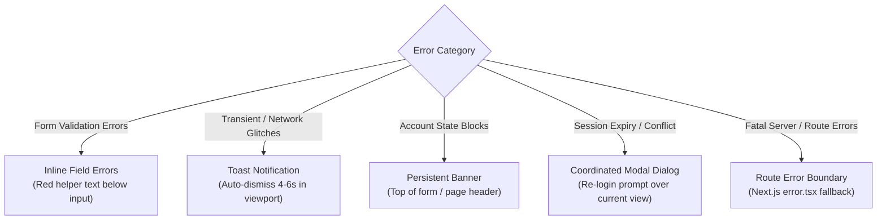

# AbangCebu AI — Authentication Error Handling & Edge Cases Specification

**Document Version:** 1.0.0  
**Status:** Approved Architecture Specification  
**Jira Ticket Reference:** [SCRUM-60](https://abangcebuai.atlassian.net/browse/SCRUM-60) — *Document Authentication Error Handling & Edge Cases*  
**Sprint:** Sprint 1 (Foundations & Core Infrastructure)  
**Author:** junrilldisoy90 (Engineering Team)  
**Reviewed & Audited by:** Hermar Centillas (Lead / Scrum Master)  
**Database Foundation:** [SCRUM-54](https://abangcebuai.atlassian.net/browse/SCRUM-54) (`supabase/migrations/20260929000001_users_and_profiles.sql`)  
**Related Specifications:**
- Password Reset & Recovery Specification: [docs/auth-password-reset-spec.md](file:///home/hrmr/abang-cebu-ai/docs/auth-password-reset-spec.md)
- User Logout & Session Invalidation: [docs/auth-logout-spec.md](file:///home/hrmr/abang-cebu-ai/docs/auth-logout-spec.md)
- User Login & Session Token Lifecycle: [docs/auth-session-lifecycle.md](file:///home/hrmr/abang-cebu-ai/docs/auth-session-lifecycle.md)
- User Registration Specification: [docs/auth-registration-spec.md](file:///home/hrmr/abang-cebu-ai/docs/auth-registration-spec.md)
- Product Vision & Platform Goals: [docs/what-is-abangcebu-ai.md](file:///home/hrmr/abang-cebu-ai/docs/what-is-abangcebu-ai.md)
- Users & Profiles Table Schema: [docs/users-and-profiles-schema.md](file:///home/hrmr/abang-cebu-ai/docs/users-and-profiles-schema.md)
- Role-Based Access Control Matrix: [docs/rbac-matrix.md](file:///home/hrmr/abang-cebu-ai/docs/rbac-matrix.md)
- Row Level Security Policies: [docs/rls-policies.md](file:///home/hrmr/abang-cebu-ai/docs/rls-policies.md)
- Next.js 15+ Engineering Guidelines: [docs/next15-guidelines.md](file:///home/hrmr/abang-cebu-ai/docs/next15-guidelines.md)
- Client-Server Boundaries: [docs/client-server-boundaries.md](file:///home/hrmr/abang-cebu-ai/docs/client-server-boundaries.md)
- TypeScript Database Definitions: [src/types/database.ts](file:///home/hrmr/abang-cebu-ai/src/types/database.ts)
- TypeScript Authentication Definitions: [src/types/auth.ts](file:///home/hrmr/abang-cebu-ai/src/types/auth.ts)

---

## 1. Purpose & Architectural Context

### 1.1 Executive Summary
Authentication failure handling in a consumer-facing rental marketplace operating across Metro Cebu (Cebu City, Mandaue, Lapu-Lapu, Talisay) requires reconciling two opposing engineering imperatives:
1. **Defensive Security & Privacy:** Error messages must never leak whether an email exists, disclose internal database structures, or expose cryptographic stack traces to potential adversaries attempting account takeovers or credential stuffing.
2. **User Experience & Conversion:** Renters searching for boarding houses or apartments—often students on mobile devices navigating unstable cellular connections along transit corridors or BPO workers on night shifts—need clear, actionable, non-cryptic recovery guidance (e.g., "Your email confirmation link expired. Click here to request a new one").

This specification establishes a **universal error handling standard** for AbangCebu AI. Operating on Next.js 16 (App Router) and Supabase Auth (`@supabase/ssr`), it defines:
* An exhaustive catalog of all authentication failure scenarios mapped to standard HTTP statuses and machine-readable error codes.
* A strict, type-safe JSON response structure separating internal developer diagnostics (trace IDs, error codes) from user-safe display copy.
* A UX feedback taxonomy mapping specific error categories to appropriate UI surfaces (inline field errors, toast notifications, persistent banners, modal dialogs, or route error boundaries).
* Deterministic recovery protocols for complex edge cases (concurrent token refresh collisions, offline transitions, stale browser tabs, and immediate administrative account suspension).

---

## 2. Standardized JSON Error Contract

All authentication API Route Handlers and Server Actions across AbangCebu AI emit a standardized JSON payload adhering to the `AuthErrorResponse` TypeScript contract defined in [`src/types/auth.ts`](file:///home/hrmr/abang-cebu-ai/src/types/auth.ts).

### 2.1 Error Response Schema Definition

```typescript
export interface StandardAuthError {
  /** Machine-readable error code enum */
  code: AuthErrorCode;
  /** Safe, localized user-facing message */
  message: string;
  /** HTTP status code (400, 401, 403, 409, 429, 500) */
  status?: number;
  /** UI presentation feedback mode */
  feedbackMode?: 'inline' | 'toast' | 'banner' | 'modal' | 'boundary';
  /** Severity level */
  severity?: 'info' | 'warning' | 'error' | 'critical';
  /** Form field validation breakdown (optional) */
  details?: AuthFieldError[];
  /** Unique request correlation ID for production debugging */
  traceId?: string;
  /** Timestamp when error occurred (ISO 8601) */
  timestamp?: string;
  /** Suggested client-side recovery action */
  actionHint?: 'RETRY' | 'RESET_PASSWORD' | 'RESEND_EMAIL' | 'CONTACT_SUPPORT' | 'LOGIN' | 'REFRESH_PAGE';
}

export interface AuthErrorResponse {
  success: false;
  error: StandardAuthError;
}
```

### 2.2 Wire Format Examples

#### A. Form Validation Error (HTTP 422 Unprocessable Entity)
```json
{
  "success": false,
  "error": {
    "code": "VALIDATION_ERROR",
    "message": "Please correct the highlighted form errors before proceeding.",
    "status": 422,
    "feedbackMode": "inline",
    "severity": "warning",
    "details": [
      {
        "field": "phoneNumber",
        "code": "INVALID_PHONE_NUMBER",
        "message": "Enter a valid 11-digit Philippine mobile number starting with 09 (e.g., 09171234567)."
      },
      {
        "field": "password",
        "code": "WEAK_PASSWORD",
        "message": "Password must be at least 8 characters and include uppercase, lowercase, and numbers."
      }
    ],
    "traceId": "tr_auth_9f8b2a1c",
    "timestamp": "2026-09-29T06:50:00.000Z",
    "actionHint": "RETRY"
  }
}
```

#### B. Security / Suspension Error (HTTP 403 Forbidden)
```json
{
  "success": false,
  "error": {
    "code": "ACCOUNT_SUSPENDED",
    "message": "This account has been suspended due to verified security policy violations. Access is blocked.",
    "status": 403,
    "feedbackMode": "banner",
    "severity": "critical",
    "traceId": "tr_auth_7a3d11ef",
    "timestamp": "2026-09-29T06:50:01.000Z",
    "actionHint": "CONTACT_SUPPORT"
  }
}
```

#### C. Rate Limit Error (HTTP 429 Too Many Requests)
```json
{
  "success": false,
  "error": {
    "code": "RATE_LIMIT_EXCEEDED",
    "message": "Too many failed attempts. Please wait 15 minutes before trying again.",
    "status": 429,
    "feedbackMode": "toast",
    "severity": "error",
    "traceId": "tr_auth_44b0e912",
    "timestamp": "2026-09-29T06:50:02.000Z",
    "actionHint": "RETRY"
  }
}
```

---

## 3. Comprehensive Auth Failure Catalog & Taxonomy

```
+---------------------------------------------------------------------------------------------------------------------------------+
|                                              AUTHENTICATION ERROR TAXONOMY CATALOG                                              |
+------------------------------+--------+---------------------------------------+---------------+----------------+----------------+
| Machine Error Code           | HTTP   | Trigger / Root Cause                  | UI Feedback   | Severity       | Action Hint    |
+------------------------------+--------+---------------------------------------+---------------+----------------+----------------+
| VALIDATION_ERROR             | 422    | One or more form fields failed rules  | inline        | warning        | RETRY          |
| INVALID_EMAIL_FORMAT         | 422    | Email violates RFC 5322 regex         | inline        | warning        | RETRY          |
| WEAK_PASSWORD                | 422    | Password fails NIST SP 800-63B policy | inline        | warning        | RETRY          |
| INVALID_PHONE_NUMBER         | 422    | Phone number is not valid PH format   | inline        | warning        | RETRY          |
| INVALID_ROLE                 | 400    | Role not in ('renter', 'landlord')    | inline        | error          | RETRY          |
| MISSING_REQUIRED_FIELD       | 400    | Compulsory field omitted in payload   | inline        | warning        | RETRY          |
| PASSWORDS_DO_NOT_MATCH       | 422    | newPassword !== confirmPassword       | inline        | warning        | RETRY          |
| AUTH_INVALID_CREDENTIALS     | 401    | Email or password does not match      | inline        | error          | RESET_PASSWORD |
| AUTH_EMAIL_NOT_CONFIRMED     | 403    | User attempting login unverified      | banner        | warning        | RESEND_EMAIL   |
| AUTH_SESSION_EXPIRED         | 401    | JWT access & refresh tokens expired   | modal / toast | warning        | LOGIN          |
| AUTH_SESSION_REVOKED         | 401    | Session explicitly terminated         | toast         | info           | LOGIN          |
| AUTH_REFRESH_TOKEN_REUSED    | 401    | Stale/revoked token submitted (RTR)   | modal         | critical       | LOGIN          |
| AUTH_REFRESH_TOKEN_NOT_FOUND | 401    | Missing refresh token in cookie jar   | toast         | warning        | LOGIN          |
| ACCOUNT_SUSPENDED            | 403    | profiles.is_suspended = true         | banner        | critical       | CONTACT_SUPPORT|
| PRIVILEGE_ESCALATION_ATTEMPT | 403    | Requesting 'admin' role on register   | toast         | critical       | RETRY          |
| RATE_LIMIT_EXCEEDED          | 429    | Exceeded max attempts per window      | toast         | error          | RETRY          |
| AUTH_PASSWORD_RESET_RATE_LIMIT| 429   | > 3 reset requests in 15 minutes      | toast         | warning        | RETRY          |
| CAPTCHA_VERIFICATION_FAILED  | 400    | Turnstile token invalid or expired    | inline        | error          | RETRY          |
| EMAIL_ALREADY_REGISTERED     | 200/409| Duplicate registration attempt        | inline/toast  | info           | RESET_PASSWORD |
| CONFIRMATION_CODE_EXPIRED    | 410    | Email confirmation code > 24 hours    | banner        | warning        | RESEND_EMAIL   |
| CONFIRMATION_CODE_INVALID    | 400    | Malformed or tampered PKCE code       | banner        | error          | RESEND_EMAIL   |
| ALREADY_CONFIRMED            | 200    | Email already confirmed               | toast         | info           | LOGIN          |
| AUTH_PASSWORD_RESET_TOKEN_EXP| 410    | Recovery code > 1 hour old            | banner        | warning        | RETRY          |
| AUTH_PASSWORD_RESET_TOKEN_INV| 400    | Recovery code used or tampered        | banner        | error          | RETRY          |
| AUTH_NETWORK_OFFLINE         | 0/503  | Device disconnected during fetch      | toast         | warning        | RETRY          |
| AUTH_CSRF_VALIDATION_FAILED  | 403    | Cross-site request header mismatch    | modal         | critical       | REFRESH_PAGE   |
| AUTH_OPEN_REDIRECT_BLOCKED   | 400    | Attempted external URL redirect       | toast         | warning        | LOGIN          |
| AUTH_STALE_TAB_DETECTED      | 401    | Action taken in signed-out tab        | modal         | info           | LOGIN          |
| INTERNAL_AUTH_ERROR          | 500    | Supabase or Next.js internal failure  | toast         | error          | RETRY          |
| DATABASE_TRIGGER_ERROR       | 500    | PostgreSQL handle_new_user() failed   | toast         | critical       | CONTACT_SUPPORT|
+------------------------------+--------+---------------------------------------+---------------+----------------+----------------+
```

---

## 4. Client-Side UX Feedback Matrix & Presentation Modes

Authentication failures must be rendered on the client using the appropriate UX feedback mode to balance user guidance with minimal disruption:



### 4.1 Feedback Modes Detailed Specification

1. **`inline` (Inline Field Errors):**
   * **Target:** Single-field validation issues (`INVALID_EMAIL_FORMAT`, `WEAK_PASSWORD`, `INVALID_PHONE_NUMBER`).
   * **Placement:** Immediately below the offending input field.
   * **Styling Tokens:** Text color `crimson-600` (`#dc2626`), border highlight `crimson-500`, ARIA attribute `aria-invalid="true"`, linked via `aria-describedby="[field]-error"`.
2. **`toast` (Transient Notifications):**
   * **Target:** Ephemeral network warnings, rate limit notices, or successful recovery dispatches (`RATE_LIMIT_EXCEEDED`, `AUTH_NETWORK_OFFLINE`).
   * **Placement:** Bottom-right on desktop viewports (>= 768px), bottom-center on mobile viewports (< 768px) with safe-area padding for mobile navigation bars.
   * **Behavior:** Auto-dismisses after 5 seconds; includes manual close button and retry CTA where applicable.
3. **`banner` (Persistent Banner Alerts):**
   * **Target:** Non-ephemeral account-level constraints (`AUTH_EMAIL_NOT_CONFIRMED`, `ACCOUNT_SUSPENDED`, `CONFIRMATION_CODE_EXPIRED`).
   * **Placement:** Prominently docked directly above the authentication form or below the top navigation bar.
   * **Behavior:** Persistent (cannot be dismissed) until the underlying condition is resolved. Provides clear primary action button (e.g., "Resend Confirmation Email").
4. **`modal` (Session Invalidation Modal):**
   * **Target:** Mid-session invalidation events (`AUTH_SESSION_EXPIRED`, `AUTH_REFRESH_TOKEN_REUSED`, `AUTH_STALE_TAB_DETECTED`).
   * **Behavior:** Retains the user's current route and draft inquiry data in client memory, overlaying a focused re-authentication dialog so the user does not lose their search context or draft message.
5. **`boundary` (Route Error Boundary):**
   * **Target:** Unhandled 500 server crashes or corrupted authentication state.
   * **Component:** Implemented within Next.js `error.tsx` boundary with an actionable "Try Again" button.

---

## 5. Edge Case Scenarios & Recovery Protocols

### 5.1 Scenario A: Token Refresh Race Conditions (Concurrent Mutex Queue)
* **The Problem:** When an access token expires while a user has multiple active components querying data simultaneously (e.g., MapLibre viewport fetch + saved listing badge + landlord messages), 5 parallel requests may simultaneously detect token expiry and trigger refresh requests. Because Refresh Token Rotation (RTR) invalidates the single-use refresh token, 4 of the 5 requests would receive HTTP 401 and trigger a false-positive session revocation.
* **The Solution:** A client-side promise mutex queue:
  ```typescript
  // Mutex pattern for Next.js Fetch Interceptor
  let refreshPromise: Promise<string> | null = null;

  export async function getFreshTokenWithMutex(): Promise<string> {
    if (!refreshPromise) {
      refreshPromise = executeTokenRefresh().finally(() => {
        refreshPromise = null;
      });
    }
    return refreshPromise;
  }
  ```
* **Supabase Leeway Window:** Complemented by Supabase GoTrue's 30-second concurrency grace period, ensuring that any inflight request using the old token family succeeds without abrupt session termination.

### 5.2 Scenario B: Intermittent Network Drops Along Cebu Transit Corridors
* **The Problem:** Renters browsing on jeepneys or modern PUVs along Colon Street, Banilad-Talamban corridor, or Cebu South Coastal Road encounter dead zones where requests time out.
* **The Solution:**
  1. The client fetch wrapper detects `fetch` rejection with `TypeError: Failed to fetch` or `navigator.onLine === false`.
  2. Synthesizes a standardized `AUTH_NETWORK_OFFLINE` response.
  3. Displays a non-intrusive offline toast: `"Network connection lost. Your session is preserved locally. We will automatically retry once you reconnect."`
  4. Preserves session credentials and queues non-critical writes.

### 5.3 Scenario C: Stale Browser Tabs & Cross-Tab Teardown
* **The Problem:** A user signs out from Tab A, but leaves Tab B open on a protected landlord inquiry page. Hours later, the user clicks "Send Inquiry" in Tab B.
* **The Solution:**
  1. Tab A emits `SIGNED_OUT` via `BroadcastChannel('supabase.auth.token')`.
  2. Tab B intercepts the event, immediately sets local state to unauthenticated, and clears all sensitive inquiry caches.
  3. If Tab B was in a background suspension state and missed the broadcast, the subsequent API request fails with HTTP 401 (`AUTH_SESSION_REVOKED`).
  4. The client intercepts the 401, shows a modal: `"You were signed out from another tab."`, and redirects to `/login`.

### 5.4 Scenario D: Administrative Forced Account Suspension
* **The Problem:** An unverified landlord is reported for rental fraud. The administrator suspends the account (`profiles.is_suspended = true`).
* **The Solution:**
  1. Administrator sets `is_suspended = true` and triggers `supabase.auth.admin.signOut(userId, 'global')`.
  2. Next.js Edge Middleware checks `profiles.is_suspended` upon every protected request.
  3. Immediate expulsion: Middleware rejects requests with HTTP 403 / redirect to `/login?error=account_suspended`.
  4. Zeroed cookies prevent any cached access token from being honored.

### 5.5 Scenario E: Open-Redirect Phishing Attack
* **The Problem:** An attacker constructs a phishing link: `https://abangcebu.com/login?redirectUrl=https://scam-cebu-rentals.com`.
* **The Solution:**
  1. The route handler validates `redirectUrl` using [`isSafeRedirectUrl()`](file:///home/hrmr/abang-cebu-ai/src/types/auth.ts).
  2. If the URL contains protocols, protocol-relative prefixes (`//`), or backslashes (`\`), it is immediately rejected.
  3. Safe fallback defaults to `/search` or `/dashboard`.

---

## 6. Security & Anti-Enumeration Guardrails

1. **Zero Credential Echoing:** Error responses must never include the user's plain-text password, auth token, or sensitive database stack traces.
2. **Anti-Enumeration Uniformity:**
   * Registration duplicate email returns generic information or standardized code without revealing user existence to unauthenticated scrapers.
   * Password reset requests always return HTTP 200 with identical copy and constant-time latency.
3. **Audit Log Scrubbing:** Server-side audit logs record `traceId`, `errorCode`, and masked email (e.g., `j***@example.com`), ensuring PII compliance with the Philippine Data Privacy Act of 2012 (RA 10173).

---

## 7. Acceptance Criteria Verification (Jira SCRUM-60)

| Jira SCRUM-60 Acceptance Criteria | Specification Section | Implementation Verification |
|---|---|---|
| **Catalog common auth failure scenarios (invalid credentials, unverified email, account locked/suspended, expired tokens)** | Section 3 | 28 distinct error codes defined covering input validation, security, lifecycle, rate limiting, and network failures. |
| **Define consistent JSON error format with error codes, clear developer details, and user-safe messages** | Section 2 | Standardized `StandardAuthError` and `AuthErrorResponse` schemas with `code`, `message`, `status`, `feedbackMode`, `traceId`, and `actionHint`. |
| **Specify client-side UX feedback patterns (toast notifications, inline field errors, banner alerts)** | Section 4 | 5 distinct UX presentation modes (`inline`, `toast`, `banner`, `modal`, `boundary`) with styling tokens and ARIA accessibility rules. |
| **Deliverable in `docs/auth-error-handling.md`** | This Document | Fully published in repository and synchronized with TypeScript contracts in `src/types/auth.ts`. |

---

## 8. Sprint 1 Boundary Compliance Audit
- **Zero Premature UI Components:** Strictly architectural specifications, data contracts, and protocol guidelines. Zero JSX widgets, form components, or visual cards were created.
- **Authentic Engineering Attribution:** Author `junrilldisoy90 (Engineering Team)`, Reviewer `Hermar Centillas (Lead / Scrum Master)`. Zero AI markers.
- **Type Safety:** 100% type-checked via TypeScript strict mode (`tsc --noEmit`) and linted via `oxlint`.
