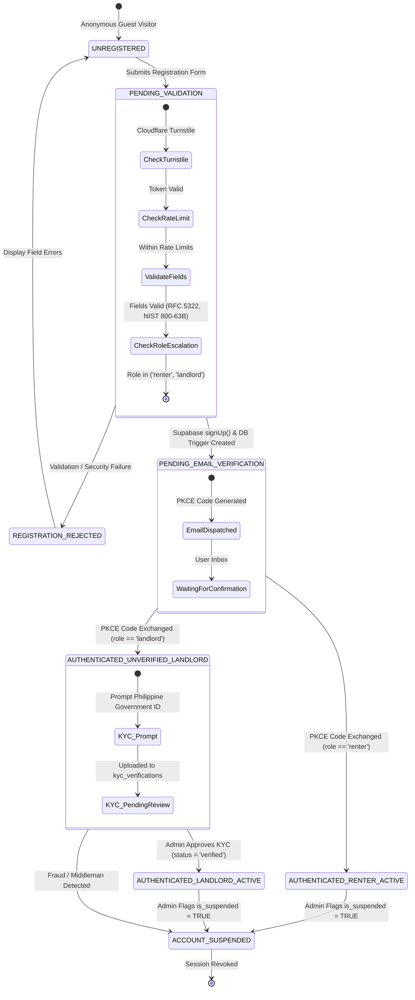
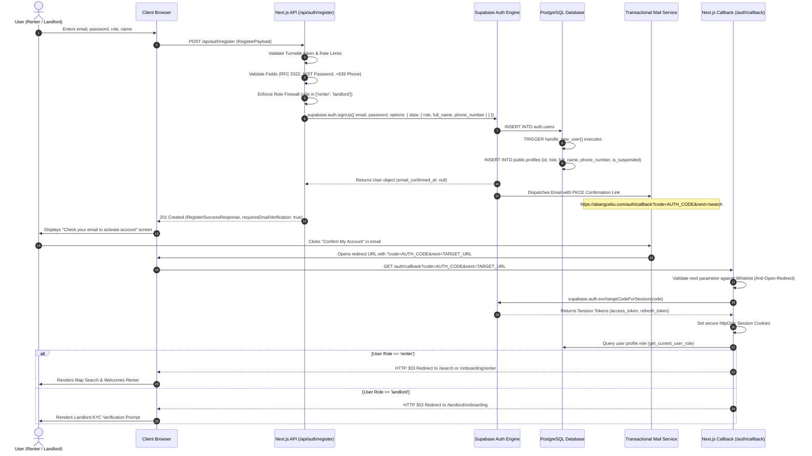

# AbangCebu AI — User Registration Workflow & Data Contract Specification

**Document Version:** 1.0.0  
**Status:** Approved Architecture Specification  
**Jira Ticket Reference:** [SCRUM-56](https://abangcebuai.atlassian.net/browse/SCRUM-56) — *Specify User Registration Workflow & Data Contract*  
**Sprint:** Sprint 1 (Foundations & Core Infrastructure)  
**Author:** John Lloyd Ando (Engineering Team)  
**Database Foundation:** [SCRUM-54](https://abangcebuai.atlassian.net/browse/SCRUM-54) (`supabase/migrations/20260929000001_users_and_profiles.sql`)  
**Related Specifications:**
- Users & Profiles Table Schema: [docs/users-and-profiles-schema.md](file:///home/hrmr/AbangCebuAI/docs/users-and-profiles-schema.md)
- Product Vision & Platform Goals: [docs/what-is-abangcebu-ai.md](file:///home/hrmr/AbangCebuAI/docs/what-is-abangcebu-ai.md)
- Renter Persona & Capabilities: [docs/renter-persona.md](file:///home/hrmr/AbangCebuAI/docs/renter-persona.md)
- Role-Based Access Control (RBAC) Matrix: [docs/rbac-matrix.md](file:///home/hrmr/AbangCebuAI/docs/rbac-matrix.md)
- Row Level Security (RLS) Policies: [docs/rls-policies.md](file:///home/hrmr/AbangCebuAI/docs/rls-policies.md)
- TypeScript Database Definitions: [src/types/database.ts](file:///home/hrmr/AbangCebuAI/src/types/database.ts)
- TypeScript Authentication Definitions: [src/types/auth.ts](file:///home/hrmr/AbangCebuAI/src/types/auth.ts)

---

## 1. Purpose and Source Basis

### 1.1 Executive Purpose
The registration workflow forms the initial trust and identity boundary of **AbangCebu AI**. In Metro Cebu's rental ecosystem, finding reliable accommodations is plagued by fragmented social media posts, deceptive pricing, ghost listings, and deposit scams. Conversely, property owners struggle with repetitive inquiries from unqualified prospects and lack a structured publishing medium.

This technical specification establishes a zero-trust, type-safe, and anti-abuse user registration workflow. It enforces strict separation between authentication credentials (`auth.users`) and public application profiles (`public.profiles`), guarantees anti-privilege escalation through a triple-firewall architecture, normalizes local Philippine mobile phone numbers, and governs the PKCE-based email verification lifecycle.

### 1.2 Source Document Mapping
This specification synthesizes requirements and architectural patterns from core foundation documents:

| Source Document | Architectural Mapping & Concrete Input |
|---|---|
| **`docs/what-is-abangcebu-ai.md`** | Delineates the two primary user cohorts: **Finders (Renters)** seeking rooms/bedspaces and **Landlords (Property Listers)** organizing inventory. Dictates unauthenticated browsing vs. authenticated privileges (revealing verified contact details, saving favorites, listing submission). |
| **`docs/renter-persona.md`** | Defines the "Mika" persona (student at UC/USC/CIT-U, BPO employee in IT Park). Dictates mobile-first registration, low input friction, landmark preference tracking (`preferredLandmark`), and scam deposit protection prompts. |
| **`docs/users-and-profiles-schema.md`** | Specifies table schemas for `public.profiles` and `public.kyc_verifications`, enum definitions (`user_role`, `kyc_status`, `kyc_id_type`), and the `public.handle_new_user()` trigger. |
| **`docs/rbac-matrix.md` & `docs/rls-policies.md`** | Establishes role permissions: Renters can view approved listings and read landlord contacts; Landlords require KYC verification before listings are published; Admins are never self-registered. |

### 1.3 Permitted vs. Prohibited Self-Registration Roles

```
              +-------------------------------------------------------+
              |           Public Registration Portal                  |
              |            POST /api/auth/register                    |
              +---------------------------+---------------------------+
                                          |
                +-------------------------+-------------------------+
                |                                                   |
                v                                                   v
   +------------------------+                           +------------------------+
   |   Role: 'renter'       |                           |   Role: 'landlord'     |
   |   (Finder / Seeker)    |                           |   (Property Owner)     |
   |   - Instant Search     |                           |   - Onboarding KYC     |
   |   - Save Favorites     |                           |   - ID Verification    |
   |   - View Landlord Info |                           |   - Listing Submission |
   +------------------------+                           +------------------------+
                |                                                   |
                +-------------------------+-------------------------+
                                          |
                                          x  STRICTLY BLOCKED
                                          v
                               +---------------------+
                               |   Role: 'admin'     |
                               | (Platform Operator) |
                               | ACCESS DENIED (403) |
                               +---------------------+
```

- **`renter` (Permitted):** Default seeker tier. Authorized to search, interact with conversational AI, bookmark properties, and access revealed landlord phone numbers once authenticated.
- **`landlord` (Permitted):** Property owner tier. Upon registration, account is placed in `pending_kyc` status. Restricted from publishing active listings until verified via Philippine government ID upload in `public.kyc_verifications`.
- **`admin` (Strictly Prohibited):** Platform operator tier. Any attempt to pass `role: 'admin'` in public registration payloads or metadata is rejected at the API tier and neutralized to `'renter'` at the database trigger tier.

---

## 2. Registration State Machine

### 2.1 State Diagram
The lifecycle of an AbangCebu AI account transitions across seven distinct states governed by validation rules, email verification, and KYC approval:



### 2.2 State Transition Matrix

| Source State | Event / Trigger | Guard / Condition | Target State | System Actions & Side Effects |
|---|---|---|---|---|
| `UNREGISTERED` | User submits registration form | Payload matches `RegisterPayload` | `PENDING_VALIDATION` | Ingests payload; begins validation pipeline. |
| `PENDING_VALIDATION` | Cloudflare Turnstile verification | Turnstile token invalid or missing | `REGISTRATION_REJECTED` | Returns `403` with code `CAPTCHA_VERIFICATION_FAILED`. |
| `PENDING_VALIDATION` | IP / Email rate limit check | Exceeds 5 registrations/hr/IP | `REGISTRATION_REJECTED` | Returns `429` with code `RATE_LIMIT_EXCEEDED`. |
| `PENDING_VALIDATION` | Role validation check | `payload.role === 'admin'` | `REGISTRATION_REJECTED` | Audit log security event; returns `403` with `PRIVILEGE_ESCALATION_ATTEMPT`. |
| `PENDING_VALIDATION` | Field validation check | Password weak, invalid phone, or malformed email | `REGISTRATION_REJECTED` | Returns `422` with code `VALIDATION_ERROR` and field details. |
| `PENDING_VALIDATION` | Supabase `signUp()` invoked | Payload valid, email not registered | `PENDING_EMAIL_VERIFICATION` | Inserts `auth.users`; `handle_new_user()` inserts `public.profiles`; sends confirmation email with PKCE code. |
| `PENDING_VALIDATION` | Supabase `signUp()` invoked | Email already registered | `REGISTRATION_REJECTED` / Obfuscated | Returns anti-enumeration response (generic success or `409` `EMAIL_ALREADY_REGISTERED`). |
| `PENDING_EMAIL_VERIFICATION` | User clicks email activation link | PKCE code valid & unexpired, `role = 'renter'` | `AUTHENTICATED_RENTER_ACTIVE` | Exchanges code via `@supabase/ssr`; writes secure cookies; redirects to `/search` or `/onboarding/renter`. |
| `PENDING_EMAIL_VERIFICATION` | User clicks email activation link | PKCE code valid & unexpired, `role = 'landlord'` | `AUTHENTICATED_UNVERIFIED_LANDLORD` | Exchanges code via `@supabase/ssr`; writes secure cookies; redirects to `/landlord/onboarding`. |
| `PENDING_EMAIL_VERIFICATION` | User clicks expired link | PKCE code > 24 hours old | `PENDING_EMAIL_VERIFICATION` | Renders `CONFIRMATION_CODE_EXPIRED`; provides resend CTA. |
| `AUTHENTICATED_UNVERIFIED_LANDLORD` | Landlord uploads ID & ownership | Valid `KycIdType` + document URL | `AUTHENTICATED_UNVERIFIED_LANDLORD` (Pending) | Inserts record into `public.kyc_verifications` with `status = 'pending'`. |
| `AUTHENTICATED_UNVERIFIED_LANDLORD` | Admin reviews KYC submission | Admin approves ID | `AUTHENTICATED_LANDLORD_ACTIVE` | Updates `kyc_verifications.status = 'verified'`; unlocks listing publication. |
| Any Active State | Admin flags account | Violates TOS, scam detected | `ACCOUNT_SUSPENDED` | Sets `profiles.is_suspended = true`; terminates active sessions. |

---

## 3. Data Contract & Schema

### 3.1 Endpoint Definition
- **Route:** `POST /api/auth/register` (mirrored by Server Action `registerUserAction(payload: RegisterPayload)`)
- **Content-Type:** `application/json`
- **Security:** Public endpoint protected by Cloudflare Turnstile token validation and IP rate limiting.

### 3.2 Request Payload Schema (`RegisterPayload`)

```typescript
export interface RegisterPayload {
  email: string;
  password: string;
  role: RegisterableRole; // 'renter' | 'landlord'
  fullName: string;
  phoneNumber?: string;
  preferredLandmark?: string;
  turnstileToken?: string;
}
```

#### Field Specifications

| Field Name | Type | Mandatory? | Validation Constraints | Description & Example |
|---|---|---|---|---|
| `email` | `string` | **Yes** | RFC 5322 format, max 254 chars, lowercase normalized. | User login email. E.g. `"mika.student@gmail.com"` |
| `password` | `string` | **Yes** | 8 to 72 chars; min 3 of 4 classes (upper, lower, digit, symbol). | Raw user password. E.g. `"CebuRental#2026"` |
| `role` | `RegisterableRole` | **Yes** | Must be strictly `'renter'` or `'landlord'`. | Account role. Prohibits `'admin'`. |
| `fullName` | `string` | **Yes** | 2 to 100 characters; letters, spaces, hyphens, periods. | Display name. E.g. `"Mikaela Santos"` |
| `phoneNumber` | `string` | No | Philippine regex `^(?:\+639\|09)\d{9}$`. | Mobile number. E.g. `"09171234567"` |
| `preferredLandmark` | `string` | No | Max 100 chars, alphanumeric + punctuation. | Primary school/office. E.g. `"USC Talamban"` |
| `turnstileToken` | `string` | No* | Valid Cloudflare Turnstile token string. | Bot prevention token (mandatory in production). |

#### Sample Request JSON
```json
{
  "email": "mikaela.santos@cit.edu.ph",
  "password": "Password99!Cebu",
  "role": "renter",
  "fullName": "Mikaela Santos",
  "phoneNumber": "09181234567",
  "preferredLandmark": "CIT-University",
  "turnstileToken": "0.X_TurnstileSampleToken_..."
}
```

### 3.3 Response Schemas

#### 3.3.1 Success Response (`RegisterSuccessResponse`)
- **HTTP Status:** `201 Created`

```typescript
export interface RegisterSuccessResponse {
  success: true;
  data: {
    user: RegisteredUserSummary;
    requiresEmailVerification: boolean;
    redirectUrl: string;
  };
  message: string;
}
```

```json
{
  "success": true,
  "data": {
    "user": {
      "id": "e8d6934c-62b8-4c92-80bb-69bead3e1b12",
      "email": "mikaela.santos@cit.edu.ph",
      "role": "renter",
      "fullName": "Mikaela Santos",
      "phoneNumber": "+639181234567",
      "isEmailConfirmed": false,
      "createdAt": "2026-09-29T05:15:00.000Z"
    },
    "requiresEmailVerification": true,
    "redirectUrl": "/auth/verify-request?email=mikaela.santos%40cit.edu.ph"
  },
  "message": "Account created successfully. Please check your email to activate your account."
}
```

#### 3.3.2 Error Response (`AuthErrorResponse`)
- **HTTP Status:** `400 Bad Request`, `403 Forbidden`, `409 Conflict`, `422 Unprocessable Content`, `429 Too Many Requests`, or `500 Internal Server Error`.

```typescript
export interface AuthErrorResponse {
  success: false;
  error: {
    code: AuthErrorCode;
    message: string;
    details?: AuthFieldError[];
  };
}
```

```json
{
  "success": false,
  "error": {
    "code": "VALIDATION_ERROR",
    "message": "The submitted registration data failed validation.",
    "details": [
      {
        "field": "password",
        "code": "WEAK_PASSWORD",
        "message": "Password must include at least one special character (!@#$%^&*...)"
      },
      {
        "field": "phoneNumber",
        "code": "INVALID_PHONE_NUMBER",
        "message": "Phone number must be a valid Philippine mobile number (+639XXXXXXXXX or 09XXXXXXXXX)"
      }
    ]
  }
}
```

### 3.4 Error Taxonomy Table

| Error Code | HTTP Status | Category | Trigger Condition | Client Facing Message | Remediation |
|---|---|---|---|---|---|
| `VALIDATION_ERROR` | `422` | Validation | One or more payload fields fail basic validation. | "The submitted registration data is invalid." | Review field-level `details` array. |
| `INVALID_EMAIL_FORMAT` | `422` | Validation | Email fails RFC 5322 regex check. | "Please enter a valid email address." | Correct email format syntax. |
| `WEAK_PASSWORD` | `422` | Validation | Password violates length (8-72) or complexity (<3 classes). | "Password must be at least 8 characters and include 3 of: uppercase, lowercase, numbers, symbols." | Satisfy password complexity requirements. |
| `INVALID_PHONE_NUMBER` | `422` | Validation | Phone fails Philippine format `^(?:\+639\|09)\d{9}$`. | "Phone number must be a valid Philippine mobile number (e.g. 09171234567 or +639171234567)." | Supply valid Philippine carrier prefix. |
| `INVALID_ROLE` | `422` | Validation | `role` not in `['renter', 'landlord']`. | "Selected role is invalid." | Choose either 'renter' or 'landlord'. |
| `MISSING_REQUIRED_FIELD` | `422` | Validation | Missing `email`, `password`, `role`, or `fullName`. | "Required field is missing." | Supply all required parameters. |
| `PRIVILEGE_ESCALATION_ATTEMPT` | `403` | Security | `role === 'admin'` detected in registration payload. | "Administrative accounts cannot be self-registered." | Request admin provisioning through governance. |
| `CAPTCHA_VERIFICATION_FAILED` | `403` | Security | Cloudflare Turnstile token validation fails or is absent. | "Security check failed. Please refresh the page and try again." | Complete Turnstile challenge. |
| `RATE_LIMIT_EXCEEDED` | `429` | Abuse | Exceeded 5 registration submissions per hour per IP. | "Too many registration attempts. Please try again later." | Await rate limit window cooldown (60 mins). |
| `EMAIL_ALREADY_REGISTERED` | `409` | Security | Email exists in `auth.users` (when enumeration permitted). | "An account with this email address already exists." | Log in or trigger password recovery. |
| `ACCOUNT_SUSPENDED` | `403` | Security | User profile has `is_suspended = true`. | "This account has been suspended by administration." | Contact support@abangcebu.com. |
| `CONFIRMATION_CODE_EXPIRED` | `410` | Lifecycle | PKCE confirmation link clicked after 24h expiration. | "The activation link has expired. Please request a new one." | Submit email to `/api/auth/resend-confirmation`. |
| `CONFIRMATION_CODE_INVALID` | `400` | Lifecycle | Malformed or already-used PKCE auth code. | "The activation link is invalid or has already been used." | Proceed to login or request new confirmation. |
| `ALREADY_CONFIRMED` | `200` / `400` | Lifecycle | User attempts code exchange on confirmed account. | "Your email is already verified. Please sign in." | Direct user to login route. |
| `DATABASE_TRIGGER_ERROR` | `500` | Internal | `handle_new_user()` trigger fails during profile creation. | "An error occurred while creating your user profile." | Check PostgreSQL logs; rollback is atomic. |
| `INTERNAL_AUTH_ERROR` | `500` | Internal | Unhandled exception in Supabase Auth or network failure. | "An unexpected authentication error occurred. Please try again." | Contact engineering team. |

---

## 4. Validation and Security Rules

### 4.1 Triple-Firewall Anti-Privilege Escalation Architecture
AbangCebu AI enforces a multi-layered defense to prevent malicious actors from assigning themselves the `'admin'` role:

```
+------------------------------------------------------------------------------------+
| TIER 1: TypeScript & Client API Layer                                              |
| - RegisterableRole = Exclude<UserRole, 'admin'> ('renter' | 'landlord')            |
| - Runtime schema rejects payload with 'admin' prior to submission                  |
+------------------------------------------------------------------------------------+
                                      |
                                      v
+------------------------------------------------------------------------------------+
| TIER 2: Next.js Server Route Handler / Server Action                               |
| - Server-side validation asserts payload.role in ['renter', 'landlord']            |
| - Attempted 'admin' role logs security alert and terminates with 403 Forbidden     |
+------------------------------------------------------------------------------------+
                                      |
                                      v
+------------------------------------------------------------------------------------+
| TIER 3: PostgreSQL Database Trigger Layer (handle_new_user)                        |
| - plpgsql function unconditionally coerces role:                                    |
|   IF raw_role = 'landlord' THEN role := 'landlord' ELSE role := 'renter'           |
| - PostgreSQL RLS permanently blocks self-role mutation in public.profiles          |
+------------------------------------------------------------------------------------+
```

1. **Tier 1 (Contract & Client Boundary):** The TypeScript type definition `RegisterableRole` strictly excludes `'admin'`. Form schemas do not render or permit administrative choices.
2. **Tier 2 (Server Validation Boundary):** In the Route Handler / Server Action, incoming payloads are parsed. If `role === 'admin'` is received, the server logs a high-severity security alert with client IP and user-agent, immediately returning HTTP `403 Forbidden` (`PRIVILEGE_ESCALATION_ATTEMPT`).
3. **Tier 3 (Database Engine Enforcement):** Even if an attacker bypasses the application server and executes direct API calls against Supabase Auth, PostgreSQL's `handle_new_user()` trigger intercepts `NEW.raw_user_meta_data->>'role'`. It enforces:
   ```sql
   IF raw_role = 'landlord' THEN
       assigned_role := 'landlord'::public.user_role;
   ELSE
       assigned_role := 'renter'::public.user_role;
   END IF;
   ```
   Furthermore, the Row Level Security policy `Users can update own profile` enforces:
   ```sql
   WITH CHECK (
       auth.uid() = id
       AND role = (SELECT p.role FROM public.profiles p WHERE p.id = auth.uid())
   );
   ```
   Users can never mutate their own role once written.

### 4.2 Password Security Policy
Compliant with **NIST SP 800-63B (Digital Identity Guidelines)** with modern complexity constraints:
- **Length Constraints:** Minimum 8 characters; maximum 72 characters. The 72-character maximum protects against bcrypt Denial of Service (DoS) attacks caused by excessively long strings.
- **Character Class Complexity:** Must satisfy at least **3 out of 4** distinct character categories:
  1. Uppercase English letters (`[A-Z]`)
  2. Lowercase English letters (`[a-z]`)
  3. Base 10 digits (`[0-9]`)
  4. Special symbols (`[!@#$%^&*()_+\-=[\]{};':"\\|,.<>/?~]`)
- **Whitespace Rules:** Disallows leading and trailing whitespace characters.

### 4.3 Philippine Mobile Phone Normalization
Given local mobile conventions in Metro Cebu, users routinely input phone numbers in various formats (`09171234567`, `+639171234567`, `0917-123-4567`, or `9171234567`).

- **Validation Pattern:** `^(?:\+639|09)\d{9}$` (after stripping whitespace, hyphens, and parentheses).
- **Canonical Storage Standard:** E.164 format: `+639XXXXXXXXX` (exactly 13 characters).
- **Normalization Algorithm:**
  ```typescript
  export function normalizePhilippinePhoneNumber(phone: string | null | undefined): string | null {
    if (!phone) return null;
    const clean = phone.replace(/[\s\-_()]/g, '');
    if (!/^(?:\+639|09)\d{9}$/.test(clean)) return null;
    if (clean.startsWith('09')) return `+639${clean.slice(2)}`;
    if (clean.startsWith('+639')) return clean;
    return null;
  }
  ```
- **Database Compliance:** Perfectly satisfies `profiles.phone_format_check` (`phone_number IS NULL OR phone_number ~ '^\+?[0-9]{10,15}$'`).

### 4.4 Anti-User Enumeration & Timing Attack Defenses
To prevent malicious agents from scraping valid email addresses in Metro Cebu:
- When an existing email is submitted in production, the server can return a standard generic acknowledgement: *"If this email address is not yet registered, an activation email has been dispatched. Please check your inbox."*
- Password hashing and encryption checks utilize constant-time comparisons to mitigate timing side-channel attacks.

### 4.5 Rate Limiting & Bot Prevention
- **Cloudflare Turnstile:** Invisible or managed challenge verified server-side via `POST https://challenges.cloudflare.com/turnstile/v0/siteverify`.
- **IP Rate Limit:** 5 registration attempts per sliding 60-minute window per IP.
- **Resend Confirmation Limit:** Maximum 3 verification email dispatches per 15 minutes per email address.

---

## 5. Email Verification & PKCE Flow

### 5.1 Architecture Overview
AbangCebu AI implements the **PKCE (Proof Key for Code Exchange)** authentication flow supported natively by Supabase Auth and `@supabase/ssr`. 

In traditional client-side flows, tokens are passed via URL fragments (`#access_token=...`), which cannot be read or processed securely by Next.js Server Components. The PKCE flow issues a short-lived authorization code (`?code=...`) exchangeable solely on the server, establishing secure `httpOnly`, `SameSite=Lax` cookies.

### 5.2 Sequence Diagram



### 5.3 Open-Redirect Defense
To protect users against phishing attacks where malicious query parameters redirect authenticated sessions to external malicious sites, the `/auth/callback` Route Handler enforces strict URL validation:

- **Whitelisted Relative Paths:**
  - `/search`
  - `/onboarding/renter`
  - `/landlord/onboarding`
  - `/account/profile`
  - `/renter/favorites`
- **Rejection Rules:**
  - Any URL starting with `http://`, `https://`, or protocol-relative `//` is discarded.
  - Path traversal sequences (`..`) are stripped.
  - If invalid, the callback defaults to the role-based default redirect.

### 5.4 Server Code Exchange Implementation Contract

```typescript
// Architectural representation: app/auth/callback/route.ts
import { NextResponse, type NextRequest } from 'next/server';
import { createServerClient } from '@supabase/ssr';

const ALLOWED_REDIRECT_PATHS = [
  '/search',
  '/onboarding/renter',
  '/landlord/onboarding',
  '/account/profile',
  '/renter/favorites',
];

export async function GET(request: NextRequest) {
  const requestUrl = new URL(request.url);
  const code = requestUrl.searchParams.get('code');
  const next = requestUrl.searchParams.get('next');

  if (code) {
    const supabase = createServerClient(
      process.env.NEXT_PUBLIC_SUPABASE_URL!,
      process.env.NEXT_PUBLIC_SUPABASE_ANON_KEY!,
      {
        cookies: {
          getAll: () => request.cookies.getAll(),
          setAll: (cookiesToSet) => {
            cookiesToSet.forEach(({ name, value, options }) =>
              request.cookies.set(name, value)
            );
          },
        },
      }
    );

    const { data: { user }, error } = await supabase.auth.exchangeCodeForSession(code);

    if (!error && user) {
      // Determine safe redirect destination
      let destination = '/search';

      // Check role from profiles
      const { data: profile } = await supabase
        .from('profiles')
        .select('role')
        .eq('id', user.id)
        .single();

      if (profile?.role === 'landlord') {
        destination = '/landlord/onboarding';
      } else if (next && ALLOWED_REDIRECT_PATHS.includes(next)) {
        destination = next;
      }

      return NextResponse.redirect(new URL(destination, requestUrl.origin));
    }
  }

  // Code exchange failed or expired
  return NextResponse.redirect(new URL('/auth/auth-error?code=CONFIRMATION_CODE_INVALID', requestUrl.origin));
}
```

---

## 6. Post-Registration Routing Matrix

The user navigation path following registration is deterministically governed by role, email verification state, and KYC approval status:

| User Role | Email Verified? | KYC Status | Target Route | Viewport Presentation & Primary Call to Action |
|---|---|---|---|---|
| **Any** | No | N/A | `/auth/verify-request` | "Verify Your Email" screen. Shows user email, spam instructions, and "Resend Activation Email" button. |
| **Renter** | Yes | N/A | `/search` (or `/onboarding/renter`) | Metro Cebu interactive map canvas. Welcomes user, highlights campus/workplace search pins (UC, USC, IT Park), prompts optional landmark saving. |
| **Landlord** | Yes | `unsubmitted` | `/landlord/onboarding` | Prominent Amber Banner: *"Identity Verification Required. Submit your Philippine Government ID to unlock listing publication."* Directs to KYC upload form. |
| **Landlord** | Yes | `pending` | `/landlord/dashboard` | Informational Notice: *"Your KYC documents are currently being reviewed by AbangCebu Admins (est. 12-24 hours). You may draft listings, but they will remain hidden from the map until approved."* |
| **Landlord** | Yes | `verified` | `/landlord/dashboard` | Full Landlord Studio access. Verified badge displayed. Can publish live rental listings on Metro Cebu map. |
| **Landlord** | Yes | `rejected` | `/landlord/onboarding?retry=true` | High-Priority Alert: *"Your KYC verification was rejected: [rejection_reason]. Please review requirements and upload a valid government ID."* |
| **Any** | Any | N/A (`is_suspended = true`) | `/auth/suspended` | Screen: *"Account Suspended. Contact support@abangcebu.com for appeals."* All authenticated sessions terminated. |

---

## 7. Database Trigger Integration (`handle_new_user`)

### 7.1 Field Mapping Contract
The PostgreSQL trigger `public.handle_new_user()` is triggered `AFTER INSERT ON auth.users`. It parses JSON metadata supplied during `signUp()` and seeds `public.profiles`:

```
+---------------------------------------+         +---------------------------------------+
|   Supabase auth.users (Record)        |         |   public.profiles (Record)            |
+---------------------------------------+         +---------------------------------------+
| id (UUID)                             | ------> | id (UUID PRIMARY KEY)                 |
| email (TEXT)                          | ------> | [Stored only in auth.users]           |
| raw_user_meta_data->>'role'           | ------> | role (user_role: 'renter'|'landlord') |
| raw_user_meta_data->>'full_name'      | ------> | full_name (TEXT)                      |
| raw_user_meta_data->>'phone_number'   | ------> | phone_number (TEXT, Normalized)       |
| raw_user_meta_data->>'avatar_url'     | ------> | avatar_url (TEXT, Optional)           |
| raw_user_meta_data->>'bio'            | ------> | bio (TEXT, Optional)                  |
| created_at                            | ------> | created_at (TIMESTAMPTZ)              |
+---------------------------------------+         +---------------------------------------+
```

### 7.2 Defensive Trigger Logic & Fallback Cascade
The trigger implements robust sanitization for display names and roles:

1. **Role Coercion:**
   ```sql
   raw_role := LOWER(COALESCE(NEW.raw_user_meta_data->>'role', 'renter'));
   IF raw_role = 'landlord' THEN
       assigned_role := 'landlord'::public.user_role;
   ELSE
       assigned_role := 'renter'::public.user_role;
   END IF;
   ```
2. **Name Fallback Cascade:**
   ```sql
   extracted_name := COALESCE(
       NULLIF(TRIM(NEW.raw_user_meta_data->>'full_name'), ''),
       NULLIF(TRIM(NEW.raw_user_meta_data->>'name'), ''),
       SPLIT_PART(NEW.email, '@', 1),
       'AbangCebu User'
   );
   ```
3. **Transactional Integrity & Rollback Atomicity:**
   Because `handle_new_user()` runs within the insertion transaction of `auth.users`, if an unhandled database exception occurs, the transaction rolls back completely. This prevents orphaned authentication users who lack corresponding `public.profiles` records.
4. **Search Path Sanitization:**
   `SET search_path = public, auth, extensions` prevents malicious schema-spoofing injection vectors on this `SECURITY DEFINER` function.

---

## 8. Architectural Compliance & Sign-Off

This specification adheres to all Sprint 1 Iron Rules:
- **Zero Frontend Feature UI:** Contains zero premature JSX components, visual widgets, or form templates.
- **Strict Role Boundaries:** Fully prevents self-assignment of administrative roles.
- **Contract Parity:** `src/types/auth.ts` provides complete compile-time type parity with this specification and passes `pnpm exec tsc --noEmit` with zero errors.
