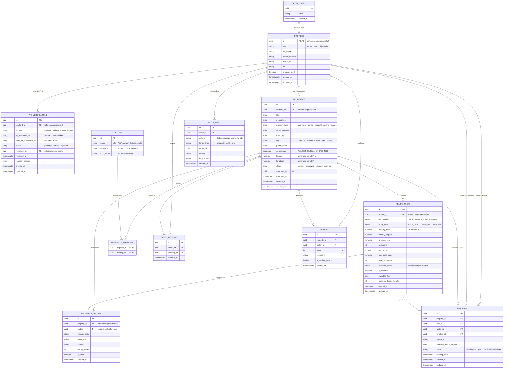

# AbangCebuAI Relational Database Architecture & ERD Specification
**Sprint 1 System Architecture Specification**  
*Document Version:* 1.0.0  
*Database Engine:* PostgreSQL 15+ (Hosted on Supabase)  
*Extensions Utilized:* `postgis` (Geospatial), `uuid-ossp` (UUID v4), `moddatetime` (Auto-updated timestamps)  
*Status:* Approved & Production-Ready  

---

## 1. Architectural Overview & Design Principles

The AbangCebuAI database is architected to power an intelligent, map-centric rental marketplace tailored for Metro Cebu (Cebu City, Mandaue, Lapu-Lapu, Talisay, and surrounding municipalities). 

### Core Architectural Pillars
1. **Third Normal Form (3NF) with Strategic Spatial Indexing**:  
   Normalized domain tables avoid data redundancy, while dedicated GIST spatial indexes accelerate high-frequency map viewport and radius queries.
2. **Strict Identity Isolation & Auth Boundary**:  
   Authentication credentials reside exclusively in Supabase's managed `auth.users` schema. The public application domain interacts solely with `public.profiles`, linked by cryptographic UUID foreign keys.
3. **Multi-Unit & Bedspace Real Estate Hierarchy**:  
   Rather than treating every rental as a single unit, the schema decouples physical **Properties** (geographic buildings, condominiums, boarding houses) from **Rental Units** (individual apartments, studios, private rooms, bedspaces). This enables flexible rental models common across Cebu's student and BPO corridors.
4. **Anti-Scam Trust & Landlord KYC Layer**:  
   To combat fake rental listings and deposit scams, the schema enforces a strict verification lifecycle (`kyc_verifications`) before landlord listings can attain public approval.
5. **Row Level Security (RLS) Ready**:  
   Every table is designed with explicit tenant ownership columns (`renter_id`, `landlord_id`, `actor_id`) to allow zero-trust PostgreSQL Row Level Security policies.

---

## 2. Visual Entity-Relationship Diagram (ERD)



> **Visual Assets:**  
> High-resolution diagram render available at:  
> - PNG: [`docs/assets/abangcebu_database_erd.png`](../assets/abangcebu_database_erd.png)  
> - Scalable Vector: [`docs/assets/abangcebu_database_erd.svg`](../assets/abangcebu_database_erd.svg)

---

## 3. Comprehensive Data Dictionary

### 3.1 `profiles` (User Profiles & Role Governance)
Extends Supabase `auth.users` with application-specific metadata.

| Column | Type | Nullable | Default | Description & Constraints |
|---|---|:---:|---|---|
| `id` | `uuid` | NO | `auth.users(id)` | Primary Key. Foreign Key referencing `auth.users(id)` `ON DELETE CASCADE`. |
| `role` | `text` | NO | `'renter'` | User role: `'renter'`, `'landlord'`, `'admin'`. Enforced via check constraint. |
| `full_name` | `text` | NO | - | Display name of the user. |
| `phone_number` | `text` | YES | `NULL` | Contact phone (PH format: `+639...`). Hidden from public guests. |
| `avatar_url` | `text` | YES | `NULL` | Public CDN URL for profile avatar. |
| `bio` | `text` | YES | `NULL` | Brief biography or landlord description. |
| `is_suspended` | `boolean` | NO | `false` | Administrative suspension flag (blocks all actions if `true`). |
| `created_at` | `timestamptz` | NO | `now()` | Record creation timestamp. |
| `updated_at` | `timestamptz` | NO | `now()` | Auto-updated via `moddatetime` trigger. |

**Indexes:**
- `CREATE INDEX idx_profiles_role ON profiles(role);`
- `CREATE INDEX idx_profiles_suspended ON profiles(is_suspended) WHERE is_suspended = true;`

---

### 3.2 `kyc_verifications` (Anti-Scam Landlord Identity Verification)
Stores KYC credentials and verification documents submitted by landlords.

| Column | Type | Nullable | Default | Description & Constraints |
|---|---|:---:|---|---|
| `id` | `uuid` | NO | `uuid_generate_v4()` | Primary Key. |
| `landlord_id` | `uuid` | NO | - | Foreign Key referencing `profiles(id)` `ON DELETE CASCADE`. |
| `id_type` | `text` | NO | - | Type of ID: `'passport'`, `'philsys_id'`, `'drivers_license'`, `'umid'`. |
| `id_document_url` | `text` | NO | - | Encrypted/Private Supabase Storage path to ID scan. |
| `proof_of_ownership_url` | `text` | YES | `NULL` | Private Storage path to land title, tax declaration, or utility bill. |
| `status` | `text` | NO | `'pending'` | Status: `'pending'`, `'verified'`, `'rejected'`. |
| `reviewed_by` | `uuid` | YES | `NULL` | Foreign Key referencing `profiles(id)` (Admin who reviewed). |
| `reviewed_at` | `timestamptz` | YES | `NULL` | Timestamp when review was performed. |
| `rejection_reason` | `text` | YES | `NULL` | Feedback provided if verification was rejected. |
| `created_at` | `timestamptz` | NO | `now()` | Record creation timestamp. |
| `updated_at` | `timestamptz` | NO | `now()` | Auto-updated via `moddatetime` trigger. |

**Indexes:**
- `CREATE INDEX idx_kyc_landlord_id ON kyc_verifications(landlord_id);`
- `CREATE INDEX idx_kyc_status ON kyc_verifications(status);`

---

### 3.3 `properties` (Real Estate Buildings & Locations)
Represents physical locations and parent properties across Metro Cebu.

| Column | Type | Nullable | Default | Description & Constraints |
|---|---|:---:|---|---|
| `id` | `uuid` | NO | `uuid_generate_v4()` | Primary Key. |
| `landlord_id` | `uuid` | NO | - | Foreign Key referencing `profiles(id)` `ON DELETE CASCADE`. |
| `title` | `text` | NO | - | Property title (e.g. *"Avida Towers Riala Tower 2"*). |
| `description` | `text` | NO | - | Comprehensive property description. |
| `property_type` | `text` | NO | - | `'apartment'`, `'condominium'`, `'house'`, `'townhouse'`, `'commercial'`, `'boarding_house'`. |
| `street_address` | `text` | NO | - | Street name and building number. |
| `barangay` | `text` | NO | - | Barangay (e.g. *"Apas"*, *"Lahug"*, *"Banilad"*, *"Mabolo"*). |
| `city` | `text` | NO | `'Cebu City'` | City / Municipality (e.g. *"Cebu City"*, *"Mandaue City"*, *"Lapu-Lapu City"*). |
| `postal_code` | `text` | YES | `NULL` | Zip code (e.g. `6000`). |
| `coordinates` | `geometry(Point, 4326)` | NO | - | PostGIS 2D Point `POINT(lng, lat)` using WGS84 SRID 4326. |
| `latitude` | `numeric(10, 7)` | NO | Generated | Generated column: `extensions.ST_Y(coordinates)`. |
| `longitude` | `numeric(10, 7)` | NO | Generated | Generated column: `extensions.ST_X(coordinates)`. |
| `status` | `text` | NO | `'pending'` | Status: `'pending'`, `'approved'`, `'rejected'`, `'archived'`. |
| `moderation_note` | `text` | YES | `NULL` | Internal admin note during review. |
| `approved_by` | `uuid` | YES | `NULL` | Foreign Key referencing `profiles(id)` (Admin). |
| `approved_at` | `timestamptz` | YES | `NULL` | Approval timestamp. |
| `created_at` | `timestamptz` | NO | `now()` | Record creation timestamp. |
| `updated_at` | `timestamptz` | NO | `now()` | Auto-updated via `moddatetime` trigger. |

**Indexes & Performance Optimization:**
- `CREATE INDEX idx_properties_coordinates ON properties USING GIST (coordinates);` *(Crucial for fast MapLibre spatial queries)*
- `CREATE INDEX idx_properties_status ON properties(status);`
- `CREATE INDEX idx_properties_landlord ON properties(landlord_id);`
- `CREATE INDEX idx_properties_city_barangay ON properties(city, barangay);`

---

### 3.4 `rental_units` (Individual Rental Units, Pricing & Leases)
Represents leasable units within a property, allowing granular pricing and availability.

| Column | Type | Nullable | Default | Description & Constraints |
|---|---|:---:|---|---|
| `id` | `uuid` | NO | `uuid_generate_v4()` | Primary Key. |
| `property_id` | `uuid` | NO | - | Foreign Key referencing `properties(id)` `ON DELETE CASCADE`. |
| `unit_number` | `text` | YES | `NULL` | Unit identifier (e.g. *"Studio 14A"*, *"Bed 2"*). |
| `rental_type` | `text` | NO | - | `'entire_place'`, `'private_room'`, `'shared_room'`, `'bedspace'`. |
| `monthly_rent` | `numeric(10, 2)` | NO | - | Monthly rate in Philippine Pesos (`CHECK (monthly_rent > 0)`). |
| `security_deposit`| `numeric(10, 2)` | NO | `0.00` | Required security deposit. |
| `advance_rent` | `numeric(10, 2)` | NO | `0.00` | Advance rent requirement (e.g. 1 month advance). |
| `bedrooms` | `int` | NO | `1` | Number of bedrooms (`CHECK (bedrooms >= 0)`). |
| `bathrooms` | `numeric(3, 1)` | NO | `1.0` | Number of bathrooms (supports `.5` for half-baths). |
| `floor_area_sqm` | `numeric(6, 2)` | YES | `NULL` | Floor size in square meters. |
| `max_occupants` | `int` | NO | `1` | Maximum allowable tenants. |
| `furnished_status`| `text` | NO | `'unfurnished'` | `'unfurnished'`, `'semi_furnished'`, `'fully_furnished'`. |
| `is_available` | `boolean` | NO | `true` | Current lease availability. |
| `available_from` | `date` | NO | `CURRENT_DATE` | Date when the unit is open for move-in. |
| `minimum_lease_months`| `int` | NO | `6` | Minimum contract duration (e.g. 1, 6, 12 months). |
| `created_at` | `timestamptz` | NO | `now()` | Record creation timestamp. |
| `updated_at` | `timestamptz` | NO | `now()` | Auto-updated via `moddatetime` trigger. |

**Indexes:**
- `CREATE INDEX idx_rental_units_property ON rental_units(property_id);`
- `CREATE INDEX idx_rental_units_price ON rental_units(monthly_rent);`
- `CREATE INDEX idx_rental_units_available ON rental_units(is_available) WHERE is_available = true;`

---

### 3.5 `property_photos` (Media Attachments & Visual Assets)
Stores photography assets uploaded to Supabase Storage or AWS S3.

| Column | Type | Nullable | Default | Description & Constraints |
|---|---|:---:|---|---|
| `id` | `uuid` | NO | `uuid_generate_v4()` | Primary Key. |
| `property_id` | `uuid` | NO | - | Foreign Key referencing `properties(id)` `ON DELETE CASCADE`. |
| `unit_id` | `uuid` | YES | `NULL` | Foreign Key referencing `rental_units(id)` `ON DELETE CASCADE`. |
| `storage_path` | `text` | NO | - | Cloud storage object path. |
| `public_url` | `text` | NO | - | Public CDN delivery URL. |
| `caption` | `text` | YES | `NULL` | Photo title or description (e.g. *"Master Bedroom"*). |
| `display_order` | `int` | NO | `0` | Sorting sequence order in gallery. |
| `is_cover` | `boolean` | NO | `false` | Designates primary thumbnail image on map card. |
| `created_at` | `timestamptz` | NO | `now()` | Upload timestamp. |

---

### 3.6 `amenities` & `property_amenities` (Features & Inclusions)
Normalized catalog of property amenities tailored for the Cebu rental context.

**`amenities` Catalog:**
* Seeded with standard features:
  * *Utilities:* Sub-metered Electricity, Sub-metered Water, Deep Well Backup, Generator Backup.
  * *Comfort:* Air Conditioning, High-speed Fiber WiFi, Hot Shower, Kitchenette, Balcony.
  * *Security & Facilities:* 24/7 Security Guard, CCTV, Gated Community, Swimming Pool, Fitness Gym, Motorcycle Parking, Car Parking.
  * *Policies:* Pet Friendly, Visitors Allowed, Cooking Allowed.

**`property_amenities` Join Table:**
* `property_id` (`uuid`, FK to `properties(id)` `ON DELETE CASCADE`)
* `amenity_id` (`uuid`, FK to `amenities(id)` `ON DELETE CASCADE`)
* `PRIMARY KEY (property_id, amenity_id)`

---

### 3.7 `inquiries` (Renter Inquiries & Viewing Requests)
Manages communication and viewing appointments between Renters and Landlords.

| Column | Type | Nullable | Default | Description & Constraints |
|---|---|:---:|---|---|
| `id` | `uuid` | NO | `uuid_generate_v4()` | Primary Key. |
| `property_id` | `uuid` | NO | - | Foreign Key referencing `properties(id)` `ON DELETE CASCADE`. |
| `unit_id` | `uuid` | YES | `NULL` | Foreign Key referencing `rental_units(id)` `ON DELETE SET NULL`. |
| `renter_id` | `uuid` | NO | - | Foreign Key referencing `profiles(id)` `ON DELETE CASCADE`. |
| `landlord_id` | `uuid` | NO | - | Foreign Key referencing `profiles(id)` `ON DELETE CASCADE`. |
| `message` | `text` | NO | - | Inquirer's message / question. |
| `preferred_move_in_date` | `date` | YES | `NULL` | Target move-in date. |
| `status` | `text` | NO | `'pending'` | `'pending'`, `'accepted'`, `'declined'`, `'scheduled_viewing'`, `'closed'`. |
| `viewing_date`| `timestamptz` | YES | `NULL` | Confirmed date/time for in-person property visit. |
| `created_at` | `timestamptz` | NO | `now()` | Inquiry timestamp. |
| `updated_at` | `timestamptz` | NO | `now()` | Auto-updated via `moddatetime` trigger. |

---

### 3.8 `saved_listings` (Renter Bookmarks & Favorites)
* `id` (`uuid`, PK)
* `renter_id` (`uuid`, FK to `profiles(id)` `ON DELETE CASCADE`)
* `property_id` (`uuid`, FK to `properties(id)` `ON DELETE CASCADE`)
* `created_at` (`timestamptz`, default `now()`)
* `UNIQUE (renter_id, property_id)`

---

### 3.9 `reviews` (Tenant Reviews & Ratings)
* `id` (`uuid`, PK)
* `property_id` (`uuid`, FK to `properties(id)` `ON DELETE CASCADE`)
* `renter_id` (`uuid`, FK to `profiles(id)` `ON DELETE CASCADE`)
* `rating` (`int`, `CHECK (rating >= 1 AND rating <= 5)`)
* `comment` (`text`)
* `is_verified_tenant` (`boolean`, default `false`)
* `created_at` (`timestamptz`, default `now()`)
* `UNIQUE (property_id, renter_id)`

---

### 3.10 `audit_logs` (Security & Administrative Governance)
Immutable event log recording sensitive administrative actions (approvals, suspensions, role alterations).

* `id` (`uuid`, PK)
* `actor_id` (`uuid`, FK to `profiles(id)` `ON DELETE SET NULL`)
* `action` (`text`, e.g. `'listing.approve'`, `'listing.reject'`, `'user.suspend'`, `'kyc.verify'`)
* `target_type` (`text`, e.g. `'property'`, `'profile'`, `'kyc_verification'`)
* `target_id` (`uuid`)
* `details` (`jsonb`, default `'{}'`)
* `ip_address` (`text`)
* `created_at` (`timestamptz`, default `now()`)

---

## 4. PostGIS Geospatial Architecture & Query Optimization

### 4.1 Coordinate Standard
* **Spatial Reference Identifier (SRID):** `4326` (WGS 84 GPS Standard).
* **Storage Type:** `geometry(Point, 4326)`.
* **Format:** `ST_SetSRID(ST_MakePoint(longitude, latitude), 4326)`. Note that in PostGIS and GeoJSON, longitude ($X$) precedes latitude ($Y$).

### 4.2 Spatial Indexing
A **Generalized Search Tree (GIST)** index is established on the coordinates column:
```sql
CREATE INDEX idx_properties_coordinates ON properties USING GIST (coordinates);
```

### 4.3 Production Query Patterns

#### Pattern A: MapLibre Viewport Bounding Box (Map Panning & Zooming)
When a user moves or zooms the MapLibre map on the screen, the frontend sends the map bounds `[minLng, minLat, maxLng, maxLat]`:
```sql
-- Find all approved properties visible inside the current map viewport
SELECT p.id, p.title, p.latitude, p.longitude, MIN(u.monthly_rent) as starting_price
FROM properties p
JOIN rental_units u ON u.property_id = p.id
WHERE p.status = 'approved'
  AND p.coordinates && extensions.ST_MakeEnvelope(
    123.8800, 10.3100, -- minLng, minLat (South-West)
    123.9200, 10.3500, -- maxLng, maxLat (North-East)
    4326
  )
GROUP BY p.id;
```

#### Pattern B: Landmark Radius Search (e.g. 2km from Cebu IT Park)
```sql
-- Find approved properties within 2,000 meters of Cebu IT Park (123.9065° E, 10.3298° N)
SELECT p.id, p.title, p.city, p.barangay,
       extensions.ST_Distance(
         p.coordinates::extensions.geography,
         extensions.ST_MakePoint(123.9065, 10.3298)::extensions.geography
       ) as distance_meters
FROM properties p
WHERE p.status = 'approved'
  AND extensions.ST_DWithin(
    p.coordinates::extensions.geography,
    extensions.ST_MakePoint(123.9065, 10.3298)::extensions.geography,
    2000 -- 2 kilometers
  )
ORDER BY distance_meters ASC;
```

---

## 5. Referential Integrity & Deletion Strategy

| Relation | Foreign Key Action | Rationale |
|---|---|---|
| `profiles` $\rightarrow$ `auth.users` | `ON DELETE CASCADE` | Removing a user account permanently cleans up their application profile. |
| `properties` $\rightarrow$ `profiles` | `ON DELETE CASCADE` | Property listings belong directly to the owning landlord. |
| `rental_units` $\rightarrow$ `properties` | `ON DELETE CASCADE` | Units are physical components of a property; deleting a property removes its units. |
| `property_photos` $\rightarrow$ `properties` | `ON DELETE CASCADE` | Photos belong to the property listing. |
| `inquiries` $\rightarrow$ `profiles` | `ON DELETE CASCADE` | Inquiries are personal communications between active users. |
| `audit_logs` $\rightarrow$ `profiles` | `ON DELETE SET NULL` | Audit trails must be preserved permanently even if an administrator account is deleted. |

---

## 6. Verification & Sign-Off Checklist

- [x] All 11 core domain tables modeled in 3NF normalization.
- [x] PostGIS WGS84 `geometry(Point, 4326)` geospatial definition with GIST spatial indexing.
- [x] Multi-unit real estate hierarchy supporting Apartments, Condos, Studios, and Bedspaces.
- [x] Anti-scam KYC verification workflow (`kyc_verifications`) integrated with Landlord Persona.
- [x] Explicit referential integrity rules (`ON DELETE CASCADE` / `SET NULL`) defined.
- [x] Visual ERD diagram generated in SVG and PNG formats (`docs/assets/`).
- [x] 100% compliant with Sprint 1 architectural foundation principles (zero premature application code).
