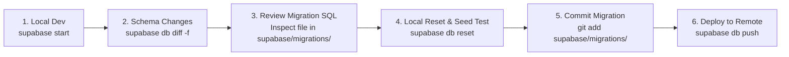
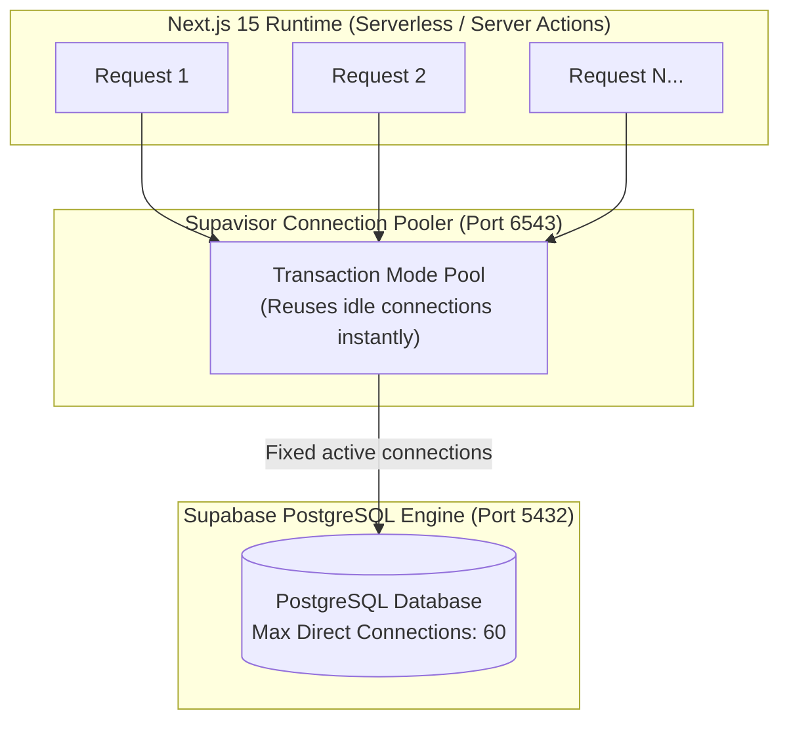

# AbangCebuAI Supabase Database Architecture & Extensions Plan

## 1. Required PostgreSQL Extensions

AbangCebuAI requires specific PostgreSQL extensions to handle geospatial queries in Metro Cebu, secure identifier generation, and fuzzy text search.

| Extension | Schema | Purpose in AbangCebuAI | Example Use Case |
| :--- | :--- | :--- | :--- |
| **`postgis`** | `extensions` | Geospatial spatial indexing, coordinates, and proximity calculations | Finding rentals within 2km of Cebu IT Park or UC Main using `ST_DWithin()` |
| **`uuid-ossp`** | `extensions` | RFC 4122 standard UUID v4 generation | Generating primary keys for `listings`, `rentals`, and `profiles` |
| **`pgcrypto`** | `extensions` | Cryptographic functions and `gen_random_uuid()` | Hashing verification tokens and fallback UUID generation |
| **`pg_trgm`** | `extensions` | Trigram matching for fast fuzzy text search | Searching misspelled Cebu barangays (e.g., "Lahug", "Kasambagan", "Banilad") |

### Installation Migration:
All extensions are version-controlled in [`supabase/migrations/20260929000000_init_extensions.sql`](../../supabase/migrations/20260929000000_init_extensions.sql):
```sql
CREATE EXTENSION IF NOT EXISTS postgis WITH SCHEMA extensions;
CREATE EXTENSION IF NOT EXISTS "uuid-ossp" WITH SCHEMA extensions;
CREATE EXTENSION IF NOT EXISTS pgcrypto WITH SCHEMA extensions;
CREATE EXTENSION IF NOT EXISTS pg_trgm WITH SCHEMA extensions;
```

---

## 2. Migration Versioning Strategy (Supabase CLI)

To ensure consistency across local development, staging, and production environments, all database schema changes must be managed via versioned SQL migrations using the **Supabase CLI**.

### Directory Structure:
```
supabase/
├── config.toml           # Local Supabase emulator configuration
├── migrations/           # Immutable, sequential SQL migration files
│   └── <timestamp>_<name>.sql
└── seed.sql              # Deterministic test data for local development
```

### Migration Naming Convention:
Migration files must use standard UTC timestamps:
```text
YYYYMMDDHHMMSS_<descriptive_action_name>.sql
```
*Examples:*
* `20260929000000_init_extensions.sql`
* `20260930120000_create_users_and_profiles.sql`
* `20261001093000_create_listings_and_spatial_indexes.sql`

### Team Migration Workflow:



1. **Start Local Database**:
   ```bash
   supabase start
   ```
2. **Generate New Migration**:
   ```bash
   supabase migration new create_profiles_table
   ```
3. **Verify Locally**:
   ```bash
   supabase db reset
   ```
   *(Applies all migrations from scratch and runs `supabase/seed.sql` to verify repeatability).*
4. **Push to Remote Project**:
   ```bash
   supabase db push
   ```

---

## 3. Connection Pooling Architecture & Limits

Because Next.js 15 uses a serverless and edge execution model (App Router Route Handlers and Server Components), opening direct PostgreSQL connections for each request will quickly exhaust database connection pools.



### Connection Modes:
1. **Transaction Mode (`Port 6543`) — Mandatory for Next.js App Router**:
   * Connections are assigned only for the duration of a single database transaction and returned to the pool immediately upon completion.
   * Allows thousands of concurrent serverless requests to share a small number of physical PostgreSQL connections.
2. **Session Mode (`Port 5432`)**:
   * Reserves a dedicated connection for the entire client session.
   * Reserved strictly for long-running database migrations (`supabase db push`) or prepared statements.

### Connection Limits (Supabase Free/Pro Tier Reference):
* **Direct Connections Limit**: ~60 connections.
* **Pooled Connections (Supavisor)**: Up to 200–500 concurrent connections.
* **Statement Timeout**: Default set to `8s` for API queries to prevent hung transactions from locking rows.
