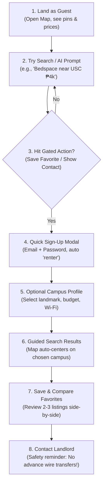

# AbangCebu AI — Renter Persona, Access Rights & Capabilities Specification

**Document Version:** 1.0.0  
**Status:** Approved / Active Specification  
**Jira Reference:** [SCRUM-61](https://abangcebuai.atlassian.net/browse/SCRUM-61)  
**Related Documents:**
- Role-Based Access Control (RBAC) Matrix: [`docs/security/rbac-matrix.md`](../security/rbac-matrix.md)
- Database ERD Architecture: [`docs/database/database-erd.md`](../database/database-erd.md)
- Users & Profiles Table Schema: [`docs/database/users-and-profiles-schema.md`](../database/users-and-profiles-schema.md)
- Row Level Security (RLS) Policies: [`docs/security/rls-policies.md`](../security/rls-policies.md)

---

## 1. Purpose and Source Basis

This document formally defines the **Renter** user persona (historically designated as the "Finder" in the early architecture documents) within **AbangCebu AI**. It specifies authorized renter capabilities, operational boundaries, explicitly denied actions, security enforcement tiers, and the guided onboarding flow for student and young professional property seekers in Metro Cebu.

Items marked `[Source]` originate from foundational system flow and technical architecture specifications. Items marked `[Proposed]` are design and UX specifications introduced to fulfill ticket requirements.

| Item | Status | Basis |
|---|---|---|
| **Finder / Renter Actor**, Map, Price Markers, Rental Cards | `[Source]` | System flow and MapLibre mapping specifications |
| **Conversational Search** (e.g., *"Find me a private room near Cebu IT Park under ₱5,000 with Wi-Fi"*) | `[Source]` | AI Architecture & LLM tool specification |
| **Geospatial Radius & Landmark Search** | `[Source]` | PostGIS spatial querying specification |
| **Read-Only AI Operation** (returns only approved records) | `[Source]` | AI Security & Safety specification |
| **Contact Info Protection** (authenticated gate) | `[Source]` | Privacy & Route Handler protection policy |
| **Favorites Management**, Student Onboarding Flow, In-App Safety Prompts | `[Proposed]` | Product experience & engagement requirements |

---

## 2. Renter Persona Profile

```
+--------------------------------------------------------------------------+
|  PERSONA: "Mika" - The Budget-Conscious Metro Cebu Student / Relocator   |
+--------------------------------------------------------------------------+
| Age: 20                                                                  |
| Occupation: 3rd-Year University Student / BPO Intern                     |
| Relocating To: Metro Cebu (Lahug / IT Park / Banilad / Urgello corridor) |
| Device: Android Smartphone (Primary), Mobile 4G/5G Data                  |
+--------------------------------------------------------------------------+
```

### 2.1 Goals & Motivations
- Locate safe, affordable, clean rental accommodations (private room or bedspace) within a predictable commute distance from campus or workplace.
- Stay strictly within monthly budget constraints (typically ₱3,500 – ₱7,000/month).
- Verify basic amenities in advance (high-speed Wi-Fi, submetered electricity/water, security gates, curfew flexibility).
- Connect directly with legitimate property owners without dealing with deceptive middlemen or duplicate spam listings.

### 2.2 Operational Context & Behaviors
- **Mobile-First Realities:** Searches predominantly on mobile devices, often while in transit or during breaks using mobile data. Demands fast load times and low asset payload.
- **Micro-Sessions:** Compares 3 to 5 candidate rentals in a single session; relies on saving favorites to review later.
- **Commute Sensitivity:** Estimates distance not just in kilometers, but in walking time or jeepney/bus route feasibility (e.g., proximity to 17B, 04L, or 13C routes).

### 2.3 Key Pain Points & Frustrations
- **Location Ambiguity:** Social media rental posts frequently list inaccurate or misleading pin locations (e.g., labeled "near IT Park" but actually 4km away in uphill Busay).
- **Outdated / Stale Listings:** Inquiring about properties only to find they were rented out weeks prior.
- **Hidden Utility Charges:** Surprise markups on electricity (₱20/kWh) or fixed water surcharges not declared upfront.
- **Deposit Scam Risks:** Bogus "landlords" demanding reservation downpayments before physical inspection.

### 2.4 Trust Builders in AbangCebu AI
- **Admin Verification:** Every listing undergoes admin verification before publication.
- **Map Accuracy:** Real coordinate pins with radius indicators.
- **AI Grounding:** AI recommendations strictly reference validated, live database listings.
- **Zero Premature Payments:** Prominent anti-scam warnings reminding renters never to send money prior to ocular visits.

---

## 3. Access Rights & Boundary Summary

A user assigned the `renter` role holds authenticated seeker privileges. Under the AbangCebu AI single-role-per-account architecture, a renter account cannot create or manage listings.

| Boundary Area | Renter Access Level & Rule |
|---|---|
| **Authentication** | Authenticated via Supabase Auth (`email` + `password`). Initial role defaults to `renter`. |
| **Public Routes** | `/`, `/map`, `/search`, `/listings/[id]` (approved and active listings only). |
| **Renter Routes** | `/renter/favorites`, `/account/profile`, `/account/preferences`. |
| **Restricted Routes** | `/landlord/*` and `/admin/*` return HTTP `403 Forbidden` with a dedicated unauthorized page. |
| **Auth Redirects** | Signed-in renters navigating to `/login` or `/register` are redirected to `/search` or `/renter/favorites`. |
| **Data Visibility** | Read access strictly limited to listings where `status = 'approved'` and `is_active = TRUE`. Drafts, pending reviews, and suspended records are inaccessible. |
| **User Data Isolation** | Renters can only read/update their own profile and favorites via Row Level Security (`auth.uid() = user_id`). |

---

## 4. Renter Capabilities & Permission Mapping

Renter permissions directly correlate with the master Role-Based Access Control matrix (`docs/rbac-matrix.md`).

| ID | Permission Token | Functional Capability | Technical Endpoint / Method |
|---|---|---|---|
| **P01** | `map:view` | Interactive Metro Cebu MapLibre canvas; render rental price pins, clustering, and viewport bounds. | `GET /api/listings?bounds=...` |
| **P02** | `listing:search` | Multi-parameter spatial search: radius around landmark/campus, price ceiling, room type, Wi-Fi/aircon tags. | `GET /api/listings?near=...&radius=...` |
| **P03** | `listing:read` | Detailed listing view: verified photo gallery, description, house rules, exact street coordinates, walking radius. | `GET /api/listings/[id]` |
| **P04** | `contact:read` | Reveal verified landlord contact number/messenger handle. **Gated to signed-in users only**. | `GET /api/listings/[id]/contact` |
| **P05** | `ai:chat` | Natural language conversational search via AI agent. Parses user constraints and returns matching listings. | `POST /api/ai/chat` |
| **P06** | `profile:read_own` | Inspect own profile data, contact details, preferred landmark, and budget preferences. | `GET /api/me` |
| **P07** | `profile:update_own`| Update display name, phone number, default campus/work landmark, and alert preferences. | `PATCH /api/me` |
| **P23** | `favorite:manage_own`| Add, view, and remove listings from private favorites list. Stored in `favorites` table. | `GET /api/me/favorites`<br>`POST /api/me/favorites`<br>`DELETE /api/me/favorites/[id]` |

### 4.1 Favorites Lifecycle Rules
- Renters can only favorite listings with status `approved`.
- If an approved listing is subsequently archived, paused, or suspended by admin/landlord, it remains linked in the database but is automatically filtered out from the renter's active `/renter/favorites` view.
- If the listing returns to `approved` and active status, it automatically reappears in the renter's favorites view.

---

## 5. AI Assistant Operational Guardrails for Renters

When a renter interacts with the conversational AI assistant (e.g., *"Find me a pet-friendly studio near USC Talamban under ₱6,000"*), execution conforms to the following strict boundaries:

1. **Read-Only Tool Execution:** The AI model converts natural language queries into deterministic JSON filter parameters and calls read-only internal search functions.
2. **No Direct Database Access:** The AI agent possesses zero database credentials and cannot write, modify, or delete any tables.
3. **Approved Inventory Only:** The AI search tool exclusively queries `status = 'approved' AND is_active = TRUE`. It cannot reveal unapproved, rejected, or hidden listings.
4. **No Direct Contact Info Disclosure in Chat:** The AI assistant does not emit raw phone numbers or email addresses in text responses. It directs the renter to the listing card's authenticated `Show Contact` button to ensure audit logging and rate limiting.
5. **No Autonomous State Mutation:** The AI assistant cannot favorite listings or submit inquiries without explicit user button confirmation in the UI.

---

## 6. Restricted Actions & Multi-Layer Enforcement

Any action not explicitly permitted is denied by default.

### 6.1 Denied Operations Matrix

| Functional Group | Denied Operation | Target Endpoint | Enforcement Mechanism |
|---|---|---|---|
| **Listings Management** | Create rental listings | `POST /api/listings` | HTTP 403 (`P08 listing:create` denied) |
| **Listings Modification** | Edit, archive, or delete listings | `PATCH/DELETE /api/listings/[id]` | HTTP 403 (`P10-P12` landlord ownership required) |
| **Media Uploads** | Upload or delete property photos | `POST /api/listings/[id]/photos` | HTTP 403 (`P13` restricted to listing owner) |
| **Availability** | Toggle listing occupancy status | `PUT /api/listings/[id]/availability` | HTTP 403 (`P14` landlord owner only) |
| **Landlord Area** | Access landlord dashboard | `/landlord/*` | Next.js Middleware route guard (HTTP 403) |
| **Moderation** | Approve, reject, or unpublish listings | `/api/admin/listings/*` | HTTP 403 (`P16-P18` admin role required) |
| **Admin Area** | Access administrative portal | `/admin/*` | Next.js Middleware route guard (HTTP 403) |
| **User Administration** | Alter roles or suspend accounts | `/api/admin/users/*` | HTTP 403 (`P19-P21` admin role required) |
| **Cross-Tenant Data** | View other users' profiles or favorites | `/api/me/*` | Supabase RLS isolation (`auth.uid() = user_id`) |

### 6.2 4-Tier Security Enforcement Model

```
+--------------------------------------------------------------------------+
| Tier 1: Next.js Middleware Edge Gate                                    |
| Intercepts route requests. Checks JWT cookie. If non-landlord visits     |
| /landlord/* or non-admin visits /admin/*, immediately halts with 403.    |
+--------------------------------------------------------------------------+
                                    |
                                    v
+--------------------------------------------------------------------------+
| Tier 2: Route Handler Authorization Guards                               |
| Server-side handler extracts Supabase session, checks user_role in DB,   |
| and validates specific permission tokens (P01-P23). Returns 403 JSON.    |
+--------------------------------------------------------------------------+
                                    |
                                    v
+--------------------------------------------------------------------------+
| Tier 3: Supabase Row Level Security (RLS)                                |
| Database-level policies enforce auth.uid() = user_id on profiles and     |
| favorites tables. Even if application code errs, DB guarantees isolation.|
+--------------------------------------------------------------------------+
                                    |
                                    v
+--------------------------------------------------------------------------+
| Tier 4: Read-Only AI Agent Sandboxing                                    |
| AI execution is sandboxed with strictly read-only tools and cannot       |
| perform mutation queries or access private user data.                     |
+--------------------------------------------------------------------------+
```

---

## 7. Onboarding Experience for Student Renters

The onboarding workflow is optimized for speed, clarity, and zero friction, allowing students to explore real listings before requiring account creation.



### 7.1 Detailed Step Walkthrough
1. **Explore as Guest:** Student arrives at AbangCebu AI. The interactive Metro Cebu map opens immediately with verified price pins. No sign-up wall.
2. **Execute First Search:** The student enters a campus landmark (e.g., "USC Talamban", "UC Banilad", "Cebu Doctors") or prompts the AI assistant.
3. **Trigger Gated Action:** When the user taps `Save to Favorites` or `Show Landlord Contact`, a lightweight modal informs them that a free seeker account is needed.
4. **Streamlined Registration:** Sign-up requires only email and password. The system assigns `role: renter` by default. No administrative roles are exposed.
5. **Quick Preference Onboarding (Skippable):** An optional 30-second screen lets the student set their primary campus/landmark and max monthly budget.
6. **Contextual Results:** The map recenters on the selected landmark with a default 2km radius circle, highlighting verified listings.
7. **Favorites Comparison:** The student saves 2–3 properties to `/renter/favorites` for side-by-side amenity comparison.
8. **Contact Landlord with Safety Advisory:** When tapping `Show Contact`, a prominent modal displays the landlord's verified phone/messenger handle alongside safety instructions: *"Always conduct a physical ocular visit. Never send GCash/bank deposits prior to viewing."*

---

## 8. Architectural Clarifications & Review Notes

### 8.1 Note on UI Screenshots (Sprint 1 Scope Boundary)
During review, clarification was requested regarding implementation screenshots:
- **Sprint 1 Boundary:** Sprint 1 is strictly dedicated to **Architecture, Specifications, Governance, and Data Schemas**. Under project rules, no premature feature UI or demo views are created in Sprint 1.
- **Wireframing Tickets:** Visual UI mockups and layout designs are handled under designated tickets:
  - `SCRUM-64`: Landing Page Wireframe
  - `SCRUM-65`: Login Page Wireframe
  - `SCRUM-66`: Registration Page Wireframe
  - `SCRUM-67`: User Dashboard Wireframe
  - `SCRUM-68`: Profile Page Wireframe
- **Conclusion:** A visual screenshot is **not applicable or required** for `SCRUM-61`. The complete deliverable is this formal specification and the companion document `docs/AbangCebu_Renter_Persona_and_Access_Rights.pdf`.

### 8.2 Confirmation of Proposed Assumptions
1. **Finder vs Renter:** "Finder" in early documents is formally standardized to `renter` across all database enums, schemas, and RBAC policies.
2. **Permission P23 (`favorite:manage_own`):** Formally adopted into the permissions catalog.
3. **Contact Action:** Contacting a landlord is implemented as revealing verified direct contact information (phone, messaging app handle) with safety logging, rather than heavy in-app real-time chat in Phase 1.
4. **Single-Role Model:** Users requiring both renter and landlord functions maintain distinct role profiles or separate accounts.
