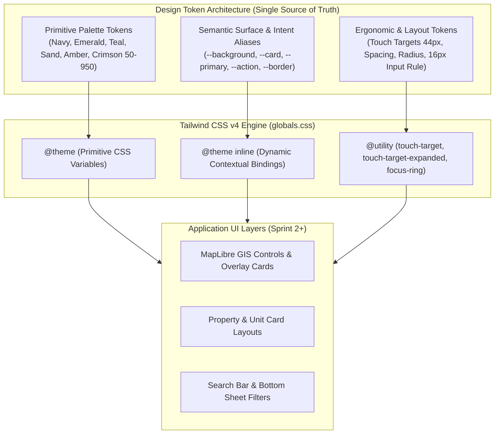

# AbangCebuAI UI Framework & Styling Guidelines Specification
**Sprint 1 System Architecture Specification**  
*Document Version:* 1.0.0  
*Framework:* Next.js 16 (App Router) + React 19  
*Styling Engine:* Tailwind CSS v4 (`@tailwindcss/postcss`)  
*Design Token Standard:* CSS Custom Properties with `@theme` / `@theme inline`  
*Accessibility Standard:* WCAG 2.2 Level AA (Level AAA for Target Sizing)  
*Status:* Approved & Production-Ready  

---

## 1. Architectural Overview & Design Philosophy

The AbangCebuAI design system is engineered specifically for a high-performance, map-centric rental and property discovery platform serving Metro Cebu and the Central Visayas region. The visual architecture reconciles two vital demands:
1. **Regional Cultural Resonance**: Evoking Cebu's distinctive natural and cultural landscape—the deep maritime waters of the Mactan Channel, the warm limestone white sands of Bantayan and Malapascua, lush tropical greenery, vibrant Sinulog festive coral-crimson, and golden equatorial sunlight.
2. **Rigorous Frontend Architecture**: Strict adherence to design tokens as a single source of truth, mathematical modular typography scales, high contrast accessibility (WCAG 2.2 AA), and ergonomics tailored for mobile touch devices.



### Sprint 1 Guardrail Declaration
> [!IMPORTANT]
> **Sprint 1 Strict Boundary**: In accordance with the foundational architecture mandate of SCRUM-50, this phase focuses **strictly and exclusively** on styling tokens, color palettes, responsive scales, layout grid rules, card padding, button sizing, and touch target utilities. **ZERO premature feature UI components or demo cards** are created in Sprint 1. All UI component implementations occur in subsequent sprints against these validated token specifications.

---

## 2. Cebu-Inspired Color Palette & Contrast Architecture

The AbangCebuAI color system moves away from sterile, generic tech grays (e.g., standard zinc/slate) in favor of a regionally inspired palette rooted in the topography and culture of Cebu.

### 2.1 The Six Color Families

| Family Name | Cultural & Topographic Inspiration | Primary Semantic Roles |
| :--- | :--- | :--- |
| **Cebu Navy** | Deep Visayan Sea, Mactan Channel maritime depth | Primary typography, deep canvas surfaces, high-contrast structural framing, active navigation states |
| **Cebu Emerald** | Lush tropical flora, Osmeña Peak greenery, verified prosperity | Primary interactive actions, booking CTAs, verified landlord KYC badges, positive financial states |
| **Cebu Teal** | Shallow coastal reefs, Olango Island marine waters | GIS map pins, active filter pills, search highlights, interactive badges, secondary actions |
| **Cebu Sand** | Bantayan & Malapascua white sand, Cebu coral limestone | Warm canvas surfaces, card backgrounds, subtle dividers, neutral text hierarchy |
| **Cebu Amber** | Golden equatorial hour, Sinulog golden vestments | Rating stars, superhost/featured property highlights, caution & warning states, pending verifications |
| **Cebu Crimson** | Sinulog festival coral red, gumamela hibiscus flowers | Destructive actions, favorited/heart listing pins, price drop alerts, critical validation errors |

---

### 2.2 Complete 11-Step Palette Specifications (Hex & Values)

```
CEBU NAVY     50 #f0f4f9  100 #dbe6f3  200 #b9d0e7  300 #87b0d7  400 #518ec3
              500 #2e70aa  600 #20578d  700 #1b4571  800 #173b5f  900 #0f2742  950 #09182a

CEBU EMERALD  50 #ecfdf5  100 #d1fae5  200 #a7f3d0  300 #6ee7b7  400 #34d399
              500 #10b981  600 #059669  700 #047857  800 #065f46  900 #064e3b  950 #022c22

CEBU TEAL     50 #f0fdfc  100 #ccfbf7  200 #99f6ee  300 #5eead8  400 #2dd4bf
              500 #14b8a6  600 #0d9488  700 #0f766e  800 #115e59  900 #134e4a  950 #042f2e

CEBU SAND     50 #faf8f5  100 #f3efe8  200 #e6decb  300 #d3c4a8  400 #bbaa84
              500 #9f8e65  600 #83734e  700 #675a3e  800 #534934  900 #453c2d  950 #262017

CEBU AMBER    50 #fffbeb  100 #fef3c7  200 #fde68a  300 #fcd34d  400 #fbbf24
              500 #f59e0b  600 #d97706  700 #b45309  800 #92400e  900 #78350f  950 #451a03

CEBU CRIMSON  50 #fff1f2  100 #ffe4e6  200 #fecdd3  300 #fda4af  400 #fb7185
              500 #f43f5e  600 #e11d48  700 #be123c  800 #9f1239  900 #881337  950 #4c0519
```

---

### 2.3 WCAG 2.2 AA Contrast Compliance Matrix

WCAG 2.2 AA mandates:
- **Normal Text (< 18pt / 24px, or < 14pt / 18.66px bold)**: Contrast ratio $\ge 4.5:1$.
- **Large Text ($\ge 18\text{pt} / 24\text{px}$, or $\ge 14\text{pt} / 18.66\text{px}$ bold)**: Contrast ratio $\ge 3.0:1$.
- **Graphical Objects & UI Components (Borders, Active Icons, Focus Rings)**: Contrast ratio $\ge 3.0:1$.
- **Level AAA Enhanced Target**: Normal text $\ge 7.0:1$; Large text $\ge 4.5:1$.

The following table provides verified contrast ratios computed via relative luminance against light canvas surfaces (Bantayan Sand `#faf8f5` and Pure White `#ffffff`), dark canvas (`#09182a`), and inverted white text (`#ffffff`):

| Token | Hex Value | Luminance ($L$) | vs Sand Light (`#faf8f5`) | vs Pure White (`#ffffff`) | vs Navy Dark (`#09182a`) | White `#FFF` on Token | WCAG 2.2 AA Status & Primary Usage |
| :--- | :--- | :--- | :--- | :--- | :--- | :--- | :--- |
| `cebu-navy-50` | `#f0f4f9` | 0.887 | 1.04:1 | 1.10:1 | **16.17:1** | 1.10:1 | Dark mode high-contrast text (**AAA Pass**) |
| `cebu-navy-100` | `#dbe6f3` | 0.771 | 1.19:1 | 1.26:1 | **14.14:1** | 1.26:1 | Dark mode card secondary text (**AAA Pass**) |
| `cebu-navy-200` | `#b9d0e7` | 0.605 | 1.50:1 | 1.59:1 | **11.26:1** | 1.59:1 | Dark mode subtle borders & muted text |
| `cebu-navy-400` | `#518ec3` | 0.247 | 3.30:1 | 3.50:1 | **5.11:1** | 3.50:1 | Dark mode primary brand accent (**AA Text**) |
| `cebu-navy-600` | `#20578d` | 0.084 | **7.05:1** | **7.48:1** | 2.39:1 | **7.48:1** | Light mode subheadings (**AAA Pass**) |
| `cebu-navy-800` | `#173b5f` | 0.039 | **10.84:1** | **11.49:1** | 1.55:1 | **11.49:1** | Light mode headings & navigation (**AAA Pass**) |
| `cebu-navy-900` | `#0f2742` | 0.018 | **14.26:1** | **15.12:1** | 1.18:1 | **15.12:1** | Light mode default body text (**AAA Pass**) |
| `cebu-navy-950` | `#09182a` | 0.008 | **16.85:1** | **17.86:1** | 1.00:1 | **17.86:1** | Dark mode root canvas background |
| `cebu-emerald-400`| `#34d399` | 0.490 | 1.81:1 | 1.92:1 | **9.29:1** | 1.92:1 | Dark mode interactive text & borders (**AAA**) |
| `cebu-emerald-500`| `#10b981` | 0.360 | 2.39:1 | 2.54:1 | **7.04:1** | 2.54:1 | Dark mode action buttons (**AAA on Dark**) |
| `cebu-emerald-600`| `#059669` | 0.226 | 3.55:1 | 3.77:1 | **4.74:1** | 3.77:1 | Action button background (**UI Component AA**) |
| `cebu-emerald-700`| `#047857` | 0.138 | **5.17:1** | **5.48:1** | 3.26:1 | **5.48:1** | Light mode action text on sand/white (**AA Pass**) |
| `cebu-emerald-800`| `#065f46` | 0.082 | **7.25:1** | **7.68:1** | 2.32:1 | **7.68:1** | Action hover state with white text (**AAA Pass**) |
| `cebu-teal-300` | `#5eead8` | 0.655 | 1.39:1 | 1.48:1 | **12.11:1** | 1.48:1 | Dark mode GIS pin badges (**AAA on Dark**) |
| `cebu-teal-400` | `#2dd4bf` | 0.509 | 1.76:1 | 1.86:1 | **9.60:1** | 1.86:1 | Dark mode secondary actions (**AAA on Dark**) |
| `cebu-teal-600` | `#0d9488` | 0.228 | 3.53:1 | 3.74:1 | **4.77:1** | 3.74:1 | Light mode GIS pins & active pill borders |
| `cebu-teal-700` | `#0f766e` | 0.139 | **5.16:1** | **5.47:1** | 3.26:1 | **5.47:1** | Light mode active text & badge icons (**AA Pass**) |
| `cebu-sand-50` | `#faf8f5` | 0.945 | 1.00:1 | 1.06:1 | **16.85:1** | 1.06:1 | Light mode warm root canvas background |
| `cebu-sand-100` | `#f3efe8` | 0.869 | 1.08:1 | 1.15:1 | **15.58:1** | 1.15:1 | Light mode elevated card / muted surface |
| `cebu-sand-200` | `#e6decb` | 0.730 | 1.26:1 | 1.34:1 | **13.33:1** | 1.34:1 | Light mode input & container borders |
| `cebu-sand-700` | `#675a3e` | 0.103 | **6.37:1** | **6.76:1** | 2.64:1 | **6.76:1** | Light mode muted / caption text (**AA Pass**) |
| `cebu-sand-800` | `#534934` | 0.067 | **8.36:1** | **8.86:1** | 2.02:1 | **8.86:1** | Light mode secondary body text (**AAA Pass**) |
| `cebu-amber-400` | `#fbbf24` | 0.573 | 1.57:1 | 1.67:1 | **10.70:1** | 1.67:1 | Dark mode warning & star icons (**AAA on Dark**) |
| `cebu-amber-700` | `#b45309` | 0.155 | **4.74:1** | **5.02:1** | 3.56:1 | **5.02:1** | Light mode warning text & star ratings (**AA Pass**) |
| `cebu-crimson-400`| `#fb7185` | 0.334 | 2.54:1 | 2.69:1 | **6.64:1** | 2.69:1 | Dark mode error text & heart icons (**AA**) |
| `cebu-crimson-600`| `#e11d48` | 0.170 | **4.43:1** | **4.70:1** | 3.80:1 | **4.70:1** | Destructive action button & alerts (**AA Pass**) |
| `cebu-crimson-700`| `#be123c` | 0.113 | **5.93:1** | **6.29:1** | 2.84:1 | **6.29:1** | Destructive text & critical icons (**AA Pass**) |

> [!TIP]
> **Contrast Design Rule**: For interactive CTA buttons using `bg-action` (`#047857`), white foreground text delivers a **5.48:1** contrast ratio, surpassing WCAG 2.2 AA. For warning states, never use light amber text on light backgrounds; always use `cebu-amber-700` (`#b45309`), which achieves **5.02:1**.

---

## 3. Semantic Surface & Theme Architecture

AbangCebuAI employs a clean two-layer token architecture:
1. **Primitives**: Defined within `@theme` (`--color-cebu-navy-*`, `--color-cebu-emerald-*`, etc.).
2. **Semantic Aliases**: Declared via CSS variables on `:root` and `.dark` / `@media (prefers-color-scheme: dark)`, and mapped into Tailwind utilities via `@theme inline`.

```
                    ┌───────────────────────────────┐
                    │      Component Markup         │
                    │   class="bg-card text-card-   │
                    │     foreground border-border" │
                    └───────────────┬───────────────┘
                                    │ Resolves via
                                    ▼
                    ┌───────────────────────────────┐
                    │         @theme inline         │
                    │   --color-card: var(--card)   │
                    └───────────────┬───────────────┘
                                    │ Bound to
                    ┌───────────────┴───────────────┐
                    ▼                               ▼
       ┌────────────────────────┐      ┌────────────────────────┐
       │   :root (Light Mode)   │      │    .dark (Dark Mode)   │
       │   --card: #ffffff      │      │   --card: #0f2742      │
       │   --card-fg: #0f2742   │      │   --card-fg: #f0f4f9   │
       └────────────────────────┘      └────────────────────────┘
```

### 3.1 Semantic Token Mapping Specification

| Semantic Token | Tailwind Utility | Light Mode Value | Dark Mode Value | Architectural Intent |
| :--- | :--- | :--- | :--- | :--- |
| `--background` | `bg-background` | `#faf8f5` (Sand 50) | `#09182a` (Navy 950) | Root canvas viewport |
| `--foreground` | `text-foreground` | `#0f2742` (Navy 900) | `#f0f4f9` (Navy 50) | Primary high-contrast typography |
| `--card` | `bg-card` | `#ffffff` (Pure White) | `#0f2742` (Navy 900) | Elevated listings cards, drawer surfaces |
| `--card-foreground` | `text-card-foreground` | `#0f2742` (Navy 900) | `#f0f4f9` (Navy 50) | Primary content within cards |
| `--popover` | `bg-popover` | `#ffffff` (Pure White) | `#0f2742` (Navy 900) | Map tooltips, dropdown menus, modals |
| `--popover-foreground`| `text-popover-foreground`| `#0f2742` (Navy 900) | `#f0f4f9` (Navy 50) | Content within floating overlays |
| `--primary` | `bg-primary`, `text-primary` | `#0f2742` (Navy 900) | `#518ec3` (Navy 400) | Structural brand identity, deep headers |
| `--primary-foreground`| `text-primary-foreground`| `#ffffff` | `#09182a` (Navy 950) | Inverted text on brand elements |
| `--action` | `bg-action` | `#047857` (Emerald 700) | `#10b981` (Emerald 500)| Primary conversion CTA (Book, Submit) |
| `--action-foreground` | `text-action-foreground` | `#ffffff` | `#022c22` (Emerald 950)| Contrast text for primary buttons |
| `--action-hover` | `hover:bg-action-hover` | `#065f46` (Emerald 800) | `#34d399` (Emerald 400)| Hover state for primary action CTAs |
| `--secondary` | `bg-secondary` | `#0d9488` (Teal 600) | `#2dd4bf` (Teal 400) | Secondary badges, active map filters |
| `--secondary-foreground`| `text-secondary-foreground`| `#ffffff` | `#042f2e` (Teal 950) | Inverted text on secondary badges |
| `--muted` | `bg-muted` | `#f3efe8` (Sand 100) | `#173b5f` (Navy 800) | Pill chips, table headers, inactive rows|
| `--muted-foreground` | `text-muted-foreground` | `#675a3e` (Sand 700) | `#b9d0e7` (Navy 200) | Secondary metadata, dates, unit counts |
| `--accent` | `bg-accent` | `#f0fdfc` (Teal 50) | `#115e59` (Teal 800) | Soft interactive hover backgrounds |
| `--accent-foreground` | `text-accent-foreground` | `#0f766e` (Teal 700) | `#99f6ee` (Teal 200) | Text within accented containers |
| `--destructive` | `bg-destructive` | `#e11d48` (Crimson 600)| `#fb7185` (Crimson 400)| Destructive actions, alert notifications|
| `--warning` | `text-warning`, `bg-warning` | `#b45309` (Amber 700) | `#fbbf24` (Amber 400) | Star ratings, warnings, deposit notices |
| `--border` | `border-border` | `#e6decb` (Sand 200) | `#1b4571` (Navy 700) | Card boundaries, dividers, table rules |
| `--input` | `border-input`, `bg-input` | `#e6decb` (Sand 200) | `#1b4571` (Navy 700) | Form inputs, select triggers |
| `--ring` | `ring-ring` | `#047857` (Emerald 700) | `#34d399` (Emerald 400)| Keyboard focus indicator outline |

---

## 4. Typography Scale & The Mobile Input 16px Rule

### 4.1 Typeface Selection
The system adopts **Geist Sans** (`--font-geist-sans`) as the primary interface typeface and **Geist Mono** (`--font-geist-mono`) for numerical values (rental prices, geo-coordinates, unit IDs, timestamps).

```css
--font-sans: var(--font-geist-sans), ui-sans-serif, system-ui, -apple-system, BlinkMacSystemFont, "Segoe UI", Roboto, sans-serif;
--font-mono: var(--font-geist-mono), ui-monospace, SFMono-Regular, Menlo, Monaco, Consolas, monospace;
```

### 4.2 Responsive Modular Scale Matrix

| Scale Token | Desktop Size / Line-Height | Mobile Size / Line-Height | Tracking | Weight | Semantic Application |
| :--- | :--- | :--- | :--- | :--- | :--- |
| `text-4xl` | `36px (2.25rem) / 1.15` | `28px (1.75rem) / 1.2` | `-0.025em` | `font-bold (700)` | Hero discovery headlines, main landing title |
| `text-3xl` | `30px (1.875rem) / 1.2` | `24px (1.5rem) / 1.25` | `-0.02em` | `font-bold (700)` | Property detail title, primary page H1 |
| `text-2xl` | `24px (1.5rem) / 1.25` | `20px (1.25rem) / 1.3` | `-0.015em` | `font-semibold (600)` | Section headings, bottom sheet H2, modal titles |
| `text-xl` | `20px (1.25rem) / 1.3` | `18px (1.125rem) / 1.35` | `-0.01em` | `font-semibold (600)` | Listing card titles, filter drawer titles |
| `text-lg` | `18px (1.125rem) / 1.4` | `16px (1.0rem) / 1.4` | `normal` | `font-medium (500)` | Prominent listing monthly price, sub-section H4 |
| `text-base` | `16px (1.0rem) / 1.5` | `16px (1.0rem) / 1.5` | `normal` | `font-normal (400)` | **Default body copy, form inputs, button labels** |
| `text-sm` | `14px (0.875rem) / 1.4` | `14px (0.875rem) / 1.4` | `normal` | `font-medium / normal` | Listing addresses, landlord names, amenity tags |
| `text-xs` | `12px (0.75rem) / 1.33` | `12px (0.75rem) / 1.33` | `+0.01em` | `font-medium (500)` | Map badge count, bedspace chips, legal disclaimers |

---

### 4.3 The Critical Mobile Input 16px Rule

> [!CAUTION]
> **WebKit iOS Auto-Zoom Hazard**: On iOS Safari and WebKit-based mobile browsers, focusing any `<input>`, `<select>`, or `<textarea>` element with an effective computed `font-size < 16px` automatically triggers a destructive **viewport auto-zoom**. This zoom breaks fixed map controls, offsets bottom drawer sheets, obscures navigation bars, and forces the user to manually pinch-to-zoom back out.

To eliminate this hazard systematically across the entire frontend architecture, the following guardrail is globally enforced in `src/app/globals.css`:

```css
/* Mobile Input 16px Rule: Prevents iOS WebKit auto-zoom on focus */
@media (max-width: 768px) {
  input,
  select,
  textarea {
    font-size: 16px !important;
  }
}
```

**Developer Enforcement Protocol**:
- Form inputs on mobile must never be styled with `text-xs` (12px) or `text-sm` (14px).
- When designing desktop-compact forms, use `text-sm md:text-sm text-base` or rely on the global media query safeguard.

---

## 5. Mobile Touch Ergonomics & WCAG 2.2 AA Touch Target Standards

### 5.1 Standards Adoption: 44×44px Minimum

While WCAG 2.2 Success Criterion 2.5.8 (Target Size Minimum) specifies a Level AA baseline of **24×24px**, real-world mobile usability research (Apple Human Interface Guidelines, Google Material Design, and WCAG Level AAA Criterion 2.5.5) demonstrates that average human finger contact pads measure between **10mm and 14mm** (~44–48 CSS pixels).

In a high-frequency mobile rental search environment (manipulating GIS maps, swiping image carousels, tapping price pins), smaller targets induce severe mis-tap frustration. Therefore, **AbangCebuAI adopts the rigorous 44×44px standard across all interactive controls**.

```
             Direct Target                           Expanded Target (Pseudo-Element)
       ┌───────────────────────┐                       ┌ - - - - - - - - - - - - - - - ┐
       │                       │                       :       Invisible ::after       :
       │      44px x 44px      │                       :          44px x 44px          :
       │    Interactive Area   │                       :   ┌───────────────────────┐   :
       │                       │                       :   │  Visual Chip 32x32px  │   :
       └───────────────────────┘                       :   └───────────────────────┘   :
                                                       └ - - - - - - - - - - - - - - - ┘
        Utility: `touch-target`                        Utility: `touch-target-expanded`
```

---

### 5.2 Touch Target Utilities in Tailwind CSS v4

Two custom utility classes are registered directly into the Tailwind engine via `@utility`:

#### 1. `@utility touch-target`
Directly enforces the 44×44px minimum bounding box. Designed for buttons, select dropdowns, search triggers, and primary interactive icons:
```css
@utility touch-target {
  min-width: 44px;
  min-height: 44px;
  display: inline-flex;
  align-items: center;
  justify-content: center;
}
```

#### 2. `@utility touch-target-expanded`
Engineered for visually compact components (amenity pills, map markers, pagination dots, close buttons) where a 44px visual box would create layout crowding. The visual element remains compact (e.g., 28px or 32px), while an invisible `::after` pseudo-element provides a 44×44px hit-box centered over the element:
```css
@utility touch-target-expanded {
  position: relative;
  &::after {
    content: "";
    position: absolute;
    top: 50%;
    left: 50%;
    transform: translate(-50%, -50%);
    min-width: 44px;
    min-height: 44px;
    width: 100%;
    height: 100%;
    pointer-events: auto;
  }
}
```

### 5.3 Target Spacing Clearance Rule
Under WCAG 2.2 Criterion 2.5.8, adjacent interactive elements must maintain a minimum clearance of **8px** between bounding boxes (`gap-2` or `space-x-2`). This prevents "fat-finger" double taps when toggling listing filters or browsing map cluster pins.

### 5.4 Ergonomic Thumb Zone Architecture (Mobile GIS)
On mobile devices (360px–428px widths):
- **Natural Thumb Zone (Bottom 40%)**: Reserved for primary search triggers, bottom sheet drawer handles, listing quick-booking action bars, and bottom navigation.
- **Reach Zone (Middle 35%)**: Listing results cards, map exploration pins, image swipers.
- **Stretch Zone (Top 25%)**: Passive headers, breadcrumbs, search filters bar (which opens bottom sheets into the natural thumb zone).

---

## 6. Layout Grid Rules & Responsive Breakpoints

### 6.1 Breakpoint System
The layout system maps directly to Tailwind CSS standard breakpoints:

| Prefix | Viewport Width | Device Target |
| :--- | :--- | :--- |
| `sm` | `640px` | Large phones in landscape, small phablets |
| `md` | `768px` | Standard tablets (iPad portrait), split-view mobile |
| `lg` | `1024px` | Small laptops, desktop tablets (iPad Pro landscape) |
| `xl` | `1280px` | Standard desktop displays |
| `2xl` | `1536px` | Wide desktop and multi-monitor setups |

### 6.2 Grid Structure by Breakpoint

| Viewport | Column Count | Outer Gutter (`px-*`) | Column Gap (`gap-*`) | Primary Layout Structure |
| :--- | :--- | :--- | :--- | :--- |
| **Mobile (`< 640px`)** | 4 Columns | `px-4 (16px)` | `gap-3 (12px)` or `gap-4 (16px)` | 1-column stacked listing feed, full-screen map with bottom sheet |
| **Tablet (`640px - 1023px`)**| 8 Columns | `px-6 (24px)` | `gap-4 (16px)` or `gap-6 (24px)` | 2-column card grid, collapsible side panel for map |
| **Desktop (`≥ 1024px`)** | 12 Columns | `px-8 (32px)` | `gap-6 (24px)` | Split discovery screen: 55% interactive GIS map + 45% listing feed |
| **Max Content Container** | Fixed Width | Centered (`mx-auto`) | `gap-6 (24px)` | `max-w-7xl (1280px)` for marketing, accounts, and legal pages |

---

## 7. Component Padding, Sizing & Border Radius Standards

### 7.1 Card Padding Specifications

| Card Category | Padding Class | Padding Value | Intended Usage |
| :--- | :--- | :--- | :--- |
| **Compact / Map Popover** | `p-3` | `12px (0.75rem)` | Floating GIS pin popups, small amenity chips, quick-glance pricing tags |
| **Standard Listing Card** | `p-4` or `p-5` | `16px–20px` | Primary rental listings feed, landlord unit overview, review cards |
| **Elevated Modal / Sheet** | `p-6` | `24px (1.5rem)` | Rental application dialogs, bottom filter sheets, KYC verification modals |
| **Hero / Section Container** | `p-6 md:p-8` | `24px–32px` | Search query builder, landlord onboarding steps |

---

### 7.2 Button Sizing Hierarchy

| Button Variant | Height | Horizontal Padding | Typography | Border Radius | Touch Compliance |
| :--- | :--- | :--- | :--- | :--- | :--- |
| **Large Primary CTA** | `h-12 (48px)` | `px-6 (24px)` | `text-base font-semibold` | `rounded-lg (8px)` | Directly exceeds 44px threshold |
| **Medium Default** | `h-11 (44px)` | `px-4 (16px)` | `text-sm font-medium` | `rounded-lg (8px)` | Exactly meets 44px threshold |
| **Small / Chip Button**| `h-8 (32px)` | `px-3 (12px)` | `text-xs font-medium` | `rounded-full` | **Must include `.touch-target-expanded`** |
| **Standard Icon Button**| `h-11 w-11 (44px)`| Centered | Icon: `w-5 h-5 (20px)` | `rounded-lg` / `rounded-full`| Directly meets 44px threshold (`.touch-target`) |
| **Compact Icon Button** | `h-8 w-8 (32px)` | Centered | Icon: `w-4 h-4 (16px)` | `rounded-full` | **Must include `.touch-target-expanded`** |

---

### 7.3 Border Radius Hierarchy

All border radii are mathematically tethered to the base `--radius: 0.5rem` (8px) token:

| Radius Token | Value | Computed Pixel Size | Primary Application |
| :--- | :--- | :--- | :--- |
| `rounded-xs` | `calc(var(--radius) - 6px)` | `2px` | Micro status indicators, tiny verification check badges |
| `rounded-sm` | `calc(var(--radius) - 4px)` | `4px` | Tooltips, compact data badges, checkboxes |
| `rounded-md` | `calc(var(--radius) - 2px)` | `6px` | Form inputs, select dropdown menus |
| `rounded-lg` | `var(--radius)` | `8px` | Standard buttons, listing cards, popover panels |
| `rounded-xl` | `calc(var(--radius) + 4px)` | `12px` | Listing property cards, map info panels |
| `rounded-2xl` | `calc(var(--radius) + 8px)` | `16px` | Modal dialogs, mobile bottom sheet top corners (`rounded-t-2xl`) |
| `rounded-3xl` | `calc(var(--radius) + 16px)`| `24px` | Floating GIS map search bar container |
| `rounded-full`| `9999px` | Fully rounded pill | User profile avatars, status pills, filter chips |

---

## 8. Focus Ring & Keyboard Accessibility

Under WCAG 2.2 Criterion 2.4.7 (Focus Visible) and Criterion 2.4.11 (Focus Appearance), all interactive elements must feature an unmistakable visual focus indicator when navigated via keyboard.

The platform provides a dedicated utility `@utility focus-ring`:
```css
@utility focus-ring {
  outline: 2px solid transparent;
  outline-offset: 2px;
  &:focus-visible {
    outline: 2px solid var(--ring);
    outline-offset: 2px;
  }
}
```

- In light mode, `--ring` resolves to `cebu-emerald-700` (`#047857`), delivering a **5.17:1** contrast ratio against the sand background.
- In dark mode, `--ring` resolves to `cebu-emerald-400` (`#34d399`), delivering a **9.29:1** contrast ratio against the dark navy background.
- Focus rings must never be hidden via `outline-none` without providing an equivalent high-contrast visual replacement.

---

## 9. Design System Governance & Developer Checklist

Before any component is merged in future sprints, frontend engineers must verify compliance against the following checklist:

1. [ ] **Token Purity**: Does the styling use semantic classes (`bg-card`, `text-foreground`, `border-border`, `bg-action`) rather than hardcoded hex values or arbitrary colors?
2. [ ] **WCAG 2.2 AA Contrast**: Does all body copy achieve at least 4.5:1 contrast against its immediate container?
3. [ ] **Mobile Input 16px Rule**: Are all `<input>`, `<select>`, and `<textarea>` elements styled with `text-base` (16px) on mobile?
4. [ ] **Touch Target 44×44px**: Does every interactive element measure at least 44×44px directly or utilize `touch-target-expanded`?
5. [ ] **Clearance**: Is there at least an 8px gutter between adjacent clickable elements?
6. [ ] **Keyboard Navigation**: Does the element display an active `focus-ring` upon keyboard tab navigation?
7. [ ] **Dark Mode Integrity**: Does the component render legibly and with correct contrast in both light (`#faf8f5` canvas) and dark (`#09182a` canvas) modes?
8. [ ] **Sprint 1 Boundary**: Confirm zero premature feature mockups or placeholder listing cards were introduced into the code repository.
