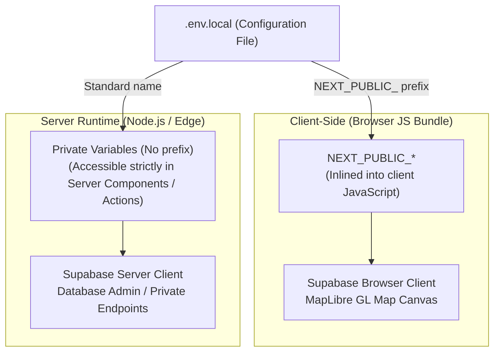

# AbangCebuAI Environment Variables & Secrets Governance Plan

## 1. Core Architectural Boundary: Client vs. Server Variables

Next.js employs a strict build-time separation between variables exposed to browser JavaScript and variables kept confidential on the server runtime.



| Scope | Prefix Rule | Runtime Visibility | Security Level |
| :--- | :--- | :--- | :--- |
| **Client-Exposed** | Must begin with `NEXT_PUBLIC_` | Inlined into browser JS bundles during build | **Public / Non-sensitive only**. Protected by Supabase Row Level Security (RLS). |
| **Server-Only** | **Never** prefix with `NEXT_PUBLIC_` | Accessible only in Node.js server runtime, Server Actions, Route Handlers | **Strict Confidential**. Bypass RLS, manage database migrations. |

---

## 2. Zero-Leak Security Policy

To prevent catastrophic leaks of database master credentials or private API keys:

### Rule 1: The Service Role Rule
* `SUPABASE_SERVICE_ROLE_KEY` bypasses all Row Level Security (RLS) policies.
* **NEVER** prefix this key with `NEXT_PUBLIC_`.
* **NEVER** import or reference this key inside any file marked with `'use client'`.

### Rule 2: Git Quarantine Policy
The following files are strictly quarantined in `.gitignore` and must never be committed to GitHub:
```gitignore
# Local Environment Overrides (Strictly Ignored)
.env*.local
.env
.env.production
*.jira*
.jira*

# Permitted in Git (Templates Only)
!.env.example
```

### Rule 3: Automated Pre-Commit & PR Verification
Before submitting a Pull Request, every developer must verify their git diff:
```bash
# Check staged changes for accidental secrets
git diff --staged | grep -iE "key|secret|password|token"
```
The repository's `.github/pull_request_template.md` includes a mandatory sign-off:
`- [ ] No Secrets Exposed: Diff does not contain API keys, private service keys, or .env files.`

---

## 3. Environment Variable Catalog

| Variable Name | Required | Scope | Description & Purpose | Example |
| :--- | :--- | :--- | :--- | :--- |
| `NEXT_PUBLIC_SUPABASE_URL` | **Yes** | Client & Server | The public HTTPS endpoint for the Supabase project. | `https://xyzproject.supabase.co` |
| `NEXT_PUBLIC_SUPABASE_ANON_KEY` | **Yes** | Client & Server | Public anonymous API key. Safe for browser exposure; restricted by Supabase RLS. | `eyJhbGciOi...` |
| `SUPABASE_SERVICE_ROLE_KEY` | Optional (Admin) | **Server-Only** | Admin master key. Bypasses RLS. Used exclusively for administrative scripts or server webhooks. | `eyJhbGciOi...` |
| `NEXT_PUBLIC_MAP_STYLE_URL` | **Yes** | Client | URL or path to the MapLibre style JSON specification. Defaults to local OpenStreetMap tiles. | `/styles/osm.json` |

---

## 4. Local Environment Setup Guide for Developers

Follow these 4 steps to configure your local machine:

### Step 1: Copy the Template
Inside `/abang-cebu-ai`, create your local environment file:
```bash
cp .env.example .env.local
```

### Step 2: Retrieve Credentials from Supabase Dashboard
1. Log in to **[Supabase Dashboard](https://supabase.com/dashboard)**.
2. Select the `AbangCebuAI` project.
3. Navigate to: **Project Settings ➔ API**.
4. Copy:
   * **Project URL** ➔ Paste into `NEXT_PUBLIC_SUPABASE_URL`
   * **`anon` `public` key** ➔ Paste into `NEXT_PUBLIC_SUPABASE_ANON_KEY`

### Step 3: Populate `.env.local`
Your `.env.local` should look like this:
```env
NEXT_PUBLIC_SUPABASE_URL=https://your-project.supabase.co
NEXT_PUBLIC_SUPABASE_ANON_KEY=eyJhbGciOi...
NEXT_PUBLIC_MAP_STYLE_URL=/styles/osm.json
```

### Step 4: Verify Local Startup
Start the Next.js development server:
```bash
pnpm dev --turbopack
```
Next.js will log: `Loaded env from /.../.env.local`.

---

## 5. Incident Response & Secret Rotation Plan
If an API key or service role key is accidentally committed or leaked to GitHub:
1. **Immediate Revocation**: Go to Supabase Dashboard ➔ **Project Settings ➔ API** ➔ Click **Rotate anon key** or **Rotate service role key**.
2. **Purge Git History**: If committed to a remote branch, notify the Team Lead (@hermarDev) immediately to rewrite branch history using `git filter-repo` or BFG Repo-Cleaner.
3. **Notify Team**: Post a notice in the team channel so all members update their `.env.local` with the new keys.
