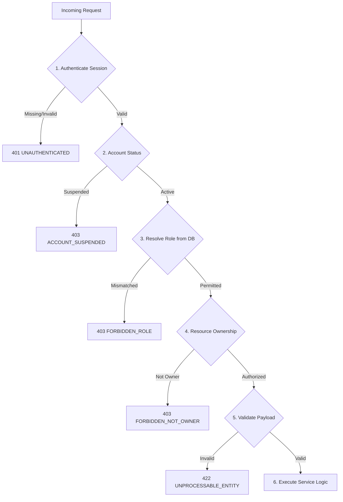

# Role-Based Access Control (RBAC) Permission Matrix
**Abang Cebu AI — Sprint 1 Architecture Specification**
*Author: Joan Marie Encallado Inting*  
*Reviewed & Audited by: Hermar Centillas (Lead / Scrum Master)*  
*Jira Reference: [SCRUM-63](https://abangcebuai.atlassian.net/browse/SCRUM-63)*

---

## 1. Actors & Roles

The platform defines three authenticated actors plus unauthenticated public visitors:

| Role | Identity / Token Claim | Description |
|---|---|---|
| **Public Guest** | No session (`anon`) | Browses approved rentals, view public Metro Cebu map, and uses rate-limited AI search. |
| **Renter** | `role = 'renter'` (Finder) | Searches rentals, views verified landlord contact details, manages saved favorites and profile. |
| **Landlord** | `role = 'landlord'` | Manages own properties, units, rental photos, availability, and responds to inquiries. |
| **Admin** | `role = 'admin'` | Moderates listings (approve/reject/unpublish), manages users, enforces platform anti-scam trust. |

> [!NOTE]
> The authoritative user role is stored in the Supabase PostgreSQL `profiles` table. Admin accounts are provisioned via database seed or invited by an existing administrator—never through public self-registration.

---

## 2. Action vs. Role Matrix

**Legend:**
- **Allow**: Unrestricted action.
- **Deny**: Action blocked (HTTP 403 Forbidden).
- **Cond.**: Conditional action (see criteria notes).

### A. Discovery & Search
| Action | Guest | Renter | Landlord | Admin |
|---|:---:|:---:|:---:|:---:|
| View landing page & Metro Cebu MapLibre map | Allow | Allow | Allow | Allow |
| View approved rental listings (markers, cards, prices) | Allow | Allow | Allow | Allow |
| View approved listing details & photos | Allow | Allow | Allow | Allow |
| Geospatial search by radius, landmark, or map bounds (PostGIS) | Allow | Allow | Allow | Allow |
| View landlord contact information (phone, email) | **Deny** | **Allow** | Cond. (own) | **Allow** |
| Query AI rental assistant (search tools only) | Cond. (rate-limited) | Allow | Allow | Allow |

> [!IMPORTANT]
> **Anti-Scam / Anti-Scraping Protection**: Landlord direct contact details are strictly hidden from Public Guests to prevent web-scraping bots and untrusted solicitation. Renters must authenticate to view direct contact info.

### B. Account & Profile
| Action | Guest | Renter | Landlord | Admin |
|---|:---:|:---:|:---:|:---:|
| Register / Log in | Allow | Cond. (redirect if logged in) | Cond. (redirect if logged in) | Cond. (redirect if logged in) |
| View & edit own profile | Deny | Allow | Allow | Allow |
| Log out | Deny | Allow | Allow | Allow |

### C. Listing Management
| Action | Guest | Renter | Landlord | Admin |
|---|:---:|:---:|:---:|:---:|
| Create listing (initial status = `pending`) | Deny | Deny | **Allow** | Deny |
| View own listings in any status (`pending`, `approved`, `rejected`) | Deny | Deny | Cond. (`landlord_id = auth.uid()`) | Allow |
| Edit listing details | Deny | Deny | Cond. (own) | Allow |
| Upload or remove property photos | Deny | Deny | Cond. (own) | Allow |
| Update listing availability | Deny | Deny | Cond. (own) | Allow |
| Delete or archive listing | Deny | Deny | Cond. (own) | Allow |
| Submit listing for admin approval | Deny | Deny | Cond. (own) | Deny |

### D. Platform Administration & Moderation
| Action | Guest | Renter | Landlord | Admin |
|---|:---:|:---:|:---:|:---:|
| View all listings (any status across platform) | Deny | Deny | Deny | **Allow** |
| Approve or reject pending listing | Deny | Deny | Deny | **Allow** |
| Unpublish / moderate flagged listing | Deny | Deny | Deny | **Allow** |
| View global user directory | Deny | Deny | Deny | **Allow** |
| Change user role | Deny | Deny | Deny | **Allow** |
| Suspend or reactivate user account | Deny | Deny | Deny | **Allow** |
| Access Admin Dashboard (`/admin/*`) | Deny | Deny | Deny | **Allow** |

### E. AI Assistant Restrictions (Universal Boundary)
| Action | Guest | Renter | Landlord | Admin |
|---|:---:|:---:|:---:|:---:|
| AI calls rental-search tools (`approved` listings only) | Allow | Allow | Allow | Allow |
| AI direct database access / raw SQL execution | **Deny** | **Deny** | **Deny** | **Deny** |
| AI create, edit, approve, or delete listings | **Deny** | **Deny** | **Deny** | **Deny** |
| AI access private user contact data or pending records | **Deny** | **Deny** | **Deny** | **Deny** |

---

## 3. Route Protection Rules

| Route Pattern | Protection Level | Unauthenticated Visitor | Authenticated (Wrong Role) |
|---|---|---|---|
| `/`, `/map`, `/search` | Public | Allow | Allow |
| `/listings/[id]` | Public (Approved only) | Allow (HTTP 404 if not approved) | Allow (Owner & Admin can preview) |
| `/login`, `/register` | Guest only | Allow | Redirect to role home |
| `/account/*` | Authenticated | Redirect 302 to `/login?next=<path>` | Allow (Scoped to own profile) |
| `/renter/*` | `role = 'renter'` | Redirect 302 to `/login?next=<path>` | Render HTTP 403 Forbidden page |
| `/landlord/*` | `role = 'landlord'` | Redirect 302 to `/login?next=<path>` | Render HTTP 403 Forbidden page |
| `/admin/*` | `role = 'admin'` | Redirect 302 to `/login?next=<path>` | Render HTTP 403 Forbidden page |

### Defense-in-Depth Enforcement Layers:
1. **Next.js Middleware (`middleware.ts`)**: Fast edge boundary checking session presence and role prefix route matching.
2. **Server Route Handlers (`src/app/api/*`)**: Authoritative security boundary verifying JWT, DB profile role, and record ownership (`landlord_id = user.id`).
3. **Supabase PostgreSQL RLS Policies**: Database-level hard barrier. Even if API code has bugs, PostgreSQL refuses unauthorized reads or writes.
4. **AI Tool Isolation**: LLM functions only expose parameter-validated, read-only search tools over public approved records.

---

## 4. API Authorization Guard Behavior

### 4.1 Evaluation Sequence
Each protected endpoint must execute in strict order:


### 4.2 Standard Response Specifications

#### HTTP 401 Unauthorized (Missing / Expired Session)
```json
{
  "error": {
    "code": "UNAUTHENTICATED",
    "message": "Authentication required. Please sign in to continue."
  }
}
```

#### HTTP 403 Forbidden (Insufficient Role or Ownership)
```json
{
  "error": {
    "code": "FORBIDDEN_ROLE",
    "message": "You do not have permission to perform this action."
  }
}
```

#### HTTP 404 Not Found (Information Disclosure Shield)
When an unauthorized user attempts to probe a non-approved or private listing, the API returns **HTTP 404** rather than 403 to prevent existence enumeration by malicious actors.
