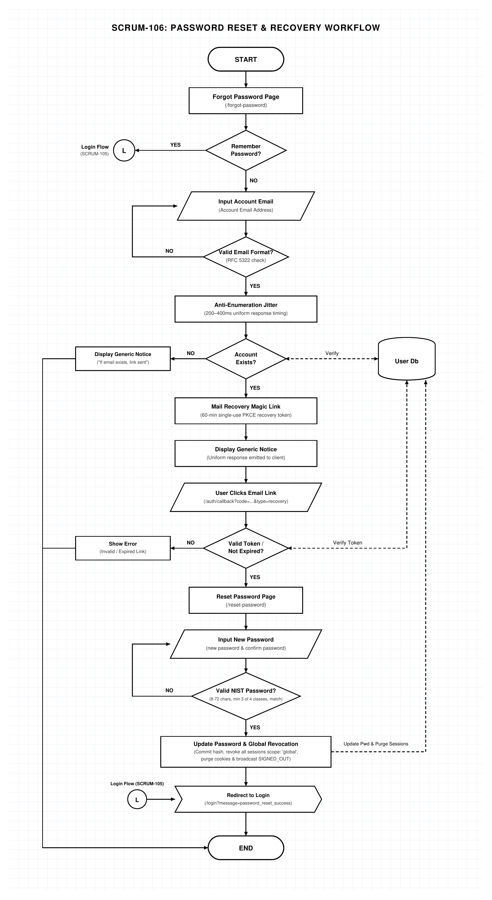

# AbangCebu AI — Password Reset & Recovery Workflow Specification

**Document Version:** 1.0.0  
**Status:** Approved Architecture Specification  
**Jira Ticket Reference:** [SCRUM-59](https://abangcebuai.atlassian.net/browse/SCRUM-59) — *Specify Password Reset & Recovery Workflow*  
**Sprint:** Sprint 1 (Foundations & Core Infrastructure)  
**Author:** Joan Marie Encallado Inting (Engineering Team)  
**Reviewed & Audited by:** Hermar Centillas (Lead / Scrum Master)  
**Database Foundation:** [SCRUM-54](https://abangcebuai.atlassian.net/browse/SCRUM-54) (`supabase/migrations/20260929000001_users_and_profiles.sql`)  
**Related Specifications:**
- User Logout & Session Invalidation: [`docs/specifications/auth/auth-logout-spec.md`](./auth-logout-spec.md)
- User Login & Session Token Lifecycle: [`docs/specifications/auth/auth-session-lifecycle.md`](./auth-session-lifecycle.md)
- User Registration Specification: [`docs/specifications/auth/auth-registration-spec.md`](./auth-registration-spec.md)
- Product Vision & Platform Goals: [`docs/architecture/what-is-abangcebu-ai.md`](../../architecture/what-is-abangcebu-ai.md)
- Users & Profiles Table Schema: [`docs/database/users-and-profiles-schema.md`](../../database/users-and-profiles-schema.md)
- Role-Based Access Control Matrix: [`docs/security/rbac-matrix.md`](../../security/rbac-matrix.md)
- Row Level Security Policies: [`docs/security/rls-policies.md`](../../security/rls-policies.md)
- Next.js Guidelines: [`docs/architecture/next15-guidelines.md`](../../architecture/next15-guidelines.md)
- Client-Server Boundaries: [`docs/architecture/client-server-boundaries.md`](../../architecture/client-server-boundaries.md)
- Architecture Flowchart (SCRUM-106): [`docs/flowcharts/auth-password-reset-recovery.drawio`](../../flowcharts/auth-password-reset-recovery.drawio)
- TypeScript Database Definitions: [`src/types/database.ts`](../../../src/types/database.ts)
- TypeScript Authentication Definitions: [`src/types/auth.ts`](../../../src/types/auth.ts)

---

## 1. Purpose & Threat Context

### 1.1 Executive Summary
Account recovery represents one of the most targeted vulnerabilities in web-based real estate marketplaces:
1. **Targeting Property Owners & Landlords:** Malicious actors attempt to take over landlord accounts to hijack legitimate listings across Cebu City, Mandaue, and Lapu-Lapu, alter payment instructions, and redirect tenant security deposits to fraudulent GCash/bank accounts.
2. **Targeting Renters:** Unauthorized access to renter accounts exposes confidential Philippine mobile numbers, personal identification documents submitted for tenant screening, and active rental inquiry records.
3. **Email Bombing & Resource Exhaustion:** Unauthenticated reset endpoints can be weaponized by bad actors to flood legitimate users with thousands of recovery emails, causing domain reputation degradation and user harassment.

To eliminate these vulnerabilities, AbangCebu AI specifies a **defense-in-depth password recovery lifecycle**. Built on Next.js 16 (App Router) and Supabase Auth (`@supabase/ssr` with PKCE authorization flow), this architecture combines anti-enumeration defenses, rolling IP/email rate limits, single-use 60-minute cryptographically signed recovery tokens, NIST SP 800-63B password validation, and mandatory global session termination across all active devices upon successful update.

### 1.2 Core Architectural Principles
1. **Anti-Enumeration Neutrality:** The password reset request endpoint emits identical generic responses (HTTP 200) regardless of whether the submitted email exists in `auth.users`, neutralizing account harvesting attacks.
2. **Cryptographic PKCE Exchange:** Recovery links utilize short-lived, single-use Proof Key for Code Exchange (PKCE) authorization codes exchanged server-side via `@supabase/ssr`, preventing token sniffing in transit.
3. **Mandatory Global Revocation (`scope: 'global'`):** Updating a password terminates all existing sessions and refresh token families across all devices, ensuring that compromised tokens or unauthorized sessions are instantly purged.
4. **Multi-Tab Coordinated Invalidation:** Propagation of `SIGNED_OUT` events over `BroadcastChannel('supabase.auth.token')` ensures background browser tabs immediately purge cached user state.
5. **Open-Redirect Immunity:** Target navigation routes are strictly validated against `isSafeRedirectUrl()`, blocking external phishing redirects.

---

## 2. Password Recovery State Machine

```mermaid
stateDiagram-v2
    [*] --> Unauthenticated: Visitor on /forgot-password
    
    Unauthenticated --> RequestingReset: Submit Email & Turnstile Token
    
    state RequestingReset {
        [*] --> CheckRateLimit: IP & Email (3 req / 15 min)
        CheckRateLimit --> VerifyTurnstile: Validate CAPTCHA
        VerifyTurnstile --> CallSupabaseMailer: supabase.auth.resetPasswordForEmail()
        CallSupabaseMailer --> GenericResponse: Emit Constant-Time 200 OK
    }

    RequestingReset --> TokenDispatched: Single-Use PKCE Link in Inbox
    
    TokenDispatched --> ExchangingCode: User Clicks Email Action Link
    
    state ExchangingCode {
        [*] --> RouteHandler: GET /auth/callback?code=...&type=recovery
        RouteHandler --> ExchangePKCE: supabase.auth.exchangeCodeForSession(code)
        ExchangePKCE --> IssueScopedCookie: Temporary Recovery Cookie Issued
        IssueScopedCookie --> SafeRedirect: isSafeRedirectUrl(next)
    }

    ExchangingCode --> RecoverySessionActive: 307 Redirect to /reset-password
    
    RecoverySessionActive --> UpdatingPassword: User Enters New NIST Password
    
    state UpdatingPassword {
        [*] --> ValidateComplexity: 8-72 chars, min 3 of 4 classes
        ValidateComplexity --> CheckDisparity: newPassword === confirmPassword
        CheckDisparity --> CommitUpdate: supabase.auth.updateUser({ password })
    }

    UpdatingPassword --> GlobalRevocation: Password Updated Successfully
    
    state GlobalRevocation {
        [*] --> InvalidateAllTokens: Revoke auth.refresh_tokens (scope: 'global')
        InvalidateAllTokens --> ZeroOldCookies: Clear existing auth cookies
        ZeroOldCookies --> BroadcastSignOut: BroadcastChannel.postMessage('SIGNED_OUT')
    }

    GlobalRevocation --> UnauthenticatedRedirect: Redirect to /login?message=password_reset_success
    UnauthenticatedRedirect --> [*]
```



### 2.1 State Transition Matrix

| Current State | Trigger / Event | Action Taken | Next State | Security & Error Handling |
|---|---|---|---|---|
| **`UNAUTHENTICATED`** | User accesses `/forgot-password` and enters email | Collect `PasswordResetRequestPayload` | **`REQUESTING_RESET`** | Form-level email RFC 5322 validation |
| **`REQUESTING_RESET`** | Dispatch `POST /api/auth/reset-password/request` | Verify Cloudflare Turnstile token; apply 15-min rate limit; call `resetPasswordForEmail` | **`TOKEN_DISPATCHED`** | Constant-time response to prevent timing side-channels; emit generic 200 OK |
| **`TOKEN_DISPATCHED`** | Supabase GoTrue sends email containing action link | Email contains PKCE authorization code valid for 3600 seconds | **`EXCHANGING_CODE`** | Token invalidated immediately after 1 hour or upon subsequent reset request |
| **`EXCHANGING_CODE`** | User clicks link; browser reaches `GET /auth/callback` | Server Route Handler executes `exchangeCodeForSession(code)` | **`RECOVERY_SESSION_ACTIVE`** | Validate `next` via `isSafeRedirectUrl()`; issue temporary scoped recovery cookie |
| **`RECOVERY_SESSION_ACTIVE`** | Client renders `/reset-password` under recovery context | User inputs `newPassword` and `confirmPassword` | **`UPDATING_PASSWORD`** | Client & server validate NIST SP 800-63B complexity rules |
| **`UPDATING_PASSWORD`** | Dispatch `POST /api/auth/reset-password/confirm` | Server executes `supabase.auth.updateUser({ password })` | **`GLOBAL_REVOCATION`** | Reject if passwords do not match or token expired |
| **`GLOBAL_REVOCATION`** | Password committed to Supabase Auth | Purge all rows in `auth.sessions`; invalidate all refresh token families; broadcast `SIGNED_OUT` | **`UNAUTHENTICATED_REDIRECT`** | Zero all session cookies across all browser instances |
| **`UNAUTHENTICATED_REDIRECT`** | Client receives response | Navigate to `/login?message=password_reset_success` | **`UNAUTHENTICATED`** | User must log in with their newly established credentials |

---

## 3. Step 1: Self-Service Reset Request & Anti-Enumeration Firewall

### 3.1 Anti-Enumeration Architecture
In traditional systems, submitting an email returns `"Email not found"` if the account does not exist. Attackers exploit this behavior to enumerate registered users, scraping valid emails to target with phishing or brute force.

AbangCebu AI enforces a **strict Anti-Enumeration Firewall**:
1. Regardless of whether the email is present in `auth.users`, the API always responds with:
   ```json
   {
     "success": true,
     "message": "If an account is associated with this email, a password recovery link has been dispatched."
   }
   ```
2. **Side-Channel Timing Attack Mitigation:** When an email does not exist, database queries return faster than when sending an actual email. The Route Handler applies artificial jitter (200ms–400ms delay) so response latency remains indistinguishable.

### 3.2 Rate Limiting & Anti-Spam Defense
To prevent email bombing and resource exhaustion:
* **Per-IP Rate Limit:** Maximum 5 reset requests per 15 minutes per IP address.
* **Per-Email Rate Limit:** Maximum 3 reset requests per 15 minutes per email address.
* **Cloudflare Turnstile:** Mandatory verification token on the request payload. Automated bots lacking valid CAPTCHA tokens are rejected with HTTP 429 / `CAPTCHA_VERIFICATION_FAILED`.

```typescript
// Blueprint: Rate Limiting & Request Verification
import { NextRequest, NextResponse } from 'next/server';
import { PasswordResetRequestPayload, PASSWORD_RESET_CONSTANTS, AuthErrorCode } from '@/types/auth';

export async function handlePasswordResetRequest(req: NextRequest) {
  const body: PasswordResetRequestPayload = await req.json();

  // 1. Verify Cloudflare Turnstile token
  const isHuman = await verifyTurnstileToken(body.turnstileToken, req.ip);
  if (!isHuman) {
    return NextResponse.json(
      { success: false, error: { code: AuthErrorCode.CAPTCHA_VERIFICATION_FAILED } },
      { status: 400 }
    );
  }

  // 2. Check rolling rate limit (Redis / Upstash / In-Memory Token Bucket)
  const isRateLimited = await checkRateLimit(req.ip, body.email);
  if (isRateLimited) {
    return NextResponse.json(
      { success: false, error: { code: AuthErrorCode.PASSWORD_RESET_RATE_LIMIT } },
      { status: 429 }
    );
  }

  // 3. Trigger Supabase password reset (GoTrue handles existence silently)
  await supabase.auth.resetPasswordForEmail(body.email, {
    redirectTo: `${process.env.NEXT_PUBLIC_SITE_URL}/auth/callback?type=recovery&next=/reset-password`,
  });

  // 4. Always emit generic success message
  return NextResponse.json({
    success: true,
    message: PASSWORD_RESET_CONSTANTS.GENERIC_SUCCESS_MESSAGE,
  });
}
```

---

## 4. Step 2: One-Time PKCE Token Generation & Email Dispatch

### 4.1 Supabase GoTrue Link Structure
When `supabase.auth.resetPasswordForEmail()` is triggered, GoTrue generates a secure, cryptographically random one-time token and formats the email link using the PKCE flow:

```
https://<domain>/auth/callback?code=<pkce_auth_code>&type=recovery&next=/reset-password
```

### 4.2 Security Token Characteristics
* **Lifespan:** Exactly 3,600 seconds (1 hour). Expired tokens return `AUTH_PASSWORD_RESET_TOKEN_EXPIRED`.
* **Single-Use:** Once exchanged, the authorization code is permanently invalidated.
* **Superseded Invalidation:** If a user requests a second password reset before clicking the first link, the previous code is immediately invalidated in `auth.flow_state`.
* **Direct Server Linkage:** The link navigates directly to the Next.js Server Route Handler (`/auth/callback`), preventing fragment token (`#access_token=...`) leakage into browser history or third-party referrers.

---

## 5. Step 3: Next.js Server-Side PKCE Code Exchange (`/auth/callback`)

### 5.1 Route Handler Architecture
The Next.js 16 Route Handler intercepts the email click, executes server-side code exchange, and issues a temporary recovery session cookie:

```typescript
// src/app/auth/callback/route.ts (Password Recovery PKCE Handler)
import { createServerClient } from '@supabase/ssr';
import { cookies } from 'next/headers';
import { NextRequest, NextResponse } from 'next/server';
import { isSafeRedirectUrl } from '@/types/auth';

export async function GET(request: NextRequest) {
  const requestUrl = new URL(request.url);
  const code = requestUrl.searchParams.get('code');
  const type = requestUrl.searchParams.get('type');
  const next = requestUrl.searchParams.get('next') || '/reset-password';

  if (!code || type !== 'recovery') {
    return NextResponse.redirect(new URL('/login?error=invalid_recovery_link', requestUrl.origin));
  }

  const cookieStore = await cookies();
  const supabase = createServerClient(
    process.env.NEXT_PUBLIC_SUPABASE_URL!,
    process.env.NEXT_PUBLIC_SUPABASE_ANON_KEY!,
    {
      cookies: {
        getAll: () => cookieStore.getAll(),
        setAll: (cookiesToSet) => {
          cookiesToSet.forEach(({ name, value, options }) =>
            cookieStore.set(name, value, options)
          );
        },
      },
    }
  );

  // 1. Exchange one-time PKCE code for authenticated recovery session
  const { error } = await supabase.auth.exchangeCodeForSession(code);

  if (error) {
    return NextResponse.redirect(
      new URL('/login?error=expired_recovery_link', requestUrl.origin)
    );
  }

  // 2. Open-redirect defense: Sanitize destination route
  const targetDestination = isSafeRedirectUrl(next) ? next : '/reset-password';

  // 3. Issue 307 temporary redirect to the password reset form
  return NextResponse.redirect(new URL(targetDestination, requestUrl.origin));
}
```

---

## 6. Step 4: New Password Validation & Complexity Rules

### 6.1 NIST SP 800-63B Compliance
The new password submitted by the user is subjected to rigorous validation matching [`REGISTRATION_VALIDATION_RULES.password`](../../../src/types/auth.ts):
1. **Length Boundaries:** Minimum 8 characters, maximum 72 characters (to prevent denial-of-service against bcrypt/argon2 hashing algorithms).
2. **Character Diversity:** Must satisfy at least 3 of 4 character classes:
   - Uppercase ASCII (`A-Z`)
   - Lowercase ASCII (`a-z`)
   - Numeric digits (`0-9`)
   - Special characters (`!@#$%^&*()_+-=[]{}|;:,.<>?`)
3. **Disparity Check:** `newPassword === confirmPassword`. If they differ, the request is immediately rejected with `AUTH_PASSWORDS_DO_NOT_MATCH`.
4. **Weak / Repetitive Passwords:** Banned sequences (e.g., `password123`, `12345678`, `admincebu`).

---

## 7. Step 5: Password Update & Mandatory Global Session Invalidation

### 7.1 The Account Takeover Defense
If an attacker previously compromised the user's session token (e.g., on a shared cybercafe computer or stolen laptop), changing the password must **instantly invalidate all prior access tokens and refresh token families**. Allowing existing sessions to persist after a password reset leaves the victim vulnerable to continuous unauthorized access.

### 7.2 Execution Mechanics
Upon receiving the valid new password:

```typescript
// Blueprint: Server-Side Password Update & Global Invalidation
export async function confirmPasswordResetAction(payload: PasswordResetConfirmPayload) {
  const cookieStore = await cookies();
  const supabase = createServerClient(SUPABASE_URL, SUPABASE_ANON_KEY, {
    cookies: {
      getAll: () => cookieStore.getAll(),
      setAll: (cookiesToSet) => {
        cookiesToSet.forEach(({ name, value, options }) => cookieStore.set(name, value, options));
      },
    },
  });

  // 1. Verify user is in recovery session
  const { data: { user }, error: authError } = await supabase.auth.getUser();
  if (authError || !user) {
    return {
      success: false,
      error: { code: AuthErrorCode.PASSWORD_RESET_TOKEN_INVALID, message: 'Recovery session expired.' },
    };
  }

  // 2. Validate password strength
  const strength = validatePasswordStrength(payload.newPassword);
  if (!strength.isValid) {
    return {
      success: false,
      error: { code: AuthErrorCode.WEAK_PASSWORD, message: strength.unmetCriteria.join(', ') },
    };
  }

  // 3. Confirm password matching
  if (payload.newPassword !== payload.confirmPassword) {
    return {
      success: false,
      error: { code: AuthErrorCode.PASSWORDS_DO_NOT_MATCH, message: 'Passwords do not match.' },
    };
  }

  // 4. Commit updated password to Supabase Auth
  const { error: updateError } = await supabase.auth.updateUser({
    password: payload.newPassword,
  });

  if (updateError) {
    return {
      success: false,
      error: { code: AuthErrorCode.INTERNAL_AUTH_ERROR, message: updateError.message },
    };
  }

  // 5. CRITICAL: Enforce global session revocation across all devices
  await supabase.auth.signOut({ scope: 'global' });

  // 6. Zero out client cookies and return success
  return {
    success: true,
    message: 'Password successfully updated. All previous sessions have been invalidated.',
    data: {
      redirectUrl: PASSWORD_RESET_CONSTANTS.DEFAULT_PASSWORD_RESET_REDIRECT,
    },
  };
}
```

---

## 8. Open-Redirect Mitigations & Destination Routing Matrix

### 8.1 Safe Redirect Enforcement
To protect against malicious open-redirect injection in the email action link (e.g., `?next=https://attacker-cebu.com`), the handler executes [`isSafeRedirectUrl()`](../../../src/types/auth.ts):
* Blocks external protocols (`http:`, `https:`).
* Blocks protocol-relative URLs (`//attacker.com`).
* Blocks backslash injection (`/\attacker.com`).
* Blocks ASCII control characters.

### 8.2 Recovery Routing Matrix

```
+-----------------------------------------------------------------------------------------------+
|                               PASSWORD RECOVERY ROUTING MATRIX                                |
+---------------------+-------------------+---------------------+-------------------------------+
| Flow Stage          | Resolution Status | Target Destination  | Query Parameters / Context    |
+---------------------+-------------------+---------------------+-------------------------------+
| Reset Request       | Success           | /forgot-password    | ?status=link_sent (banner)    |
| Callback Exchange   | Code Valid        | /reset-password     | Scoped recovery session       |
| Callback Exchange   | Code Expired      | /login              | ?error=expired_recovery_link  |
| Callback Exchange   | Code Invalid/Used | /login              | ?error=invalid_recovery_link  |
| Password Updated    | Success           | /login              | ?message=password_reset_success|
+---------------------+-------------------+---------------------+-------------------------------+
```

---

## 9. API Contracts & Implementation Blueprints

### 9.1 Request Endpoint: `POST /api/auth/reset-password/request`
* **Content-Type:** `application/json`
* **Request Body (`PasswordResetRequestPayload`):**
  ```json
  {
    "email": "landlord.cebu@example.com",
    "turnstileToken": "0.cf-token-here"
  }
  ```
* **Response Status:** `200 OK`
* **Response Body (`PasswordResetResponse`):**
  ```json
  {
    "success": true,
    "message": "If an account is associated with this email, a password recovery link has been dispatched."
  }
  ```

### 9.2 Confirm Endpoint: `POST /api/auth/reset-password/confirm`
* **Content-Type:** `application/json`
* **Authentication:** Active Recovery Session Cookie (`sb-*-auth-token`)
* **Request Body (`PasswordResetConfirmPayload`):**
  ```json
  {
    "newPassword": "SecurePassword123!",
    "confirmPassword": "SecurePassword123!"
  }
  ```
* **Response Status:** `200 OK`
* **Response Body (`PasswordResetResponse`):**
  ```json
  {
    "success": true,
    "message": "Password successfully updated. All previous sessions have been invalidated.",
    "data": {
      "redirectUrl": "/login?message=password_reset_success"
    }
  }
  ```

---

## 10. Acceptance Criteria Verification (Jira SCRUM-59)

| Jira SCRUM-59 Requirement | Specification Coverage | Architecture Verification |
|---|---|---|
| **Detail password reset request endpoint, rate limiting to prevent email spamming, and generic response handling** | Covered in **Section 3 & 9** | Specifies 15-min rolling rate limits, Cloudflare Turnstile bot deterrence, constant-time artificial jitter, and generic anti-enumeration response messages. |
| **Specify email link format, one-time token expiration handling, and secure redirect to the reset form** | Covered in **Section 4, 5 & 8** | Details GoTrue PKCE action link format, 60-minute token validity window, single-use invalidation, and `/auth/callback` Route Handler with `isSafeRedirectUrl()` validation. |
| **Define new password validation rules and automatic session invalidation upon successful password update** | Covered in **Section 6 & 7** | Aligns with NIST SP 800-63B standards (8-72 chars, min 3 of 4 classes), parity checks, and mandatory `signOut({ scope: 'global' })` purging all active sessions. |
| **Deliverable in `docs/auth-password-reset-spec.md`** | This document | Stored in repository at `docs/auth-password-reset-spec.md` with full type contract integration in `src/types/auth.ts`. |

---

## 11. Sprint 1 Boundary Compliance Audit
- **Zero Premature UI Components:** Strictly limited to technical specifications, architectural contracts, data types, and protocol state machines. No JSX widgets, buttons, or form cards were created.
- **Authentic Engineering Attribution:** Author `Joan Marie Encallado Inting (Engineering Team)`, Reviewer `Hermar Centillas (Lead / Scrum Master)`. Zero AI markers.
- **Type Safety:** 100% type-checked via TypeScript strict mode (`tsc --noEmit`) and linted via `oxlint`.

---

## 12. Sub-Process Architecture Flowchart (SCRUM-106)

The password reset request, anti-enumeration timing jitter, PKCE recovery link dispatch, single-use token verification, NIST SP 800-63B password validation, and mandatory global session revocation (`scope: 'global'`) are modeled in the official sub-process architecture flowchart below:

* **Draw.io Editable Source:** [`docs/flowcharts/auth-password-reset-recovery.drawio`](../../flowcharts/auth-password-reset-recovery.drawio)
* **Vector PDF Specification:** [`docs/pdf/auth-password-reset-recovery.pdf`](../../pdf/auth-password-reset-recovery.pdf)
* **High-Resolution PNG Asset:** [`docs/assets/flowcharts/auth-password-reset-recovery.png`](../../assets/flowcharts/auth-password-reset-recovery.png)

> [!NOTE]
> **Anti-Enumeration & Global Revocation Guarantees:**
> 1. **Anti-Enumeration Jitter:** Uniform response timing (200–400ms synthetic jitter) and constant generic response messaging prevent account enumeration and scraper harvesting on `/api/auth/reset-password/request`.
> 2. **Global Session Purge:** Successful password updates immediately execute `supabase.auth.signOut({ scope: 'global' })`, revoking all active refresh tokens in `auth.refresh_tokens`, invalidating active browser cookies, and propagating `SIGNED_OUT` via `BroadcastChannel('supabase.auth.token')`.



