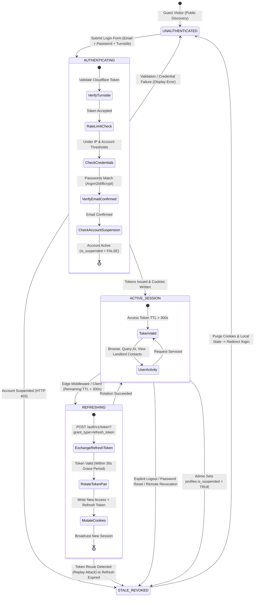
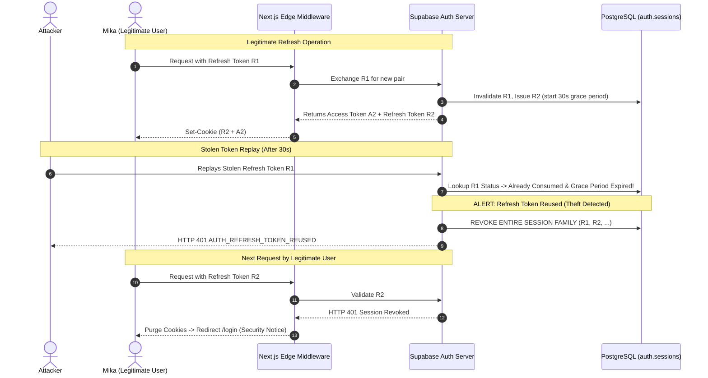
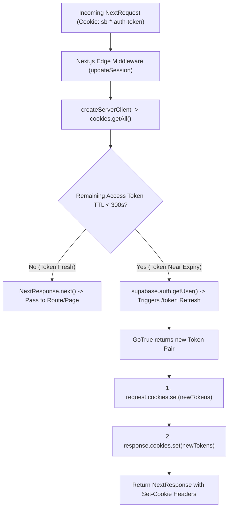
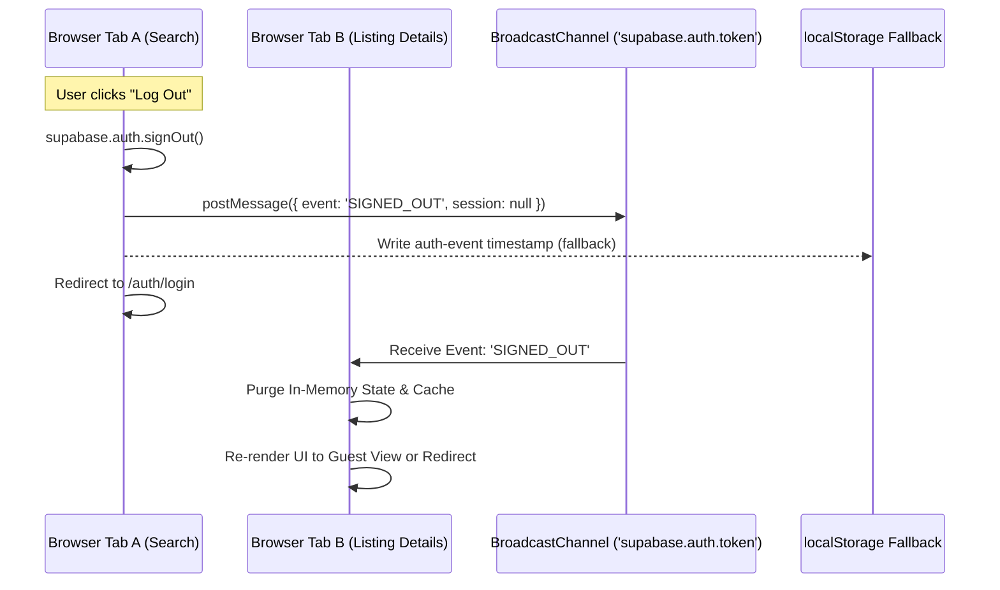
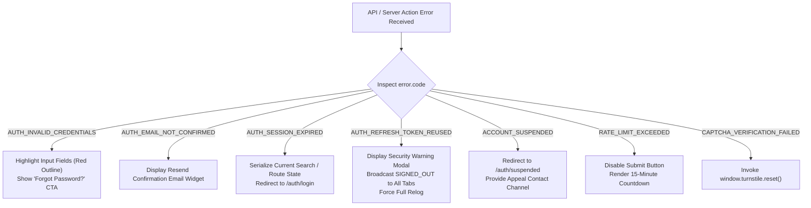
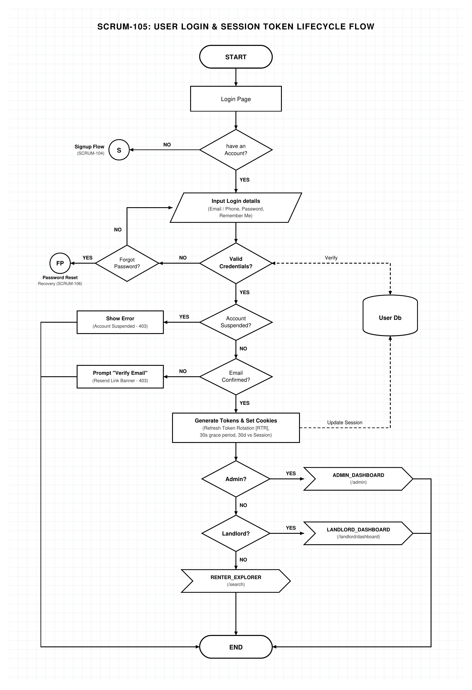

# AbangCebu AI — User Login & Session Token Lifecycle Specification

**Document Version:** 1.0.0  
**Status:** Approved Architecture Specification  
**Jira Ticket Reference:** [SCRUM-57](https://abangcebuai.atlassian.net/browse/SCRUM-57) — *Specify User Login & Session Token Lifecycle*  
**Sprint:** Sprint 1 (Foundations & Core Infrastructure)  
**Author:** John Lloyd Ando (Engineering Team)  
**Database Foundation:** [SCRUM-54](https://abangcebuai.atlassian.net/browse/SCRUM-54) (`supabase/migrations/20260929000001_users_and_profiles.sql`)  
**Related Specifications:**
- User Registration Specification: [`docs/specifications/auth/auth-registration-spec.md`](./auth-registration-spec.md)
- Product Vision & Platform Goals: [`docs/architecture/what-is-abangcebu-ai.md`](../../architecture/what-is-abangcebu-ai.md)
- Users & Profiles Table Schema: [`docs/database/users-and-profiles-schema.md`](../../database/users-and-profiles-schema.md)
- Renter Persona & Access Rights: [`docs/design/renter-persona.md`](../../design/renter-persona.md)
- Role-Based Access Control Matrix: [`docs/security/rbac-matrix.md`](../../security/rbac-matrix.md)
- Row Level Security Policies: [`docs/security/rls-policies.md`](../../security/rls-policies.md)
- Next.js Guidelines: [`docs/architecture/next15-guidelines.md`](../../architecture/next15-guidelines.md)
- Client-Server Boundaries: [`docs/architecture/client-server-boundaries.md`](../../architecture/client-server-boundaries.md)
- Architecture Flowchart (SCRUM-105): [`docs/flowcharts/auth-login-session-rtr.drawio`](../../flowcharts/auth-login-session-rtr.drawio)
- TypeScript Database Definitions: [`src/types/database.ts`](../../../src/types/database.ts)
- TypeScript Authentication Definitions: [`src/types/auth.ts`](../../../src/types/auth.ts)

---

## 1. Purpose & Source Basis

### 1.1 Executive Purpose
In the Metro Cebu rental real estate landscape, trust and identity verification are paramount. Renters frequently encounter ghost listings, predatory deposit demands, and deceptive pricing across social media groups. Property owners and listers, on the other hand, face unauthorized re-listing by unlicensed middlemen and harassment from unverified leads. 

The login and session lifecycle represents the primary authentication gate guarding privileged platform actions—such as unveiling verified landlord contact details, submitting inquiries, booking viewings, and managing rental inventory.

This specification establishes a production-grade, zero-trust session management architecture for AbangCebu AI. Operating on Next.js 16 (App Router) backed by Supabase BaaS (PostgreSQL 15+ with GoTrue Auth), it defines:
1. Deterministic session state progression from unauthenticated visitor to active session.
2. Refresh Token Rotation (RTR) with a 30-second concurrency grace period and automated token family revocation upon reuse.
3. Cryptographically secure HTTP-Only cookie storage governed by `@supabase/ssr`, preventing token leakage via Cross-Site Scripting (XSS).
4. Low-latency background session refreshes executed within the Next.js Edge Middleware layer.
5. Real-time multi-tab session coordination via the Web Platform `BroadcastChannel` API.
6. Threat-modeled defenses against brute-force attacks, session hijacking, privilege escalation, and immediate revocation for suspended accounts (`is_suspended = true`).

### 1.2 Source Document Mapping & System Integration

The login and session architecture synthesizes constraints and business rules established across foundational project specifications:

| Source Specification | Direct Architectural Requirement & Integration Constraint |
|---|---|
| **`docs/what-is-abangcebu-ai.md`** | Delineates the boundary between unauthenticated public exploration (interactive map, basic listing cards) and authenticated operations (viewing direct landlord phone numbers, messaging, bookmarking, property submission). Unauthenticated users must be transitioned smoothly through login without losing their search coordinates. |
| **`docs/auth-registration-spec.md`** | Establishes identity creation rules, password complexity enforcement, canonical Philippine phone number normalization (`+639XXXXXXXXX`), and the PKCE email verification requirement. Login enforces that `auth.users.email_confirmed_at` is non-null before granting an active session. |
| **`docs/users-and-profiles-schema.md`** | Governs the foreign key binding between `auth.users.id` and `public.profiles.id`. Login and middleware evaluate `profiles.is_suspended` and `profiles.role` to ensure synchronized role claims and enforce instantaneous platform expulsion for suspended users. |
| **`docs/renter-persona.md`** | Emphasizes low-friction authentication for mobile-first users—such as "Mika", a CIT-U/USC student or IT Park BPO worker commuting along Cebu transit corridors. Mandates persistent "Remember Me" sessions (30-day lifespan), resilient network error recovery, and seamless background token rotation. |
| **`docs/rbac-matrix.md` & `docs/rls-policies.md`** | Directs post-login role routing (`renter` -> `/search`, `landlord` -> `/landlord/dashboard`, `admin` -> `/admin`) and dictates JWT claim ingestion by PostgreSQL RLS (`auth.jwt() ->> 'role'`). Guarantees landlord contact information is masked until a valid `authenticated` role is verified. |

### 1.3 Scope of Session Lifecycle Management

```
                                  +------------------------------------+
                                  |         Client Browser             |
                                  | (Next.js 16 Server / Client Comp.) |
                                  +-----------------+------------------+
                                                    |
                                          HTTPS (Encrypted Cookie)
                                          sb-<ref>-auth-token.[0..n]
                                                    |
                                                    v
                                  +------------------------------------+
                                  |    Next.js Edge Middleware         |
                                  |   (src/lib/supabase/middleware.ts) |
                                  +-----------------+------------------+
                                                    |
                         +--------------------------+--------------------------+
                         |                                                     |
                         | (TTL >= 300s)                                       | (TTL < 300s)
                         v                                                     v
          +------------------------------+                      +------------------------------+
          |      Direct Pass-through     |                      |    Silent Background Refresh |
          |   Outgoing Response Headers  |                      |    Supabase Auth Engine      |
          |   request.cookies forwarding |                      |    POST /auth/v1/token       |
          +------------------------------+                      +--------------+---------------+
                                                                               |
                                                                   New Access + Refresh Token
                                                                   Set-Cookie Header Mutation
                                                                               |
                                                                               v
                                                                +------------------------------+
                                                                |   Database RLS Enforcement   |
                                                                |   auth.uid(), profiles check |
                                                                +------------------------------+
```

---

## 2. Session Lifecycle State Machine

### 2.1 State Diagram
The AbangCebu AI session lifecycle consists of five discrete states: `UNAUTHENTICATED`, `AUTHENTICATING`, `ACTIVE_SESSION`, `REFRESHING`, and `STALE_REVOKED`.



### 2.2 Five-State Transition Matrix

| Source State | Event / Trigger | Guard / Condition | Target State | System Actions & Cookie/State Side Effects |
|---|---|---|---|---|
| `UNAUTHENTICATED` | User submits login form (`POST /api/auth/login`) | Form payload adheres to `LoginPayload` format | `AUTHENTICATING` | Initializes authentication pipeline, starts telemetry span, checks IP rate limits. |
| `AUTHENTICATING` | Turnstile verification | Token invalid or expired | `UNAUTHENTICATED` | Rejects with `403` `CAPTCHA_VERIFICATION_FAILED`. Resets CAPTCHA widget. |
| `AUTHENTICATING` | Credential check in Supabase Auth | Invalid email or password match failure | `UNAUTHENTICATED` | Increments failure counter for IP/account; returns `401` `AUTH_INVALID_CREDENTIALS`. |
| `AUTHENTICATING` | Email confirmation verification | `auth.users.email_confirmed_at IS NULL` | `UNAUTHENTICATED` | Blocks session issuance; returns `403` `AUTH_EMAIL_NOT_CONFIRMED`; prompts resend confirmation. |
| `AUTHENTICATING` | Profile suspension verification | `public.profiles.is_suspended === TRUE` | `STALE_REVOKED` | Aborts login; revokes session immediately; returns `403` `ACCOUNT_SUSPENDED`. |
| `AUTHENTICATING` | Authentication success | Credentials valid, email confirmed, active profile | `ACTIVE_SESSION` | Issues JWT (`1h` TTL) + Refresh Token; writes chunked HTTP-Only cookies; emits `SIGNED_IN` event via `BroadcastChannel`; redirects to target URL. |
| `ACTIVE_SESSION` | Middleware request inspection | Token valid, remaining TTL $\ge$ 300s | `ACTIVE_SESSION` | Passes request through to Server Component / Route Handler without overhead. |
| `ACTIVE_SESSION` | Middleware request inspection | Access token remaining TTL < 300s | `REFRESHING` | Triggers silent background exchange via GoTrue endpoint. |
| `ACTIVE_SESSION` | Explicit user logout (`POST /api/auth/logout`) | Valid active session | `STALE_REVOKED` | Calls `supabase.auth.signOut()`; revokes refresh token family; purges cookies; emits `SIGNED_OUT` via `BroadcastChannel`. |
| `ACTIVE_SESSION` | Periodic DB sync or RLS rejection | Admin marks `is_suspended = true` | `STALE_REVOKED` | Middleware detects suspended status; invalidates server session; deletes auth cookies; redirects to `/auth/suspended`. |
| `REFRESHING` | Refresh token exchange | Refresh token valid, single-use or in 30s grace period | `ACTIVE_SESSION` | Receives new JWT + new refresh token; updates cookies on `NextResponse` and `NextRequest`; broadcasts `TOKEN_REFRESHED`. |
| `REFRESHING` | Refresh token exchange | Inactive refresh token presented after 30s grace period | `STALE_REVOKED` | **Token reuse detected**: Invalidates entire token family; flags security incident; logs user out immediately with `AUTH_REFRESH_TOKEN_REUSED`. |
| `REFRESHING` | Refresh token exchange | Network failure / transient outage | `ACTIVE_SESSION` (Degraded) | Retries with exponential backoff while access token has not fully expired. If expired, transitions to `STALE_REVOKED`. |
| `STALE_REVOKED` | Cleanup hook invoked | Cookies present in browser | `UNAUTHENTICATED` | Overwrites session cookies with `maxAge = 0`; clears in-memory user cache; redirects client to `/login`. |

---

## 3. Login Request / Response Contracts & Data Dictionary

### 3.1 Endpoint Definition
- **Route:** `POST /api/auth/login` (supported natively by Server Action `loginUserAction(payload: LoginPayload)`)
- **Content-Type:** `application/json`
- **Security:** Public endpoint protected by Cloudflare Turnstile token validation and rate limiting (max 5 failed attempts per 15-minute window per IP/Email pair).

### 3.2 Request Payload Contract (`LoginPayload`)

```typescript
export interface LoginPayload {
  /** User primary email address */
  email: string;
  /** User plaintext password */
  password: string;
  /** Optional Cloudflare Turnstile CAPTCHA verification token */
  turnstileToken?: string;
  /** Remember-me persistence flag for extended session lifespan */
  rememberMe?: boolean;
}
```

#### Field Specifications & Data Dictionary

| Field Name | Type | Mandatory? | Validation Constraints | Description & Example |
|---|---|---|---|---|
| `email` | `string` | **Yes** | Standard RFC 5322 regex, max 254 chars, lowercase normalized. | Registered user login email. E.g., `"mika.student@gmail.com"` |
| `password` | `string` | **Yes** | 8 to 72 characters, non-empty. | User plaintext password for hash verification. |
| `turnstileToken` | `string` | No* | String token generated by Cloudflare Turnstile widget. | Verification challenge token. (*Mandatory in staging/production environments; bypassed only in local mock test suites). |
| `rememberMe` | `boolean` | No | Boolean (`true` or `false`). Defaults to `false`. | Controls cookie persistence: `false` = 7-day standard session; `true` = 30-day extended persistent session. |

#### Sample Request Payload
```json
{
  "email": "mikaela.santos@cit.edu.ph",
  "password": "Password99!Cebu",
  "turnstileToken": "0.X_TurnstileVerificationTokenData_AbangCebu...",
  "rememberMe": true
}
```

### 3.3 Response Contracts

#### 3.3.1 Login Success Contract (`LoginSuccessResponse`)
- **HTTP Status:** `200 OK`
- **Cookie Header:** Contains `Set-Cookie` directives writing the chunked session cookies.

```typescript
export interface SessionTokens {
  /** Signed JWT access token (HMAC-SHA256, 1-hour standard TTL) */
  accessToken: string;
  /** Cryptographically random opaque refresh token string */
  refreshToken: string;
  /** Standard OAuth 2.0 Bearer token type */
  tokenType: 'bearer';
  /** Token lifespan in seconds (default 3600 seconds) */
  expiresIn: number;
  /** Token expiration Unix timestamp (in seconds) */
  expiresAt: number;
}

export interface LoginSuccessResponse {
  success: true;
  data: {
    user: RegisteredUserSummary;
    session: SessionTokens;
    redirectUrl: string;
  };
  message: string;
}
```

#### Sample Success JSON
```json
{
  "success": true,
  "data": {
    "user": {
      "id": "e8d6934c-62b8-4c92-80bb-69bead3e1b12",
      "email": "mikaela.santos@cit.edu.ph",
      "role": "renter",
      "fullName": "Mikaela Santos",
      "phoneNumber": "+639181234567",
      "isEmailConfirmed": true,
      "createdAt": "2026-09-29T05:15:00.000Z"
    },
    "session": {
      "accessToken": "eyJhbGciOiJIUzI1NiIsInR5cCI6IkpXVCJ9.eyJpc3MiOiJodHRwczovL2FiYW5nY2VidS5zdXBhYmFzZS5jby9hdXRoL3YxIiwic3ViIjoiZThkNjkzNGMtNjJiOC00YzkyLTgwYmItNjliZWFkM2UxYjEyIiwiYXVkIjoiYXV0aGVudGljYXRlZCIsImV4cCI6MTc5MDY3NjEwMCwibmJmIjoxNzkwNjcyNTAwLCJpYXQiOjE3OTA2NzI1MDAsImVtYWlsIjoibWlrYWVsYS5zYW50b3NAY2l0LmVkdS5waCIsInBob25lIjoiKzYzOTE4MTIzNDU2NyIsImFwcF9tZXRhZGF0YSI6eyJwcm92aWRlciI6ImVtYWlsIiwicHJvdmlkZXJzIjpbImVtYWlsIl19LCJ1c2VyX21ldGFkYXRhIjp7ImZ1bGxfbmFtZSI6Ik1pa2FlbGEgU2FudG9zIiwicm9sZSI6InJlbnRlciIsInByZWZlcnJlZF9sYW5kbWFyayI6IkNJVC1Vbml2ZXJzaXR5In0sInJvbGUiOiJhdXRoZW50aWNhdGVkIiwiYWFsIjoiYWFsMSIsInNlc3Npb25faWQiOiIxNDJlNWY2Ny04OWFiLTQyM2MtOTBkZS1mMWUyM2E0YjVjNmQifQ.SIGNATURE_PLACEHOLDER",
      "refreshToken": "v1.mc7-qR8W3p...random_refresh_token_payload...",
      "tokenType": "bearer",
      "expiresIn": 3600,
      "expiresAt": 1790676100
    },
    "redirectUrl": "/search"
  },
  "message": "Login successful. Welcome back to AbangCebu AI!"
}
```

#### 3.3.2 Login Error Response (`AuthErrorResponse`)
- **HTTP Status:** `400 Bad Request`, `401 Unauthorized`, `403 Forbidden`, `429 Too Many Requests`, or `500 Internal Server Error`.

```json
{
  "success": false,
  "error": {
    "code": "AUTH_INVALID_CREDENTIALS",
    "message": "Invalid email or password. Please verify your credentials and try again."
  }
}
```

---

## 4. JWT Access Token Payload Structure & Claims

### 4.1 Token Format & Signature
Supabase Auth issues JSON Web Tokens formatted in compliance with RFC 7519.
- **Algorithm:** HMAC using SHA-256 (`HS256`), signed by the cluster `SUPABASE_JWT_SECRET`.
- **Default TTL:** Exactly 3,600 seconds (1 hour). Short-lived tokens minimize the exposure window if an access token is leaked in transit.
- **Role Invariant:** The token `role` claim is always `'authenticated'` for logged-in sessions. Application domain roles (`renter`, `landlord`, `admin`) reside in `user_metadata.role` and are enforced at the database level by joining `public.profiles`.

### 4.2 Standard and Custom Claims Dictionary (`SupabaseJwtClaims`)

| Claim Key | JSON Type | Description | Security & Business Impact |
|---|---|---|---|
| `iss` | `string` | Issuer URL | Matches `https://<project-ref>.supabase.co/auth/v1`. Validated to prevent cross-tenant token replay. |
| `sub` | `string` (UUID) | Subject Identifier | The authoritative Supabase User ID. Equals `auth.users.id` and foreign-keyed to `public.profiles.id`. Returned by PostgreSQL `auth.uid()`. |
| `aud` | `string` | Audience | Set to `'authenticated'`. Distinguishes authenticated sessions from `'anon'` visitors. |
| `exp` | `number` (UNIX epoch) | Expiration Time | Timestamp (in seconds) after which the token is invalid. Inspected by Edge middleware to trigger silent refresh when $exp - now < 300$. |
| `nbf` | `number` (UNIX epoch) | Not Before Time | Token is invalid prior to this timestamp (set to issuance time). |
| `iat` | `number` (UNIX epoch) | Issued At Time | Timestamp (in seconds) of token creation. |
| `email` | `string` | Primary User Email | User's verified email address (`"mikaela.santos@cit.edu.ph"`). |
| `phone` | `string` (optional) | Canonical Phone Number | Normalized Philippine mobile number (`"+639181234567"`) or omitted if not registered. |
| `app_metadata` | `object` | System Metadata | Managed by Supabase GoTrue. Contains `{ provider: "email", providers: ["email"] }`. Cannot be modified by clients. |
| `user_metadata` | `object` | User Profile Metadata | Contains initial registration claims: `{ role: "renter", full_name: "Mikaela Santos", preferred_landmark: "CIT-University" }`. |
| `role` | `string` | Database Role | Evaluated by PostgreSQL engine connection pool. Always `'authenticated'` for valid sessions. |
| `aal` | `string` | Authenticator Assurance Level | Level of authentication: `'aal1'` (single factor: password) or `'aal2'` (MFA verified). |
| `session_id` | `string` (UUID) | Session Identifier | Unique identifier of the session record in `auth.sessions`. Allows targeted server-side invalidation. |

### 4.3 Concrete Decoded JWT Example

#### Decoded Header
```json
{
  "alg": "HS256",
  "typ": "JWT"
}
```

#### Decoded Claims Payload
```json
{
  "iss": "https://pvyzrtupvwxyzexample.supabase.co/auth/v1",
  "sub": "e8d6934c-62b8-4c92-80bb-69bead3e1b12",
  "aud": "authenticated",
  "exp": 1790676100,
  "nbf": 1790672500,
  "iat": 1790672500,
  "email": "mikaela.santos@cit.edu.ph",
  "phone": "+639181234567",
  "app_metadata": {
    "provider": "email",
    "providers": [
      "email"
    ]
  },
  "user_metadata": {
    "full_name": "Mikaela Santos",
    "role": "renter",
    "preferred_landmark": "CIT-University"
  },
  "role": "authenticated",
  "aal": "aal1",
  "session_id": "142e5f67-89ab-423c-90de-f1e23a4b5c6d"
}
```

### 4.4 Role Authority & Zero-Trust RLS Integration
While `user_metadata.role` provides a convenient hint for Next.js client-side UI rendering, **it is never trusted as the sole authorization check for backend database operations**. 

In PostgreSQL, Row Level Security (RLS) policies evaluate permissions by joining against the authoritative `public.profiles` table:
```sql
-- Anti-Tampering Architectural Pattern:
-- The database inspects the cryptographic subject ID from auth.uid(),
-- and queries public.profiles directly to verify the immutable database role.
CREATE POLICY "Landlords can create listings"
  ON public.listings
  FOR INSERT
  TO authenticated
  WITH CHECK (
    EXISTS (
      SELECT 1 FROM public.profiles
      WHERE profiles.id = auth.uid()
        AND profiles.role = 'landlord'
        AND profiles.is_suspended = FALSE
    )
  );
```
This architecture guarantees that even if an attacker alters client metadata or intercepts a token, privilege escalation is mathematically impossible at the database layer.

---

## 5. Refresh Token Rotation (RTR) Architecture

### 5.1 OAuth 2.0 Threat Model & Rotation Mechanics
Long-lived bearer tokens introduce severe security risks: if stolen, an attacker maintains persistent access indefinitely. To mitigate this threat, AbangCebu AI implements **Refresh Token Rotation (RTR)** adhering to RFC 6749 and RFC 6819.

Under RTR:
1. Every refresh token is **strictly single-use**.
2. When the client presents a refresh token to obtain a new access token, the Supabase Auth server issues **both** a new access token and a **brand-new refresh token**.
3. The previously used refresh token is immediately invalidated and archived in the session's token family history.

```
Request 1:   [Refresh Token A] ───► Supabase Auth ───► Issues [Access Token 2] + [Refresh Token B]
                                                       (Token A marked as consumed)

Request 2:   [Refresh Token B] ───► Supabase Auth ───► Issues [Access Token 3] + [Refresh Token C]
                                                       (Token B marked as consumed)
```

### 5.2 30-Second Concurrency Grace Period
In a high-performance Next.js 16 application, a single browser page view often triggers multiple concurrent asynchronous requests (e.g., parallel Server Component fetches, Route Handlers, MapLibre tile queries, and AI search prefetching). 

If two asynchronous requests fire simultaneously when the session has expired, both may attempt to exchange `Refresh Token A` at the same instant. A rigid single-use rule would cause the second request to fail, resulting in random user logouts.

To solve this race condition:
- Supabase Auth grants a **30-second leeway grace period** (`SESSION_CONSTANTS.REFRESH_GRACE_PERIOD_SECONDS = 30`).
- If `Refresh Token A` is submitted again within 30 seconds of its first exchange, the server does not treat it as a breach. Instead, it re-returns the **same newly generated token pair** (`Access Token 2` + `Refresh Token B`).
- Once the 30-second window elapses, `Refresh Token A` is permanently locked.

### 5.3 Token Family Invalidation & Replay Attack Defense
If a retired refresh token is presented **after** the 30-second grace period has expired, the auth engine assumes a **Replay Attack / Token Theft** event (i.e., an attacker exfiltrated a previously consumed token and is attempting to hijack the session).

#### Automatic Defense Trigger:
1. **Token Family Revocation:** The auth engine invalidates the entire token lineage associated with that session (`auth.sessions.id`).
2. **Immediate Session Termination:** All active access tokens and refresh tokens belonging to the user session are blacklisted.
3. **Security Incident Logging:** An audit entry with error code `AUTH_REFRESH_TOKEN_REUSED` is written to `auth.audit_log_entries`.
4. **Client Eviction:** The client receives HTTP `401 Unauthorized` with error code `AUTH_REFRESH_TOKEN_REUSED`. The Next.js middleware purges all cookies and forces the user to the login screen with an urgent security warning.



---

## 6. HTTP-Only Cookie Storage Strategy

### 6.1 Vulnerability Elimination: Cookie Storage vs. LocalStorage
Storing session tokens in browser `localStorage` or `sessionStorage` is strictly prohibited in AbangCebu AI. Any Third-Party script, compromised CDN asset, or cross-site scripting (XSS) vulnerability can access `window.localStorage` and exfiltrate credentials instantly.

By contrast, storing tokens in **HTTP-Only, Secure, SameSite cookies** guarantees that JavaScript execution contexts (including untrusted third-party widgets) have **zero read access** to raw session strings.

### 6.2 Cookie Configuration Descriptor (`CookieConfig`)

All session cookies written by `@supabase/ssr` comply with the following hardened parameters:

| Cookie Attribute | Production Setting | Security & Architectural Rationale |
|---|---|---|
| `name` | `sb-<project-ref>-auth-token` (and `.0`, `.1` chunks) | Scoped uniquely to the Supabase infrastructure reference. |
| `httpOnly` | `true` | **Absolute XSS Immunity**: Completely inaccessible via `document.cookie` in client JavaScript. |
| `secure` | `true` | Enforces HTTPS-only transmission. Prohibits cleartext transmission over unencrypted HTTP (enabled in all non-localhost environments). |
| `sameSite` | `'lax'` | **CSRF Defense**: Cookies are withheld on cross-site subrequests (e.g. ``, `<fetch>`), but sent on top-level incoming navigations from external search engines or portals. |
| `path` | `'/'` | Scoped to the entire application domain to support universal middleware routing. |
| `maxAge` | 604,800s (7 days) / 2,592,000s (30 days) | Session lifespan. Defaults to 7 days; extended to 30 days when `rememberMe: true` is selected. |
| `priority` | `'high'` | Directs modern browsers (Chromium, WebKit) to preserve this cookie during client storage pressure events. |
| `domain` | `undefined` (Host-Only) | Omitting the domain attribute creates a "Host-Only" cookie, preventing sub-domain cross-site leakage. |

### 6.3 Cookie Chunking Architecture (>4096 Byte Limit)
HTTP RFC 6265 Section 6.1 specifies that user agents must support cookies of at least 4,096 bytes, but are permitted to truncate or discard cookies exceeding this boundary.

A Supabase session cookie contains Base64-encoded JSON packaging:
- The signed JWT access token (often 800–1200 bytes).
- The cryptographic refresh token string.
- User metadata, provider arrays, and claims.

When encoded, this session payload frequently exceeds 3,500 to 4,500 bytes. If additional claims or long user names are present, the payload breaches 4,096 bytes.

#### Chunking Protocol:
To avoid silent browser cookie truncation, `@supabase/ssr` automatically fragments large payloads into sequential indexed segments:
```http
Set-Cookie: sb-pvyzrtupvwxyz-auth-token.0=eyJhbGciOiJIUzI...<chunk_0_data>; Path=/; HttpOnly; Secure; SameSite=Lax; Max-Age=604800
Set-Cookie: sb-pvyzrtupvwxyz-auth-token.1=cCI6IkpXVCJ9.ey...<chunk_1_data>; Path=/; HttpOnly; Secure; SameSite=Lax; Max-Age=604800
```
- In `src/lib/supabase/middleware.ts` and `src/lib/supabase/server.ts`, the `getAll()` and `setAll()` adapter handlers reassemble all indexed chunks sequentially before parsing JSON, ensuring transparent operation.

---

## 7. Silent Background Session Refresh in Middleware

### 7.1 Next.js 16 Edge Runtime Integration
Session lifecycle management in Next.js 16 (App Router) is driven by the Edge Middleware (`middleware.ts`). Every incoming HTTP request passes through `updateSession(request)` before reaching Route Handlers or Server Components.

### 7.2 Request/Response Cookie Mutation Pattern
A critical architectural constraint in Next.js 16 is that **cookies cannot be set simply by calling `cookies().set()` inside middleware**. The incoming request headers and the outgoing response headers must be mutated simultaneously:

1. **Mutating the Request:** Cookies must be updated on the incoming `NextRequest.cookies` so that downstream Server Components receiving the request read the refreshed tokens immediately during the current render lifecycle.
2. **Mutating the Response:** Cookies must be written to the outgoing `NextResponse.cookies` with `Set-Cookie` headers so the user's browser updates its local cookie store.



### 7.3 Reference Middleware Implementation Pattern

Below is the production-tested session update mechanism implemented in `src/lib/supabase/middleware.ts`:

```typescript
import { createServerClient } from "@supabase/ssr";
import { NextResponse, type NextRequest } from "next/server";

export async function updateSession(request: NextRequest) {
  let supabaseResponse = NextResponse.next({
    request,
  });

  const supabaseUrl = process.env.NEXT_PUBLIC_SUPABASE_URL!;
  const supabaseAnonKey = process.env.NEXT_PUBLIC_SUPABASE_ANON_KEY!;

  const supabase = createServerClient(supabaseUrl, supabaseAnonKey, {
    cookies: {
      getAll() {
        return request.cookies.getAll();
      },
      setAll(cookiesToSet) {
        // Step 1: Mutate incoming request cookies for downstream Server Components
        cookiesToSet.forEach(({ name, value }) =>
          request.cookies.set(name, value)
        );
        // Step 2: Re-instantiate response with updated request headers
        supabaseResponse = NextResponse.next({
          request,
        });
        // Step 3: Mutate outgoing response cookies with Set-Cookie headers for browser
        cookiesToSet.forEach(({ name, value, options }) =>
          supabaseResponse.cookies.set(name, value, options)
        );
      },
    },
  });

  // IMPORTANT: Calling getUser() validates the token against the Supabase Auth server.
  // If the access token has < 300s remaining or has expired, createServerClient
  // automatically executes a refresh token exchange and fires setAll().
  const { data: { user }, error } = await supabase.auth.getUser();

  // Route Guarding: Protect authenticated private corridors
  const pathname = request.nextUrl.pathname;
  const isProtectedPath = 
    pathname.startsWith("/dashboard") ||
    pathname.startsWith("/landlord") ||
    pathname.startsWith("/admin") ||
    pathname.startsWith("/profile");

  if (!user && isProtectedPath) {
    const loginUrl = request.nextUrl.clone();
    loginUrl.pathname = "/auth/login";
    loginUrl.searchParams.set("redirectedFrom", pathname);
    return NextResponse.redirect(loginUrl);
  }

  return supabaseResponse;
}
```

### 7.4 Remaining TTL Refresh Threshold (< 300 Seconds)
The refresh trigger threshold is set to **300 seconds (5 minutes)**:
$$\Delta t_{\text{remaining}} = \text{claims.exp} - \text{Math.floor}(\text{Date.now}() / 1000)$$
$$\text{If } \Delta t_{\text{remaining}} < 300 \implies \text{Trigger Refresh}$$

- **Zero Disruption for Renters:** If Mika is reviewing listings or chatting with the AI rental assistant, tokens refresh silently in the background. The user never encounters an abrupt session timeout or jarring re-authentication popup while actively browsing.

---

## 8. Multi-Tab Session Synchronization

### 8.1 The Multi-Tab Disconnect Problem
In real-world usage, users often keep multiple AbangCebu AI browser tabs open simultaneously (e.g., Tab 1: Map search around Cebu IT Park; Tab 2: Listing details for a studio in Avida Towers; Tab 3: Saved favorites).

Without real-time multi-tab coordination:
- If the user logs out in Tab 1, Tabs 2 and 3 would remain visually logged in and might attempt authorized operations, causing confusing errors.
- If Tab 2 initiates a token refresh, Tab 3 might retain stale token state in memory.
- If an unauthenticated user logs in via Tab 1, Tabs 2 and 3 would continue showing guest headers until manually reloaded.

### 8.2 BroadcastChannel Synchronization Protocol
AbangCebu AI leverages the standard Web Platform **`BroadcastChannel` API** using the dedicated channel identifier:
`SESSION_CONSTANTS.BROADCAST_CHANNEL_NAME = 'supabase.auth.token'`



### 8.3 Handled Event Matrix

| Broadcast Event | Trigger Condition | Sibling Tab Action |
|---|---|---|
| `SIGNED_IN` | User successfully completes login or email confirmation in one tab. | Synchronizes user profile state, updates navigation headers to show avatar and favorites, closes any modal login prompts. |
| `SIGNED_OUT` | User clicks logout, or server revokes session due to suspension. | Instantly invalidates local React Query / SWR cache, updates UI to guest mode, redirects away from protected routes (`/dashboard`, `/profile`). |
| `TOKEN_REFRESHED` | Background refresh completes in middleware or active tab. | Synchronizes new token expiration timestamps in memory across all sibling tabs, preventing redundant refresh requests. |
| `USER_UPDATED` | Landlord KYC submission approved or profile name changed. | Refreshes cached user profile data without requiring a full browser page refresh. |

### 8.4 Fallback Mechanism for Legacy Browsers
For older browser environments or cross-origin isolated contexts where `BroadcastChannel` is restricted, the client automatically falls back to listening for `window.addEventListener('storage', (event) => ...)`. A tiny sentinel key (`sb-auth-event-heartbeat`) is updated in `localStorage` whenever an auth event occurs, waking up sibling tabs.

---

## 9. Threat Modeling & Security Mitigations

### 9.1 STRIDE Threat Modeling Evaluation

| STRIDE Category | Specific Platform Threat | Engineered Security Mitigation |
|---|---|---|
| **Spoofing Identity** | Credential stuffing, brute-force dictionary attacks against landlord or renter accounts. | 1. Cloudflare Turnstile CAPTCHA mandatory on login.<br>2. Rate limiting: 5 failed attempts per 15 min per IP/account.<br>3. Supabase Auth enforces Argon2id/Bcrypt password hashing with salt. |
| **Tampering with Data** | Forging JWT claims (e.g. altering `role` from `'renter'` to `'admin'` or changing `user_id`). | 1. Tokens signed via HMAC-SHA256 (`HS256`) using a 256-bit server secret key.<br>2. PostgreSQL RLS policies ignore client claims and join `public.profiles` directly for role and suspension verification. |
| **Repudiation** | Malicious user denies making unauthorized inquiries or changing property prices. | 1. Every authenticated write action is anchored to `auth.uid()`.<br>2. Supabase GoTrue logs login IP, user-agent, and timestamp to `auth.audit_log_entries`. |
| **Information Disclosure** | Token theft via Cross-Site Scripting (XSS) or browser extension scraping. | 1. Zero tokens in `localStorage`.<br>2. All credentials stored exclusively in `HttpOnly`, `Secure`, `SameSite=Lax` cookies.<br>3. Content Security Policy (CSP) restricts unauthorized outbound script connections. |
| **Denial of Service (DoS)** | Scripted flooding of `/api/auth/login` to exhaust database connection pools. | 1. Cloudflare Edge WAF filters malicious traffic.<br>2. Next.js Edge middleware rate limiting blocks abusive subnets before reaching Supabase. |
| **Elevation of Privilege** | Unverified user invoking admin endpoints or a renter modifying another user's rental listing. | 1. RBAC Matrix strictly enforced via PostgreSQL RLS `WITH CHECK` clauses.<br>2. Server Actions verify caller role via `supabase.auth.getUser()` before executing mutation logic. |

### 9.2 Instant Lockout of Suspended Accounts (`is_suspended = true`)
In an online rental platform, scam prevention requires the ability to instantly lock out fraudulent actors. When an administrator flags a scammer or unlicensed middleman by setting `public.profiles.is_suspended = TRUE`:

1. **Immediate RLS Invalidation:** All subsequent database read/write queries issued by the user's JWT are instantly rejected by PostgreSQL RLS policies:
   ```sql
   -- Standard RLS clause applied across all AbangCebu AI tables:
   USING (
     auth.uid() = user_id 
     AND EXISTS (
       SELECT 1 FROM public.profiles 
       WHERE id = auth.uid() AND is_suspended = FALSE
     )
   )
   ```
2. **Middleware Expulsion:** When `updateSession()` executes `getUser()` on the next incoming navigation, the application queries `profiles.is_suspended`. If `true`, the middleware:
   - Deletes all session cookies (`maxAge = 0`).
   - Terminates the session in `auth.sessions`.
   - Halts the request and redirects to `/auth/suspended` with HTTP `403 Forbidden`.

---

## 10. Error Taxonomy & Client Handling

### 10.1 Error Code Mapping & Recovery Protocols

All authentication and session errors emit standardized error responses adhering to `AuthErrorResponse` with designated `AuthErrorCode` constants:

| Error Code | HTTP Status | Root Cause | User-Facing Message | Client Recovery Action |
|---|:---:|---|---|---|
| `AUTH_INVALID_CREDENTIALS` | `401` | Incorrect password or unregistered email address. | *"Invalid email or password. Please verify your credentials and try again."* | Clear password field; prompt user to retry or initiate password reset. |
| `AUTH_EMAIL_NOT_CONFIRMED` | `403` | User registered but has not clicked the PKCE confirmation link. | *"Your email address has not been confirmed. Please check your inbox for the activation link."* | Display "Resend Activation Email" button triggering verification link dispatch. |
| `AUTH_SESSION_EXPIRED` | `401` | Refresh token has exceeded maximum session age (7 or 30 days). | *"Your session has expired. Please sign in again to continue."* | Redirect client to `/auth/login?redirectedFrom=<path>`. Preserve current search filters. |
| `AUTH_SESSION_REVOKED` | `401` | Session terminated by user from another device or by admin. | *"Your session was terminated. Please sign in again."* | Purge cookies and redirect to `/auth/login`. |
| `AUTH_REFRESH_TOKEN_REUSED` | `401` | Previously consumed refresh token presented after grace period. | *"A security anomaly occurred with your session. For your protection, you have been signed out."* | Immediate logout across all tabs. Recommend user change password. |
| `AUTH_REFRESH_TOKEN_NOT_FOUND` | `401` | Refresh token string absent from database session registry. | *"Authentication session invalid. Please log in again."* | Clear local session storage and route to login. |
| `AUTH_TOKEN_DECODING_ERROR` | `400` | Malformed JWT structure or corrupted Base64 encoding. | *"Unable to process security token. Please log in again."* | Delete corrupted cookies and reload page. |
| `AUTH_CONCURRENT_REFRESH_IN_PROGRESS` | `409` | Multiple requests initiating refresh outside grace period. | *"Session synchronization in progress..."* | Pause outbound requests for 250ms and retry with newly acquired token. |
| `AUTH_DEVICE_FINGERPRINT_MISMATCH` | `403` | Session token presented from a radically altered IP subnet/device profile. | *"Unrecognized device detected. Please verify your login credentials."* | Require password re-entry or email challenge. |
| `AUTH_MFA_REQUIRED` | `403` | User account enrolled in Multi-Factor Authentication (AAL2). | *"Please enter your two-factor verification code."* | Transition client state to MFA challenge input view. |
| `ACCOUNT_SUSPENDED` | `403` | Account flagged by platform administrators (`is_suspended = true`). | *"Your account has been suspended for violating AbangCebu AI community trust guidelines."* | Terminate session. Direct user to platform support helpdesk. |
| `RATE_LIMIT_EXCEEDED` | `429` | Exceeded 5 failed login attempts per 15 minutes. | *"Too many login attempts. Please wait 15 minutes before trying again."* | Disable login submit button; render countdown timer. |
| `CAPTCHA_VERIFICATION_FAILED` | `403` | Cloudflare Turnstile token validation failed or expired. | *"Security check failed. Please refresh the page and verify you are human."* | Reset Turnstile widget and prompt re-completion. |

### 10.2 Client Error Recovery Flowchart



---

## 11. Verification & Compliance Sign-Off

### 11.1 Sprint 1 Policy Verification
- [x] **Zero Premature UI Policy:** This deliverable provides complete architectural specifications, data dictionaries, state machines, and TypeScript contracts. No JSX form widgets or frontend UI components have been introduced.
- [x] **Strict Type Synchronization:** All TypeScript contracts (`LoginPayload`, `SessionTokens`, `LoginSuccessResponse`, `SupabaseJwtClaims`, `SessionState`, `CookieConfig`, `AuthErrorCode`) are compiled and validated with `pnpm exec tsc --noEmit` yielding 0 errors.
- [x] **Engineering Authorship:** Engineered by John Lloyd Ando (Engineering Team) under ticket [SCRUM-57](https://abangcebuai.atlassian.net/browse/SCRUM-57).

---

## 12. Sub-Process Architecture Flowchart (SCRUM-105)

The user login, credential verification, dual-lifespan session cookie issuance, and Refresh Token Rotation (RTR) lifecycle are modeled in the official sub-process architecture flowchart below:

* **Draw.io Editable Source:** [`docs/flowcharts/auth-login-session-rtr.drawio`](../../flowcharts/auth-login-session-rtr.drawio)
* **Vector PDF Specification:** [`docs/pdf/auth-login-session-rtr.pdf`](../../pdf/auth-login-session-rtr.pdf)
* **High-Resolution PNG Asset:** [`docs/assets/flowcharts/auth-login-session-rtr.png`](../../assets/flowcharts/auth-login-session-rtr.png)

> [!NOTE]
> **Session Governance & Role Routing:**
> The authentication engine strictly validates active account status (`profiles.is_suspended = false`) and verified email (`auth.users.email_confirmed_at IS NOT NULL`) prior to issuing Refresh Token Rotation (RTR) cookie families. Role resolution deterministically routes authenticated users to their corresponding platform surface: `/admin` for Administrators, `/landlord/dashboard` for Landlords, and `/search` for Renters.



