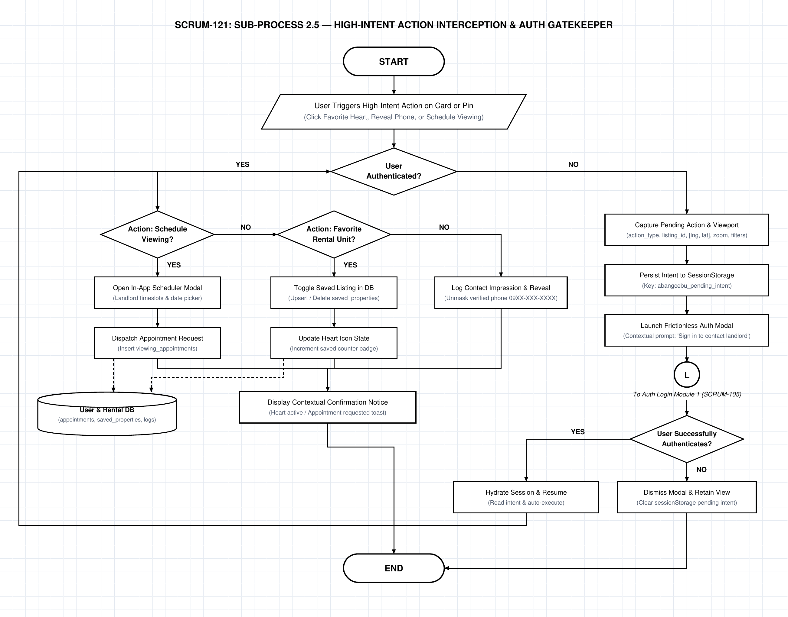

# AbangCebu AI — Sub-Process 2.5: High-Intent Action Interception & Auth Gatekeeper Specification

**Document Version:** 1.0.0  
**Status:** Approved Architecture Specification  
**Jira Ticket Reference:** [SCRUM-121](https://abangcebuai.atlassian.net/browse/SCRUM-121) — *Sub-Process 2.5: High-Intent Action Interception & Auth Gatekeeper Flowchart*  
**Sprint:** Sprint 2 (Spatial Discovery & Map Architecture Track)  
**Author:** Hermar Centillas (Lead Architect)  
**Reviewed by:** Hermar Centillas (Lead / Scrum Master)  
**Deliverables Register:**
- **Draw.io Editable XML:** [`docs/flowcharts/map-auth-gatekeeper.drawio`](../../flowcharts/map-auth-gatekeeper.drawio)
- **Vector PDF Document:** [`docs/pdf/map-auth-gatekeeper.pdf`](../../pdf/map-auth-gatekeeper.pdf)
- **High-Resolution PNG (200 DPI):** [`docs/assets/flowcharts/map-auth-gatekeeper.png`](../../assets/flowcharts/map-auth-gatekeeper.png)
- **Master Flowchart Link:** [`docs/flowcharts/map-master-orchestration.drawio`](../../flowcharts/map-master-orchestration.drawio) ([SCRUM-116](https://abangcebuai.atlassian.net/browse/SCRUM-116))

---

## Architecture Flowchart Diagram



---

## 1. Executive Summary & Micro-Module Scope

### 1.1 Architectural Purpose
The **High-Intent Action Interception & Auth Gatekeeper** subsystem secures high-intent user interactions on **AbangCebu AI** while enforcing our foundational discovery philosophy: *"The landing page IS the map."*

Under this model, map exploration is public, frictionless, and zero-barrier:
- Unauthenticated guest users can pan, zoom, search landmarks, apply price/amenity filters, inspect cards, and view property details.
- Authentication is strictly deferred until the user demonstrates **high intent** to interact with a listing or landlord.

### 1.2 High-Intent Action Classification
The gatekeeper intercepts three critical user actions:
1. **Bookmark / Favorite Unit (`favorite`):** Preserving units to the tenant's persistent saved list. Requires authenticated user ID for multi-device synchronization.
2. **Reveal Landlord Contact Info (`reveal_phone`):** Prevents automated web scrapers and unauthorized brokers from harvesting landlord phone numbers from public DOM trees. Logs contact impression audits.
3. **Schedule In-Person Viewing (`schedule_viewing`):** Requires verified contact information, preferred appointment date/timeslot, and creates an audit trail in `public.viewing_appointments`.

### 1.3 Frictionless Deferred Intent Pattern
When an unauthenticated guest triggers a gated action:
1. The system **serializes the pending intent** (action type, target listing ID, map coordinates `[lng, lat]`, zoom level, and active filter state) into browser `sessionStorage`.
2. A lightweight, contextual Auth Modal opens (linking via Connector `(L)` to Module 1 [SCRUM-105](https://abangcebuai.atlassian.net/browse/SCRUM-105) and [SCRUM-104](https://abangcebuai.atlassian.net/browse/SCRUM-104)).
3. Upon successful login or signup verification, the gatekeeper **hydrates the session, restores the exact viewport, and automatically executes the pending action** without requiring the tenant to re-trigger the action.
4. If the tenant dismisses the modal, the guest discovery view is seamlessly retained without disruptive page reloads.

---

## 2. Step-by-Step Node Dictionary

| Node ID | Shape | Step Name | Technical Execution & Data Contract |
|---|---|---|---|
| `node_start` | Stadium | **START** | Entry from Sub-Process 2.4 ([SCRUM-120](https://abangcebuai.atlassian.net/browse/SCRUM-120)) via Connector `(G)`. |
| `node_trigger_action` | Parallelogram | **User Triggers High-Intent Action on Card or Pin** | Event fired when user clicks Heart Favorite, clicks Reveal Phone Number, or clicks Schedule Viewing. |
| `node_auth_decision` | Diamond | **User Authenticated?** | Checks Supabase auth session (`supabase.auth.getUser()`). Strictly binary: **YES** / **NO**. |
| `node_schedule_decision` | Diamond | **Action: Schedule Viewing?** | *YES Branch of Diamond 1:* Checks if triggered action equals `'schedule_viewing'`. Strictly binary: **YES** / **NO**. |
| `node_open_scheduler` | Rectangle | **Open In-App Scheduler Modal** | *YES Branch of Diamond 2:* Renders appointment sheet with landlord operating hours and date picker. |
| `node_dispatch_appointment` | Rectangle | **Dispatch Appointment Request** | Inserts record into `public.viewing_appointments` with `status: 'pending_confirmation'`. |
| `node_favorite_decision` | Diamond | **Action: Favorite Rental Unit?** | *NO Branch of Diamond 2:* Checks if triggered action equals `'favorite'`. Strictly binary: **YES** / **NO**. |
| `node_toggle_favorite` | Rectangle | **Toggle Saved Listing in DB** | *YES Branch of Diamond 3:* Upserts or deletes row from `public.saved_properties` for `user_id`. |
| `node_update_heart` | Rectangle | **Update Heart Icon State** | Fills active heart SVG, toggles CSS animation, and increments saved counter badge in header. |
| `node_reveal_phone` | Rectangle | **Log Contact Impression & Reveal** | *NO Branch of Diamond 3:* Inserts audit row in `public.contact_impressions` and reveals unmasked phone `09XX-XXX-XXXX`. |
| `node_database` | Cylinder | **User & Rental DB** | Tables: `public.viewing_appointments`, `public.saved_properties`, `public.contact_impressions`. |
| `node_action_success` | Rectangle | **Display Contextual Confirmation Notice** | Renders affirmative toast notification (e.g. *"Viewing requested! The landlord has been notified."*). Proceeds to `END`. |
| `node_serialize_intent` | Rectangle | **Capture Pending Action & Viewport** | *NO Branch of Diamond 1:* Serializes `{ action, listing_id, lng, lat, zoom, filters }`. |
| `node_store_session` | Rectangle | **Persist Intent to SessionStorage** | Stores payload under key `abangcebu_pending_intent`. |
| `node_launch_auth_modal` | Rectangle | **Launch Frictionless Auth Modal** | Pops contextual auth modal with custom message: *"Sign in to schedule a viewing for this unit"*. |
| `node_connector_l` | Circle (L) | **Connector (L)** | Handoff to Auth Login & Session Lifecycle Module 1 ([SCRUM-105](https://abangcebuai.atlassian.net/browse/SCRUM-105)). |
| `node_auth_result_decision` | Diamond | **User Successfully Authenticates?** | Listens for auth state change or modal dismissal. Strictly binary: **YES** / **NO**. |
| `node_dismiss_auth` | Rectangle | **Dismiss Modal & Retain View** | *NO Branch:* User closed dialog without signing in; clears pending intent and maintains current map. |
| `node_resume_intent` | Rectangle | **Hydrate Session & Resume** | *YES Branch:* Reads `abangcebu_pending_intent`, verifies auth tokens, and auto-dispatches action. Loops back to action flow. |
| `node_end` | Stadium | **END** | Process cycle concluded; action fulfilled or gracefully aborted. |

---

## 3. Pending Intent Data Contract & Schema

```typescript
export interface PendingIntentPayload {
  action: 'favorite' | 'reveal_phone' | 'schedule_viewing';
  listingId: string;
  propertyTitle: string;
  viewport: {
    center: [number, number]; // [lng, lat]
    zoom: number;
    bbox?: [number, number, number, number];
  };
  activeFilters: Record<string, unknown>;
  timestamp: number; // TTL: 1 hour (3,600,000 ms)
}
```

### 3.1 Deferred Intent Recovery Execution
```typescript
export async function resumeDeferredIntent(): Promise<void> {
  const rawIntent = sessionStorage.getItem('abangcebu_pending_intent');
  if (!rawIntent) return;

  try {
    const intent: PendingIntentPayload = JSON.parse(rawIntent);
    
    // Validate TTL (1 hour limit)
    if (Date.now() - intent.timestamp > 3600 * 1000) {
      sessionStorage.removeItem('abangcebu_pending_intent');
      return;
    }

    // Auto-execute deferred high-intent action
    switch (intent.action) {
      case 'favorite':
        await toggleSavedPropertyAction(intent.listingId);
        break;
      case 'reveal_phone':
        await logContactImpressionAction(intent.listingId);
        break;
      case 'schedule_viewing':
        openViewingSchedulerDrawer(intent.listingId);
        break;
    }
  } finally {
    sessionStorage.removeItem('abangcebu_pending_intent');
  }
}
```

---

## 4. Database Schema Migrations for High-Intent Interactions

```sql
-- 1. Saved Properties (Favorites)
CREATE TABLE IF NOT EXISTS public.saved_properties (
    id UUID PRIMARY KEY DEFAULT gen_random_uuid(),
    user_id UUID NOT NULL REFERENCES auth.users(id) ON DELETE CASCADE,
    property_id UUID NOT NULL REFERENCES public.properties(id) ON DELETE CASCADE,
    created_at TIMESTAMPTZ NOT NULL DEFAULT NOW(),
    CONSTRAINT uq_user_saved_property UNIQUE (user_id, property_id)
);
CREATE INDEX IF NOT EXISTS idx_saved_properties_user ON public.saved_properties(user_id);

-- 2. Contact Impression Logs (Anti-Scraping Audit)
CREATE TABLE IF NOT EXISTS public.contact_impressions (
    id UUID PRIMARY KEY DEFAULT gen_random_uuid(),
    user_id UUID NOT NULL REFERENCES auth.users(id) ON DELETE CASCADE,
    property_id UUID NOT NULL REFERENCES public.properties(id) ON DELETE CASCADE,
    ip_address INET,
    user_agent TEXT,
    created_at TIMESTAMPTZ NOT NULL DEFAULT NOW()
);
CREATE INDEX IF NOT EXISTS idx_contact_impressions_property ON public.contact_impressions(property_id);

-- 3. Viewing Appointments
CREATE TABLE IF NOT EXISTS public.viewing_appointments (
    id UUID PRIMARY KEY DEFAULT gen_random_uuid(),
    tenant_id UUID NOT NULL REFERENCES auth.users(id) ON DELETE CASCADE,
    property_id UUID NOT NULL REFERENCES public.properties(id) ON DELETE CASCADE,
    preferred_date DATE NOT NULL,
    preferred_time_slot TEXT NOT NULL,
    status TEXT NOT NULL DEFAULT 'pending_confirmation' 
        CHECK (status IN ('pending_confirmation', 'confirmed', 'declined', 'completed', 'cancelled')),
    tenant_notes TEXT,
    created_at TIMESTAMPTZ NOT NULL DEFAULT NOW(),
    updated_at TIMESTAMPTZ NOT NULL DEFAULT NOW()
);
CREATE INDEX IF NOT EXISTS idx_viewing_appointments_tenant ON public.viewing_appointments(tenant_id);
CREATE INDEX IF NOT EXISTS idx_viewing_appointments_property ON public.viewing_appointments(property_id);
```

---

## 5. Security & Anti-Abuse Controls

1. **Rate Limiting on Phone Reveals:** Authenticated tenants are capped at 10 contact reveals per hour to prevent landlord harassment and competitor lead harvesting.
2. **RLS Policies:**
   - `saved_properties`: Users can only read and mutate their own saved items (`auth.uid() = user_id`).
   - `viewing_appointments`: Landlords can only read appointments for properties they own; tenants can only view their own requests.
   - `contact_impressions`: Append-only table; users can insert records, but cannot query or update audit rows.
3. **Traceability:** Every intercepted action records authentic session metadata in PostGIS spatial logs and PostgreSQL tables.
