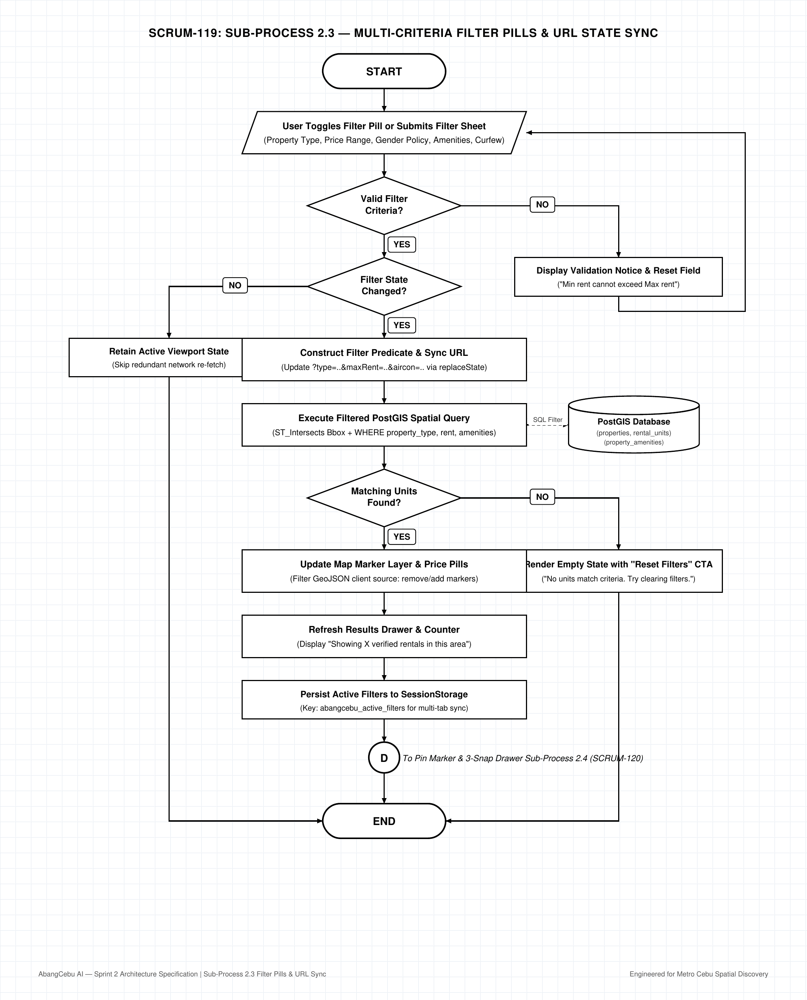
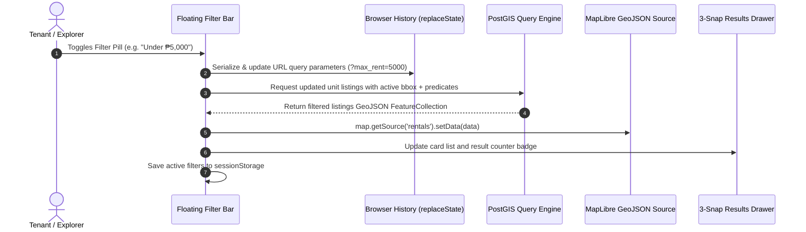

# AbangCebu AI — Sub-Process 2.3: Multi-Criteria Filter Pills & URL State Sync Specification

**Document Version:** 1.0.0  
**Status:** Approved Architecture Specification  
**Jira Ticket Reference:** [SCRUM-119](https://abangcebuai.atlassian.net/browse/SCRUM-119) — *Sub-Process 2.3: Multi-Criteria Filter Pills & URL State Sync Flowchart*  
**Sprint:** Sprint 2 (Spatial Discovery & Map Architecture Track)  
**Author:** Joan Marie Inting (Engineering Team) & Hermar Centillas (Lead Architect)  
**Reviewed by:** Hermar Centillas (Lead / Scrum Master)  
**Deliverables Register:**
- **Draw.io Editable XML:** [`docs/flowcharts/map-filtering-url-sync.drawio`](../../flowcharts/map-filtering-url-sync.drawio)
- **Vector PDF Document:** [`docs/pdf/map-filtering-url-sync.pdf`](../../pdf/map-filtering-url-sync.pdf)
- **High-Resolution PNG (200 DPI):** [`docs/assets/flowcharts/map-filtering-url-sync.png`](../../assets/flowcharts/map-filtering-url-sync.png)
- **Master Flowchart Link:** [`docs/flowcharts/map-master-orchestration.drawio`](../../flowcharts/map-master-orchestration.drawio) ([SCRUM-116](https://abangcebuai.atlassian.net/browse/SCRUM-116))

---

## Architecture Flowchart Diagram



---

## 1. Executive Summary & Micro-Module Scope

### 1.1 Architectural Purpose
The **Multi-Criteria Filter Pills & URL State Sync** subsystem governs client-side filter interaction, state serialisation, URL synchronization, and server-side spatial query filtering for **AbangCebu AI**.

In the boarding house and rental market of Metro Cebu, seekers filter according to hyper-local constraints such as:
1. **Property Type:** Boarding House, Bedspace, Studio Apartment, 1BR/2BR Condominium.
2. **Price Range:** Monthly budget boundaries (e.g. `minRent` ₱1,500 – `maxRent` ₱8,000 for student bedspaces; ₱15,000–₱35,000 for IT Park condos).
3. **Gender Policy:** Male Only, Female Only, Co-ed / Open.
4. **Amenities:** Air conditioning, Private Bathroom (CR), Wi-Fi included, Kitchen / Cooking allowed, Laundry area, Submetered electricity.
5. **Rules & Curfew:** No Curfew vs. Gate Closing Hours (e.g., 10:00 PM), Visitors allowed, Pet-friendly.

This subsystem provides zero-reload, instantaneous UI feedback via horizontal scrolling filter pills, a detailed sliding bottom filter modal, seamless URL query synchronization (`replaceState`), and dynamic MapLibre GeoJSON layer filtering.

### 1.2 Core Architectural Principles
- **URL as the Single Source of Truth:** All applied filters serialize to standard query parameters (`?type=bedspace&max_rent=5000&gender=female&amenities=aircon,wifi`). A shared or bookmarked URL immediately reproduces the identical viewport and filter results without client session dependencies.
- **Strictly Binary Flow Control:** Every decision diamond possesses exactly two outgoing branches (**YES** and **NO**), preventing ambiguous edge collisions.
- **Client Cache & Session Persistence:** Filter preferences are saved in `sessionStorage` (`abangcebu_active_filters`) so that browser tab switches, reloads, or temporary navigational detours preserve the tenant's chosen discovery criteria.
- **Optimized PostGIS Querying:** Dynamic WHERE clauses are assembled with parameterized SQL, ensuring GiST index acceleration on `coordinates` combined with btree indexes on property attributes.

---

## 2. Step-by-Step Node Dictionary

| Node ID | Shape | Step Name | Technical Execution & Data Contract |
|---|---|---|---|
| `node_start` | Stadium | **START** | Entry from Spatial Search Sub-Process 2.2 ([SCRUM-118](https://abangcebuai.atlassian.net/browse/SCRUM-118)) via Connector `(F)`. |
| `node_filter_entry` | Parallelogram | **User Toggles Filter Pill or Submits Filter Sheet** | Event triggered by clicking quick filter pills (e.g. *"Under ₱5k"*, *"Bedspace"*, *"Aircon"*) or submitting the full Filter Modal sheet. |
| `node_criteria_decision` | Diamond | **Valid Filter Criteria?** | Validates user input boundaries (e.g., `min_rent <= max_rent`, valid enum types). Strictly binary: **YES** / **NO**. |
| `node_filter_error` | Rectangle | **Display Validation Notice & Reset Field** | *NO Branch:* Shows inline toast/notice (e.g., *"Min rent cannot exceed Max rent"*), resets erroneous input field, and loops back to filter entry. |
| `node_changed_decision` | Diamond | **Filter State Changed?** | Performs deep equality check against currently active filter state. Strictly binary: **YES** / **NO**. |
| `node_no_op` | Rectangle | **Retain Active Viewport State** | *NO Branch:* Avoids duplicate queries and network latency when user selects already-active criteria. Proceeds to Connector `(D)`. |
| `node_build_predicate` | Rectangle | **Construct Filter Predicate & Sync URL** | Builds query parameters and calls `window.history.replaceState({}, '', queryUrl)`. Does not pollute navigation back history. |
| `node_query_filtered` | Rectangle | **Execute Filtered PostGIS Spatial Query** | Dispatches Server Action / API call with PostGIS bounding box and attribute predicates. |
| `node_postgis_db` | Cylinder | **PostGIS Database** | Target tables: `public.properties`, `public.rental_units`, `public.property_amenities`. Uses GiST spatial index. |
| `node_match_decision` | Diamond | **Matching Units Found?** | Evaluates response payload array length (`listings.length > 0`). Strictly binary: **YES** / **NO**. |
| `node_empty_filter` | Rectangle | **Render Empty State with "Reset Filters" CTA** | *NO Branch:* Displays empty state banner: *"No rentals match your selected filters in this area"* with quick-reset action. |
| `node_update_pins` | Rectangle | **Update Map Marker Layer & Price Pills** | Updates MapLibre client-side GeoJSON source `map.getSource('rental-points').setData(geojsonData)`. |
| `node_update_drawer` | Rectangle | **Refresh Results Drawer & Counter** | Updates drawer list view and counter (e.g., *"Showing 14 verified rentals matching criteria"*). |
| `node_cache_state` | Rectangle | **Persist Active Filters to SessionStorage** | Writes active filter JSON to `sessionStorage.setItem('abangcebu_active_filters', ...)`. |
| `node_connector_d` | Circle (D) | **Connector (D)** | Transfers control to Sub-Process 2.4: Bidirectional Pin Marker & 3-Snap Gesture Drawer ([SCRUM-120](https://abangcebuai.atlassian.net/browse/SCRUM-120)). |
| `node_end` | Stadium | **END** | Process cycle concluded; UI in synchronized, settled state. |

---

## 3. URL Parameter Specification & Canonical Schema

The URL schema follows standard URLSearchParams formatting for clean sharing:

```typescript
export interface SearchFilterParams {
  // Spatial Envelope
  bbox?: string; // "minLng,minLat,maxLng,maxLat"
  landmark?: string; // e.g. "it-park", "usc-talamban", "ayala-cebu"
  
  // Property Classification
  type?: ('boarding_house' | 'bedspace' | 'apartment' | 'condo')[];
  
  // Financial Boundaries (PHP)
  min_rent?: number;
  max_rent?: number;
  
  // Policy & Gender Constraints
  gender?: 'any' | 'male_only' | 'female_only' | 'coed';
  curfew?: 'none' | 'curfew_applies';
  
  // Amenities (Comma-separated)
  amenities?: ('aircon' | 'wifi' | 'private_cr' | 'cooking_allowed' | 'laundry' | 'submeter')[];
}
```

### 3.1 URL Serialization Example
```text
https://abangcebu.ph/?bbox=123.88,10.31,123.92,10.34&type=bedspace&max_rent=4500&gender=female_only&amenities=aircon,wifi
```

---

## 4. PostGIS SQL Dynamic Query Generation

```sql
SELECT 
    p.id,
    p.title,
    p.property_type,
    p.gender_policy,
    p.curfew_policy,
    p.address,
    p.barangay,
    p.city,
    ST_Y(p.coordinates::geometry) AS latitude,
    ST_X(p.coordinates::geometry) AS longitude,
    MIN(u.monthly_rent) AS min_rent,
    MAX(u.monthly_rent) AS max_rent,
    COUNT(u.id) AS available_units,
    COALESCE(array_agg(DISTINCT a.amenity_name), '{}') AS amenities
FROM public.properties p
JOIN public.rental_units u ON u.property_id = p.id
LEFT JOIN public.property_amenities a ON a.property_id = p.id
WHERE 
    p.status = 'approved'
    AND u.status = 'available'
    -- Spatial Viewport Bounding Box Filter
    AND ST_Intersects(
        p.coordinates::geometry,
        ST_MakeEnvelope(:min_lng, :min_lat, :max_lng, :max_lat, 4326)
    )
    -- Multi-criteria Predicates
    AND (:property_types::text[] IS NULL OR p.property_type = ANY(:property_types))
    AND (:gender_policy::text IS NULL OR p.gender_policy = :gender_policy OR p.gender_policy = 'open')
    AND (:max_rent::numeric IS NULL OR u.monthly_rent <= :max_rent)
    AND (:min_rent::numeric IS NULL OR u.monthly_rent >= :min_rent)
    AND (:curfew::text IS NULL OR p.curfew_policy = :curfew)
GROUP BY p.id
HAVING 
    (:required_amenities::text[] IS NULL OR :required_amenities <@ array_agg(a.amenity_name::text));
```

---

## 5. Client State Management & Synchronization Flow



---

## 6. Integration Contract & Downstream Handoff

1. **Upstream Inbound:** Sub-Process 2.2 Spatial Search & Viewport Query ([SCRUM-118](https://abangcebuai.atlassian.net/browse/SCRUM-118)) passes geographic coordinates and bounds to Connector `(F)`.
2. **Downstream Outbound:** Upon successful GeoJSON layer update or empty-state presentation, Connector `(D)` transfers control to Sub-Process 2.4: Bidirectional Pin Marker & 3-Snap Gesture Drawer ([SCRUM-120](https://abangcebuai.atlassian.net/browse/SCRUM-120)).
3. **Quality & Test Acceptance:**
   - URL updating must not trigger full Next.js page re-renders or WebGL map destruction.
   - Debounce on price slider must be set to 300ms.
   - Filter pills must be keyboard accessible (ARIA role `toolbar` and `checkbox` or `button`).
