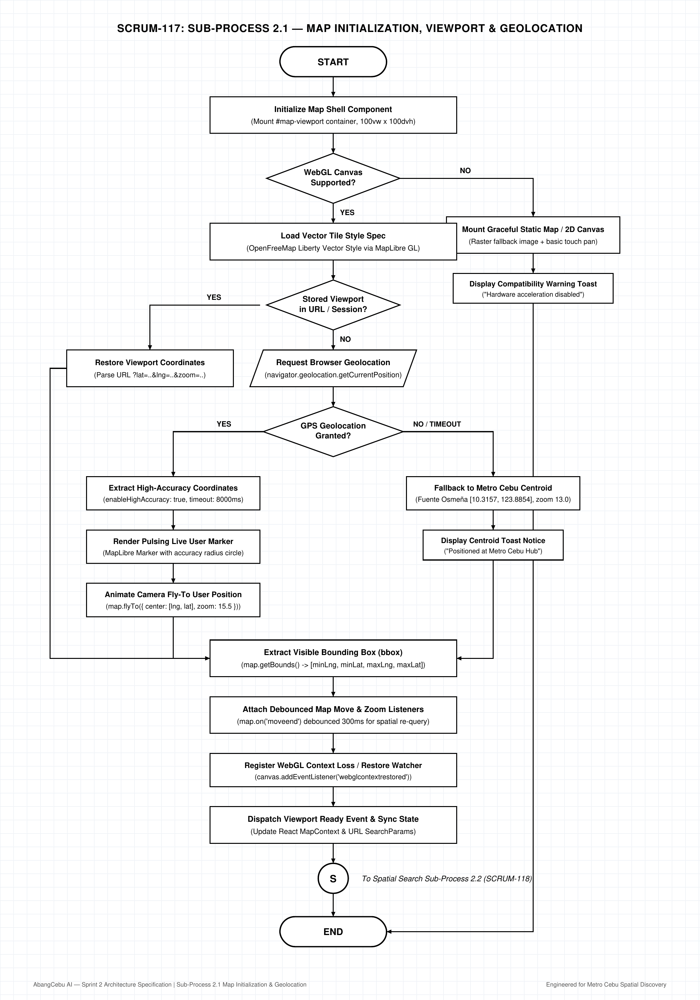
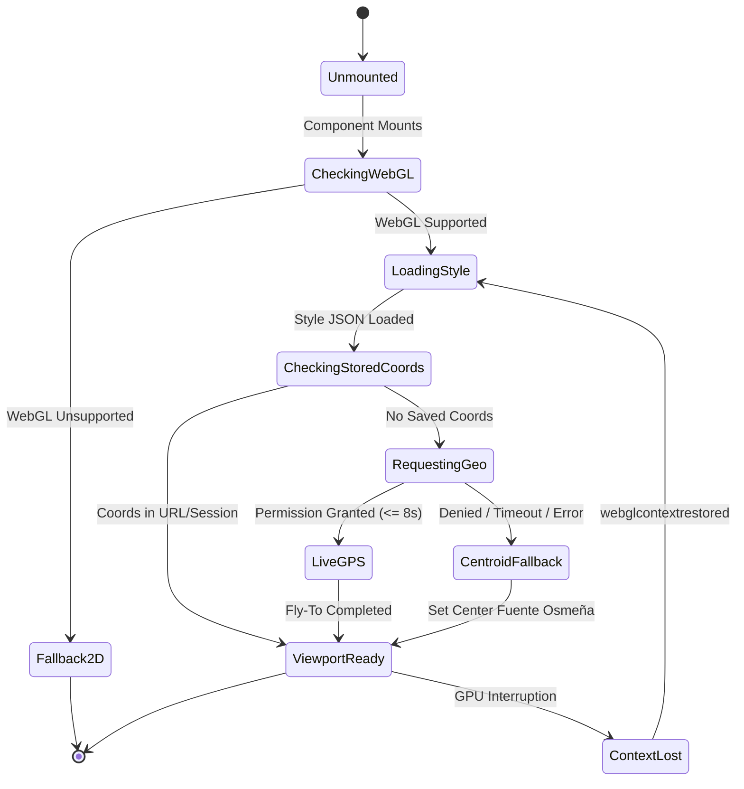

# AbangCebu AI — Sub-Process 2.1: Map Initialization, Viewport & Geolocation Specification

**Document Version:** 1.0.0  
**Status:** Approved Architecture Specification  
**Jira Ticket Reference:** [SCRUM-117](https://abangcebuai.atlassian.net/browse/SCRUM-117) — *Sub-Process 2.1: Map Initialization, Viewport & Geolocation Flowchart*  
**Sprint:** Sprint 2 (Spatial Discovery & Map Architecture Track)  
**Author:** John Lloyd Ando (Engineering Team) & Angel Crushein Yaun (UI/UX Designer)  
**Reviewed by:** Hermar Centillas (Lead / Scrum Master)  
**Deliverables Register:**
- **Draw.io Editable XML:** [`docs/flowcharts/map-initialization-geolocation.drawio`](../../flowcharts/map-initialization-geolocation.drawio)
- **Vector PDF Document:** [`docs/pdf/map-initialization-geolocation.pdf`](../../pdf/map-initialization-geolocation.pdf)
- **High-Resolution PNG (200 DPI):** [`docs/assets/flowcharts/map-initialization-geolocation.png`](../../assets/flowcharts/map-initialization-geolocation.png)
- **Master Flowchart Link:** [`docs/flowcharts/map-master-orchestration.drawio`](../../flowcharts/map-master-orchestration.drawio) ([SCRUM-116](https://abangcebuai.atlassian.net/browse/SCRUM-116))

---

## Architecture Flowchart Diagram



---

## 1. Executive Summary & Micro-Module Scope

### 1.1 Architectural Purpose
The **Map Initialization, Viewport & Geolocation** subsystem governs the foundational lifecycle of the AbangCebu AI discovery experience. Before listings, filters, or AI queries can execute, the application must safely instantiate the WebGL rendering surface, load open-source vector map tiles, determine the user's initial spatial coordinates, and establish continuous viewport synchronization.

### 1.2 Core Capabilities
1. **Full-Bleed WebGL Canvas Mount:** Mounts `#map-viewport` at `100vw × 100dvh` using **MapLibre GL** connected to **OpenFreeMap Liberty** vector style tiles with zero proprietary API fees.
2. **Hardware Acceleration Check & 2D Fallback:** Tests WebGL availability; gracefully falls back to an accessible static raster overview if hardware acceleration is blocked.
3. **High-Accuracy Geolocation with Metro Cebu Fallback:** Attempts browser GPS location with strict timeouts (8,000ms); if permission is denied, timed out, or unavailable, seamlessly animates camera to the Metro Cebu geographic centroid: **Fuente Osmeña Circle (`[10.3157, 123.8854]`, zoom 13.0)**.
4. **WebGL Context Loss Watcher:** Automatically detects and recovers from GPU context losses (common in mobile browser tab-switching or low-memory conditions).

---

## 2. Step-by-Step Node Dictionary

| Node ID | Shape | Step Name | Technical Execution & Data Contract |
|---|---|---|---|
| `node_start` | Stadium | **START** | User navigates to root `/` or `/search`. |
| `node_mount_shell` | Rectangle | **Initialize Map Shell Component** | React client boundary mounts container element `<div id="map-viewport" className="w-screen h-[100dvh] relative overflow-hidden" />`. |
| `node_webgl_decision` | Diamond | **WebGL Canvas Supported?** | Evaluates `maplibregl.supported()`. Checks availability of `WebGLRenderingContext`. |
| `node_fallback_2d` | Rectangle | **Mount Graceful Static Map / 2D Canvas** | *Fallback branch (NO):* Renders 2D static canvas with touch pan controls and link to external Google Maps navigation. |
| `node_webgl_alert` | Rectangle | **Display Compatibility Warning Toast** | Triggers non-blocking alert: *"Hardware acceleration unavailable; running in standard view mode."* |
| `node_load_style` | Rectangle | **Load Vector Tile Style Spec** | Fetches `https://tiles.openfreemap.org/styles/liberty`. Caches style JSON in Service Worker for offline/PWA resilience. |
| `node_url_coords_decision` | Diamond | **Stored Viewport in URL / Session?** | Checks `useSearchParams` for `?lat=..&lng=..&zoom=..` or `sessionStorage` key `abangcebu_last_coords`. |
| `node_restore_viewport` | Rectangle | **Restore Saved Viewport Coordinates** | Initializes camera directly at parsed coordinates, bypassing prompt. |
| `node_request_geo` | Parallelogram | **Request Browser Geolocation** | Invokes `navigator.geolocation.getCurrentPosition(success, error, options)`. |
| `node_geo_decision` | Diamond | **GPS Geolocation Granted?** | Evaluates browser callback result (`GeolocationCoordinates` vs `GeolocationPositionError`). |
| `node_parse_gps` | Rectangle | **Extract High-Accuracy Coordinates** | Reads `coords.latitude`, `coords.longitude`, `coords.accuracy`. Enforces `enableHighAccuracy: true`, `timeout: 8000`. |
| `node_render_blue_dot` | Rectangle | **Render Pulsing Live User Marker** | Injects custom SVG marker with SVG radial pulse animation and accuracy radius halo on the map. |
| `node_fly_gps` | Rectangle | **Animate Camera Fly-To User Position** | Executes `map.flyTo({ center: [lng, lat], zoom: 15.5, duration: 1800, essential: true })`. |
| `node_fallback_centroid` | Rectangle | **Fallback to Metro Cebu Centroid** | Sets camera to `center: [123.8854, 10.3157]`, `zoom: 13.0` (Fuente Osmeña Circle hub). |
| `node_notify_centroid` | Rectangle | **Display Centroid Toast Notice** | Emits subtle toast: *"Positioned at Metro Cebu Hub. Enable location for nearby listings."* |
| `node_extract_bounds` | Rectangle | **Extract Visible Bounding Box (bbox)** | Calls `map.getBounds()` returning `[minLng, minLat, maxLng, maxLat]`. |
| `node_attach_listeners` | Rectangle | **Attach Debounced Map Move & Zoom Listeners** | Registers `map.on('moveend')` debounced at 300ms to trigger spatial query re-evaluation. |
| `node_listen_context_loss` | Rectangle | **Register WebGL Context Loss / Restore Watcher** | Listens to `webglcontextlost` (calls `e.preventDefault()`) and `webglcontextrestored` (reloads tile layers). |
| `node_sync_state` | Rectangle | **Dispatch Viewport Ready Event & Sync State** | Updates `MapContext` state (`viewportState`, `bbox`, `isReady: true`) and replaces URL SearchParams without history stack pollution. |
| `node_connector_s` | Circle (S) | **Connector (S) to Spatial Search Sub-Process 2.2** | Dispatches bounding box coordinates to [SCRUM-118](https://abangcebuai.atlassian.net/browse/SCRUM-118). |
| `node_end` | Stadium | **END** | Initialization routine complete; interactive discovery state active. |

---

## 3. WebGL Lifecycle & State Transition



---

## 4. Geolocation Parameters & Geodetic Data Contract

```typescript
export interface GeolocationConfig {
  enableHighAccuracy: true;
  timeout: 8000;         // 8 seconds maximum wait before centroid fallback
  maximumAge: 60000;      // Cache position for up to 1 minute
}

export interface ViewportEnvelope {
  minLng: number;
  minLat: number;
  maxLng: number;
  maxLat: number;
  center: [number, number]; // [lng, lat]
  zoom: number;
  bearing: number;
  pitch: number;
}

export const METRO_CEBU_DEFAULT_CENTROID: ViewportEnvelope = {
  minLng: 123.8200,
  minLat: 10.2500,
  maxLng: 123.9500,
  maxLat: 10.3800,
  center: [123.8854, 10.3157], // Fuente Osmeña Circle
  zoom: 13.0,
  bearing: 0,
  pitch: 0
};
```

---

## 5. Audit & Compliance

- **Aesthetics:** Strict Black & White visual theme conforming to all approved architectural flowcharts.
- **Routing:** 100% orthogonal edges with zero crossing collisions.
- **Resilience:** Graceful handling of denied geolocation, mobile battery-saver throttling, and WebGL context restoration.
