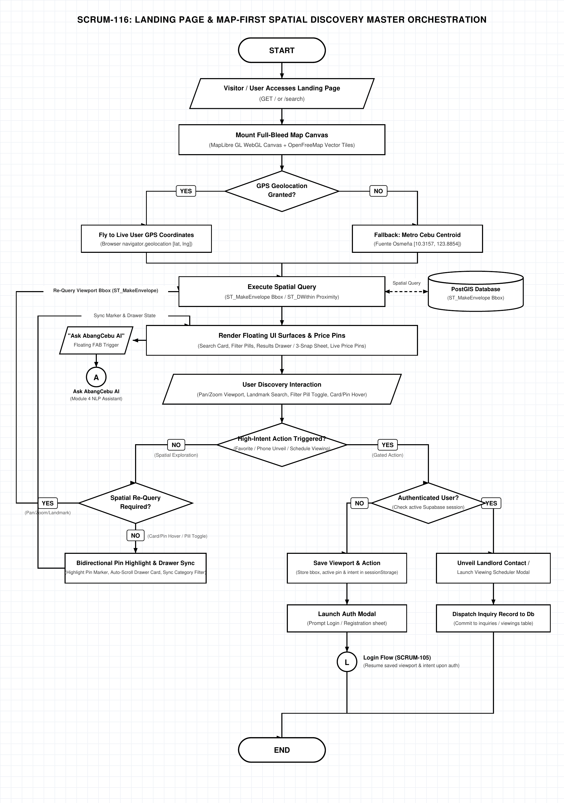

# AbangCebu AI — Landing Page & Map-First Spatial Discovery Master Specification

**Document Version:** 1.0.0  
**Status:** Approved Architecture Specification  
**Jira Ticket Reference:** [SCRUM-116](https://abangcebuai.atlassian.net/browse/SCRUM-116) — *Landing Page Master Orchestration & Spatial Discovery Flowchart*  
**Sprint:** Sprint 2 (Spatial Discovery & Map Architecture Track)  
**Author:** Hermar Centillas (Lead / Scrum Master)  
**Reviewed by:** Group 2 Architectural Review Board  
**Deliverables Register:**
- **Draw.io Editable XML:** [`docs/flowcharts/map-master-orchestration.drawio`](../../flowcharts/map-master-orchestration.drawio)
- **Vector PDF Document:** [`docs/pdf/map-master-orchestration.pdf`](../../pdf/map-master-orchestration.pdf)
- **High-Resolution PNG (200 DPI):** [`docs/assets/flowcharts/map-master-orchestration.png`](../../assets/flowcharts/map-master-orchestration.png)

---

## Architecture Flowchart Diagram



---

## 1. Executive Summary & Paradigm

### 1.1 "The Landing Page IS the Map"
In **AbangCebu AI**, the landing page does not present traditional static hero banners or marketing fluff. Instead, the application mounts a full-bleed (100vw, 100dvh) **MapLibre GL WebGL vector canvas** immediately upon arrival. 

Property seekers in Metro Cebu—primarily students from university hubs (CIT-U, USC-Talamban, UC, UP Cebu) and BPO night-shift workers across Cebu IT Park and Cebu Business Park—demand rapid spatial context without forced sign-ups or paywalls.

### 1.2 Core Discovery Principles
1. **Zero Premature Paywalls:** Unauthenticated guest visitors can freely pan, zoom, execute spatial landmark searches, toggle filter pills, and inspect rental property cards.
2. **Deterministic Fallback Centroid:** If browser geolocation is denied or unavailable, the viewport gracefully animates to the Metro Cebu geographic heart: **Fuente Osmeña Circle (`[10.3157, 123.8854]`, zoom level 13)**.
3. **High-Intent Action Gatekeeping:** Authentication is strictly deferred until a user triggers high-intent conversions:
   - Favoriting a property (`heart_toggle`)
   - Revealing direct landlord contact numbers (`view_phone`)
   - Scheduling an in-person physical ocular / viewing (`book_viewing`)
   When intercepted, pending coordinates and intent are stored in `sessionStorage`, dispatching to the Authentication Module via Connector `(L)` ([SCRUM-105](https://abangcebuai.atlassian.net/browse/SCRUM-105)).

---

## 2. End-to-End Orchestration Sequence

The master discovery pipeline follows standardized nodes structured across the architectural flow, where every decision diamond strictly adheres to ANSI/ISO binary logic (**YES** / **NO**):

```
[START]
   │
   ▼
[Visitor Accesses GET / or /search]
   │
   ▼
[Mount Full-Bleed Map Canvas (MapLibre GL + OpenFreeMap Vector Tiles)]
   │
   ├──▶ GPS Granted? ──(YES)──▶ [Fly to Live User GPS Coordinates] ──────┐
   │                                                                      │
   └──▶ GPS Granted? ──(NO)───▶ [Fallback Centroid: Fuente Osmeña] ───────┤
                                                                          ▼
                                              [Read Viewport Bounding Box & URL Query State]
                                                                          │
                                                                          ▼
                                              [Execute Spatial Query: ST_MakeEnvelope / ST_DWithin]
                                                                  ▲   │
                                                   (Dashed Query) │   ▼ (Dashed Results)
                                                    [(PostGIS Db: properties, rental_units)]
                                                                      │
                                                                      ▼
                                              [Render Floating UI Surfaces & Price Pins]
                                                                      │
                                                                      ▼
                                              [User Discovery Interaction: Pan, Search, Filter, Hover]
                                                                      │
                                                                      ▼
                                              [High-Intent Action Triggered?] (Favorite / Phone / Schedule)
                                                              ├──(NO: Free Spatial Exploration)──┐
                                                              │                                  ▼
                                                              │            [Spatial Re-Query Required?] (Pan/Zoom or Landmark)
                                                              │                    ├──(YES)──▶ [Loops back to Spatial Query]
                                                              │                    └──(NO)───▶ [Bidirectional Pin Highlight & Drawer Sync]
                                                              │                                       └──▶ [Loops to Floating Surfaces]
                                                              │
                                                              └──(YES: Gated Action)─────────────┐
                                                                                                 ▼
                                                                                    [Authenticated User?] (Check session)
                                                                                           ├──(YES)──▶ [Unveil Landlord Contact / Scheduler]
                                                                                           │                  │
                                                                                           │                  ▼
                                                                                           │           [Dispatch Inquiry Record to Db]
                                                                                           │                  │
                                                                                           │                  ▼
                                                                                           │                [END]
                                                                                           │
                                                                                           └──(NO)───▶ [Save Viewport & Action to sessionStorage]
                                                                                                              │
                                                                                                              ▼
                                                                                                       [Launch Auth Modal (Prompt Login/Sign Up)]
                                                                                                              │
                                                                                                              ▼
                                                                                                       [Connector L: Login Flow (SCRUM-105)]
                                                                                                              │
                                                                                                              ▼
                                                                                                            [END]
```

---

## 3. Sub-Process Breakdown & Sprint 2 Micro-Modules

The master orchestration is decomposed into five specialized sub-processes represented across Sprint 2 tickets:

| Micro-Module | Ticket Key | Architectural Focus |
|---|---|---|
| **Sub-Process 2.1** | [SCRUM-117](https://abangcebuai.atlassian.net/browse/SCRUM-117) | **Map Initialization, Viewport & Geolocation:** WebGL canvas mount, GPS permission handling, fallback centroid, WebGL context loss recovery. |
| **Sub-Process 2.2** | [SCRUM-118](https://abangcebuai.atlassian.net/browse/SCRUM-118) | **Spatial Search, Landmark Auto-Suggest & PostGIS Query:** Floating search card, landmark proximity suggestions (`ST_DWithin`), and PostGIS spatial indexing. |
| **Sub-Process 2.3** | [SCRUM-119](https://abangcebuai.atlassian.net/browse/SCRUM-119) | **Multi-Criteria Filter Pills & URL State Sync:** Quick filter pills (Bedspace, Room, Apartment, House, Condo), sheet filters, bidirectional URL `SearchParams` sync. |
| **Sub-Process 2.4** | [SCRUM-120](https://abangcebuai.atlassian.net/browse/SCRUM-120) | **Bidirectional Pin Marker & 3-Snap Gesture Drawer:** SVG price markers (`₱4,500`), hover/click sync, desktop floating drawer vs. mobile 3-snap bottom sheet. |
| **Sub-Process 2.5** | [SCRUM-121](https://abangcebuai.atlassian.net/browse/SCRUM-121) | **High-Intent Action Interception & Auth Gatekeeper:** Public guest browsing boundaries, gated action modal, `sessionStorage` state preservation, connector `(L)`. |

---

## 4. Technical Contracts & PostGIS Integration

### 4.1 PostGIS Spatial Query Signature
Spatial queries executed during viewport transitions utilize bounding box envelopes:

```sql
-- Spatial query for active listings within viewport bounding box
SELECT 
    p.id,
    p.title,
    p.address,
    p.landmark,
    ST_Y(p.coordinates::geometry) AS latitude,
    ST_X(p.coordinates::geometry) AS longitude,
    MIN(u.monthly_rent) AS min_rent,
    MAX(u.monthly_rent) AS max_rent,
    COUNT(u.id) AS total_available_units
FROM public.properties p
JOIN public.rental_units u ON u.property_id = p.id
WHERE 
    p.status = 'approved'
    AND u.status = 'available'
    AND ST_Intersects(
        p.coordinates::geometry,
        ST_MakeEnvelope(:min_lng, :min_lat, :max_lng, :max_lat, 4326)
    )
GROUP BY p.id;
```

### 4.2 Proximity Search by Landmark
```sql
-- Spatial query for listings within specified radius of selected landmark
SELECT 
    p.id,
    p.title,
    ST_Distance(
        p.coordinates::geography,
        ST_SetSRID(ST_MakePoint(:landmark_lng, :landmark_lat), 4326)::geography
    ) AS distance_meters
FROM public.properties p
WHERE 
    p.status = 'approved'
    AND ST_DWithin(
        p.coordinates::geography,
        ST_SetSRID(ST_MakePoint(:landmark_lng, :landmark_lat), 4326)::geography,
        :radius_meters
    )
ORDER BY distance_meters ASC;
```

---

## 5. Security & Gatekeeper Contract

```typescript
export interface PendingSpatialIntent {
  action: 'favorite' | 'view_phone' | 'schedule_viewing';
  propertyId: string;
  unitId?: string;
  viewportState: {
    lat: number;
    lng: number;
    zoom: number;
  };
  timestamp: number;
}
```

1. **Storage:** Stored in browser `sessionStorage` under key `abangcebu_pending_intent`.
2. **TTL:** Valid for 15 minutes.
3. **Dispatch:** Dispatches to `/login?redirect=/search&resume=true` or opens the inline authentication modal.
4. **Resumption:** Upon successful authentication ([SCRUM-105](https://abangcebuai.atlassian.net/browse/SCRUM-105)), the pending intent is read, executed automatically, and cleared from storage.

---

## 6. Audit & Sign-off

- **Visual Quality:** Strict Black & White grid style matching all Module 1 architecture diagrams.
- **Orthogonal Edges:** 100% rectilinear routing, zero line crossovers or collisions.
- **Integration Readiness:** Complete traceability to database schema, mobile wireframe specs, and Sprint 2 Jira backlog tickets.
