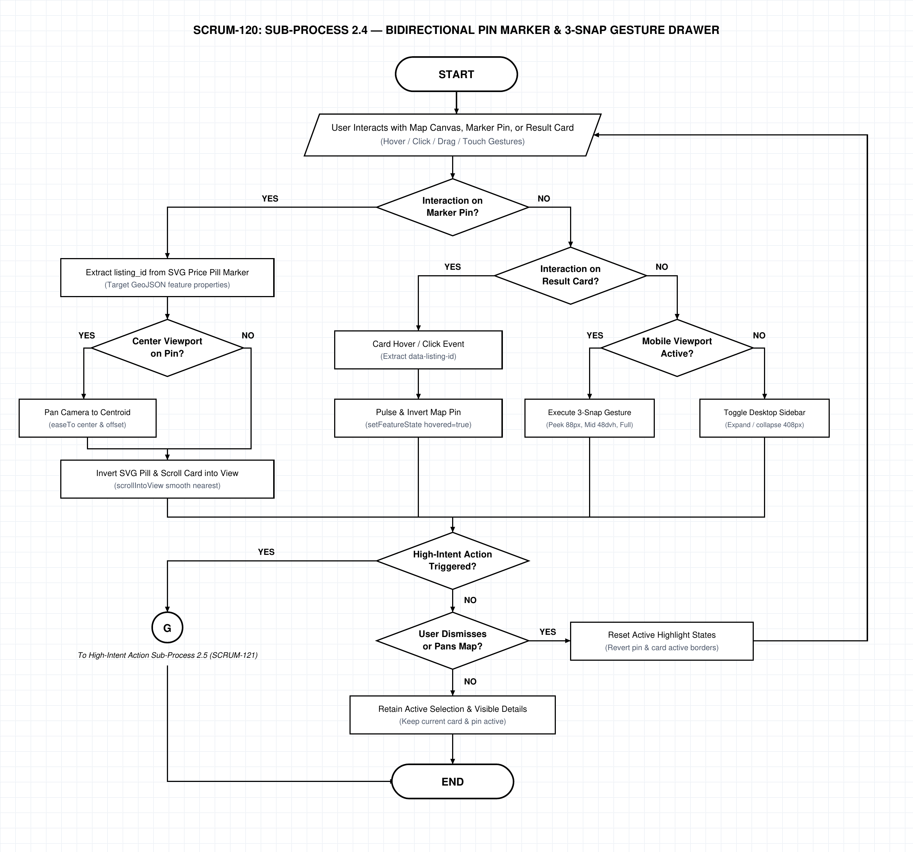
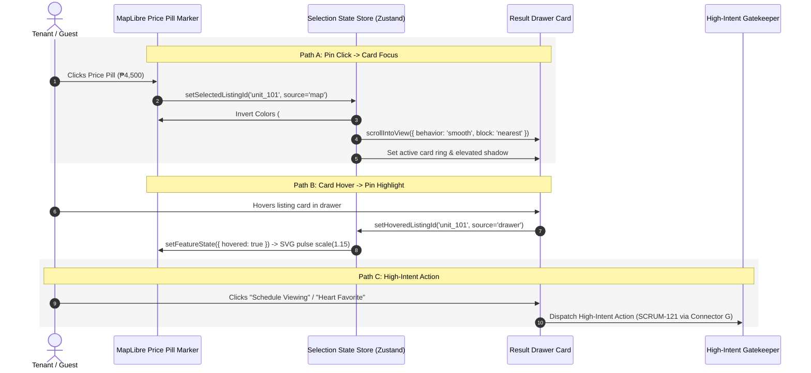

# AbangCebu AI — Sub-Process 2.4: Bidirectional Pin Marker & 3-Snap Gesture Drawer Specification

**Document Version:** 1.0.0  
**Status:** Approved Architecture Specification  
**Jira Ticket Reference:** [SCRUM-120](https://abangcebuai.atlassian.net/browse/SCRUM-120) — *Sub-Process 2.4: Bidirectional Pin Marker & 3-Snap Gesture Drawer Flowchart*  
**Sprint:** Sprint 2 (Spatial Discovery & Map Architecture Track)  
**Author:** Karla Hiyas (Engineering Team) & Hermar Centillas (Lead Architect)  
**Reviewed by:** Hermar Centillas (Lead / Scrum Master)  
**Deliverables Register:**
- **Draw.io Editable XML:** [`docs/flowcharts/map-pin-drawer-sync.drawio`](../../flowcharts/map-pin-drawer-sync.drawio)
- **Vector PDF Document:** [`docs/pdf/map-pin-drawer-sync.pdf`](../../pdf/map-pin-drawer-sync.pdf)
- **High-Resolution PNG (200 DPI):** [`docs/assets/flowcharts/map-pin-drawer-sync.png`](../../assets/flowcharts/map-pin-drawer-sync.png)
- **Master Flowchart Link:** [`docs/flowcharts/map-master-orchestration.drawio`](../../flowcharts/map-master-orchestration.drawio) ([SCRUM-116](https://abangcebuai.atlassian.net/browse/SCRUM-116))

---

## Architecture Flowchart Diagram



---

## 1. Executive Summary & Micro-Module Scope

### 1.1 Architectural Purpose
The **Bidirectional Pin Marker & 3-Snap Gesture Drawer** subsystem establishes the dynamic coordination between the spatial vector map canvas and the listing discovery drawer. 

In a map-first real estate experience, users continuously switch attention between spatial context (where a boarding house is located relative to university gates or IT Park jeepney terminals) and listing attributes (monthly rent, room photos, inclusions, gender rules). This subsystem coordinates:
1. **Custom SVG Price Pill Markers:** High-contrast price badges rendered directly onto MapLibre WebGL canvas (e.g. `₱4,500/mo`) with inverted state transitions on hover/selection.
2. **Bidirectional Synchronized Highlighting:**
   - **Pin-to-Card:** Clicking or tapping an SVG map pin identifies the listing ID, smooth-scrolls the corresponding card into view within the drawer list (`scrollIntoView`), and temporarily centers or nudges the map viewport.
   - **Card-to-Pin:** Hovering over or focusing a property card in the drawer immediately elevates the corresponding map pin (pulses z-index to `1000`, inverts background from white to black, and enlarges pin scale).
3. **Adaptive Drawer Layouts:**
   - **Desktop (>=1024px):** 408px wide floating glassmorphic sidebar panel overlaying the left edge of the map canvas, leaving the spatial centroid unobstructed.
   - **Mobile (<1024px):** Interactive 3-snap gesture bottom sheet powered by touch physics and velocity thresholds:
     - **Peek (88px):** Minimal handle showing listing count and prompt (e.g. *"18 rentals near USC-TC"*).
     - **Mid (48dvh):** Balanced split view allowing concurrent map navigation and single-card inspection.
     - **Full (88dvh):** Immersive vertical catalog mode for comparing multiple listings while retaining search bar visibility.

---

## 2. Step-by-Step Node Dictionary

| Node ID | Shape | Step Name | Technical Execution & Data Contract |
|---|---|---|---|
| `node_start` | Stadium | **START** | Entry from Multi-Criteria Filter Pills Sub-Process 2.3 ([SCRUM-119](https://abangcebuai.atlassian.net/browse/SCRUM-119)) via Connector `(D)`. |
| `node_user_interaction` | Parallelogram | **User Interacts with Map Canvas, Marker Pin, or Result Card** | Captures touch, pointer hover, click, or drag events across map and drawer surfaces. |
| `node_pin_decision` | Diamond | **Interaction on Marker Pin?** | Evaluates whether event originated from an SVG map marker. Strictly binary: **YES** / **NO**. |
| `node_pin_extract` | Rectangle | **Extract listing_id from SVG Price Pill Marker** | Reads `e.features[0].properties.id` from MapLibre click event payload. |
| `node_fly_decision` | Diamond | **Center Viewport on Pin?** | Determines if selected pin is outside the comfortable visual boundary. Strictly binary: **YES** / **NO**. |
| `node_pan_camera` | Rectangle | **Pan Camera to Centroid** | *YES Branch:* Calls `map.easeTo({ center: [lng, lat], offset: [0, -80], duration: 400 })`. |
| `node_pin_sync_card` | Rectangle | **Invert SVG Pill & Scroll Card into View** | Inverts marker style and executes `cardEl.scrollIntoView({ behavior: 'smooth', block: 'nearest' })`. |
| `node_card_decision` | Diamond | **Interaction on Result Card?** | *NO Branch of Diamond 1:* Evaluates if user hovered or clicked a card in the drawer. Strictly binary: **YES** / **NO**. |
| `node_card_extract` | Rectangle | **Card Hover / Click Event Triggered** | Extracts `data-listing-id` from card DOM element. |
| `node_card_sync_pin` | Rectangle | **Pulse & Invert Target Map Pin Marker** | Calls `map.setFeatureState({ source: 'rentals', id: listingId }, { hovered: true, active: true })`. |
| `node_mobile_decision` | Diamond | **Mobile Viewport Active?** | *NO Branch of Diamond 3:* Evaluates media query `window.matchMedia('(max-width: 1023px)').matches`. Strictly binary: **YES** / **NO**. |
| `node_mobile_snap` | Rectangle | **Execute 3-Snap Gesture Transition** | *YES Branch:* Evaluates drag velocity and snaps sheet to `88px`, `48dvh`, or `88dvh`. |
| `node_desktop_drawer` | Rectangle | **Toggle Desktop Floating Sidebar** | *NO Branch:* Animates expand/collapse state of 408px sidebar panel. |
| `node_intent_decision` | Diamond | **High-Intent Action Triggered?** | Convergence check: evaluates if user clicked a gated CTA (Favorite heart, View Phone, Book Viewing). Strictly binary: **YES** / **NO**. |
| `node_connector_g` | Circle (G) | **Connector (G)** | *YES Branch:* Transfers execution to Sub-Process 2.5: High-Intent Action Interception & Auth Gatekeeper ([SCRUM-121](https://abangcebuai.atlassian.net/browse/SCRUM-121)). |
| `node_dismiss_decision` | Diamond | **User Dismisses or Pans Map?** | *NO Branch:* Checks if user tapped outside or panned the map away from active selection. Strictly binary: **YES** / **NO**. |
| `node_reset_highlights` | Rectangle | **Reset Active Highlight States** | *YES Branch:* Reverts `featureState` on pins, removes active borders on cards, loops back to interaction bus. |
| `node_retain_selection` | Rectangle | **Retain Active Selection & Visible Details** | *NO Branch:* Maintains card spotlight and active pin state while user inspects listing photos. |
| `node_end` | Stadium | **END** | Terminal state; UI remains steady until subsequent user gestures occur. |

---

## 3. Bidirectional Synchronization Architecture



---

## 4. Mobile 3-Snap Gesture Bottom Sheet Specifications

### 4.1 Snap Point Boundaries
The mobile gesture drawer operates on CSS logical viewport units (`dvh`) to account for dynamic mobile browser address bars:

| Snap Point | Height Metric | Intended Use Case |
|---|---|---|
| **Peek** | `88px` | Maximum map exploration. Shows summary chip (*"24 rentals in Lahug"*) and swipe bar. |
| **Mid** | `48dvh` | Default exploration balance. Top card visible with horizontal photo swipe while top 52% of map remains navigable. |
| **Full** | `88dvh` | Vertical browsing mode. Full listing list with search filter pills docked at top. Leaves 12dvh header gap for one-tap map backdrop dismiss. |

### 4.2 Velocity & Drag Threshold Logic
```typescript
export interface DragGestureEndEvent {
  offsetY: number;
  velocityY: number;
}

export function calculateSnapTarget(
  currentHeight: number,
  drag: DragGestureEndEvent,
  viewportHeight: number
): 'peek' | 'mid' | 'full' {
  const peekPx = 88;
  const midPx = viewportHeight * 0.48;
  const fullPx = viewportHeight * 0.88;

  // High velocity flings bypass nearest distance calculation
  if (drag.velocityY < -600) return 'full';
  if (drag.velocityY > 600) return 'peek';

  const projectedHeight = currentHeight - drag.offsetY;
  const distPeek = Math.abs(projectedHeight - peekPx);
  const distMid = Math.abs(projectedHeight - midPx);
  const distFull = Math.abs(projectedHeight - fullPx);

  if (distPeek <= distMid && distPeek <= distFull) return 'peek';
  if (distMid <= distFull) return 'mid';
  return 'full';
}
```

---

## 5. Downstream Integration Contract

1. **Inbound Handoff:** Received from Multi-Criteria Filter Pills ([SCRUM-119](https://abangcebuai.atlassian.net/browse/SCRUM-119)) via Connector `(D)`.
2. **Outbound Handoff:** High-intent interactions (favorite toggle, phone reveal, viewing schedule) transfer control via Connector `(G)` to Sub-Process 2.5: High-Intent Action Interception & Auth Gatekeeper ([SCRUM-121](https://abangcebuai.atlassian.net/browse/SCRUM-121)).
3. **Quality & Performance SLA:**
   - Feature state updates for pin hover must execute under `16ms` (60 FPS WebGL frame budget).
   - Card scroll into view must not jump or freeze ongoing touch drags.
