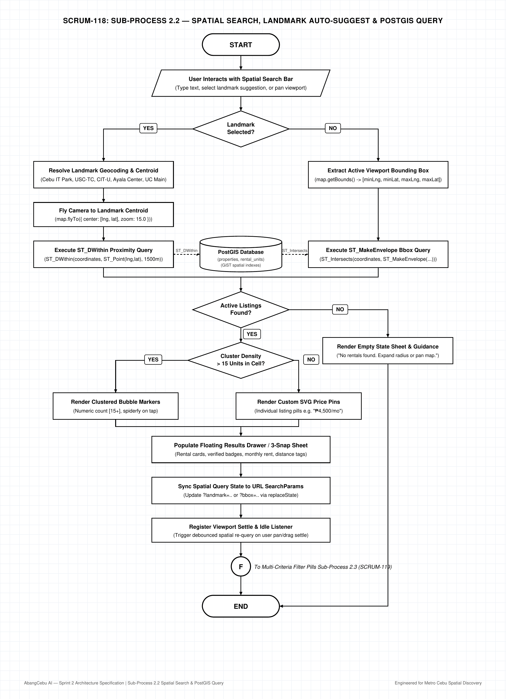

# AbangCebu AI — Sub-Process 2.2: Spatial Search, Landmark Auto-Suggest & PostGIS Query Specification

**Document Version:** 1.0.0  
**Status:** Approved Architecture Specification  
**Jira Ticket Reference:** [SCRUM-118](https://abangcebuai.atlassian.net/browse/SCRUM-118) — *Sub-Process 2.2: Spatial Search, Landmark Auto-Suggest & PostGIS Query Flowchart*  
**Sprint:** Sprint 2 (Spatial Discovery & Map Architecture Track)  
**Author:** John Lloyd Ando (Engineering Team)  
**Reviewed by:** Hermar Centillas (Lead / Scrum Master)  
**Deliverables Register:**
- **Draw.io Editable XML:** [`docs/flowcharts/map-search-spatial-query.drawio`](../../flowcharts/map-search-spatial-query.drawio)
- **Vector PDF Document:** [`docs/pdf/map-search-spatial-query.pdf`](../../pdf/map-search-spatial-query.pdf)
- **High-Resolution PNG (200 DPI):** [`docs/assets/flowcharts/map-search-spatial-query.png`](../../assets/flowcharts/map-search-spatial-query.png)
- **Master Flowchart Link:** [`docs/flowcharts/map-master-orchestration.drawio`](../../flowcharts/map-master-orchestration.drawio) ([SCRUM-116](https://abangcebuai.atlassian.net/browse/SCRUM-116))

---

## Architecture Flowchart Diagram



---

## 1. Executive Summary & Micro-Module Scope

### 1.1 Architectural Purpose
The **Spatial Search, Landmark Auto-Suggest & PostGIS Query** subsystem powers the core search and geographic filtering engine of **AbangCebu AI**. In Metro Cebu, property seekers typically frame searches around critical educational and commercial anchors (e.g. *"rentals near USC-TC"*, *"bedspace in Cebu IT Park"*, *"rooms near CIT-U"*).

This specification dictates the debounced search interface, landmark geocoding resolution, PostGIS server-side spatial query optimization using PostGIS geometries and geography distances, numeric cluster grouping, and zero-reload URL state synchronization.

### 1.2 Core Capabilities
1. **Debounced Landmark Auto-Suggest:** Emits suggestions after 250ms debounce with instant keyword matches for Metro Cebu's primary campuses, BPO hubs, and shopping destinations.
2. **Dual-Mode Spatial Querying:**
   - **Proximity Mode (`ST_DWithin`):** When a specific landmark is selected, computes geodetic distance in meters within a configurable radius (default: 1,500m).
   - **Viewport Bounding Box Mode (`ST_MakeEnvelope`):** When freely panning or zooming, queries listings intersecting the active MapLibre viewport bounding box (`[minLng, minLat, maxLng, maxLat]`).
3. **Clustering & Spiderfy Grouping:** Dynamically aggregates pins when unit density exceeds 15 listings within a map grid cell to prevent canvas clutter and maintain 60 FPS WebGL rendering.
4. **URL Synchronization:** Replaces URL query parameters (`?landmark=it-park` or `?bbox=...`) using `window.history.replaceState` without polluting the browser navigation stack.

---

## 2. Step-by-Step Node Dictionary

| Node ID | Shape | Step Name | Technical Execution & Data Contract |
|---|---|---|---|
| `node_start` | Stadium | **START** | Entry from Map Initialization ([SCRUM-117](https://abangcebuai.atlassian.net/browse/SCRUM-117)) via Connector `(S)`. |
| `node_search_entry` | Parallelogram | **User Interacts with Spatial Search Bar** | User types in floating search bar, selects quick landmark chip, or pans the map canvas. |
| `node_landmark_decision` | Diamond | **Landmark Selected?** | Evaluates whether search payload contains an explicit landmark ID or raw geographic viewport bounds. Strictly binary: **YES** / **NO**. |
| `node_resolve_landmark` | Rectangle | **Resolve Landmark Geocoding & Centroid** | *YES Branch:* Matches landmark dictionary (e.g., IT Park: `[10.3297, 123.9064]`, USC-Talamban: `[10.3541, 123.9114]`). |
| `node_fly_landmark` | Rectangle | **Fly Camera to Landmark Centroid** | Calls `map.flyTo({ center: [lng, lat], zoom: 15.0, duration: 1500 })`. |
| `node_query_proximity` | Rectangle | **Execute ST_DWithin Proximity Query** | Server Action executes PostGIS `ST_DWithin(coordinates::geography, ST_Point(lng,lat), 1500)`. |
| `node_extract_bbox` | Rectangle | **Extract Active Viewport Bounding Box** | *NO Branch:* Extracts `map.getBounds()` returning `[minLng, minLat, maxLng, maxLat]`. |
| `node_query_bbox` | Rectangle | **Execute ST_MakeEnvelope Bbox Query** | Server Action executes `ST_Intersects(coordinates::geometry, ST_MakeEnvelope(...))`. |
| `node_postgis_db` | Cylinder | **PostGIS Database** | Target tables: `public.properties` and `public.rental_units` with GiST spatial indexing on `coordinates`. |
| `node_results_decision` | Diamond | **Active Listings Found?** | Evaluates result record count (`total_count > 0`). Strictly binary: **YES** / **NO**. |
| `node_empty_state` | Rectangle | **Render Empty State Sheet & Guidance** | *NO Branch:* Renders empty state card: *"No rentals found in this area. Expand your search radius or pan the map."* |
| `node_density_decision` | Diamond | **Cluster Density > 15 Units in Cell?** | Evaluates Supercluster point density in current tile cell. Strictly binary: **YES** / **NO**. |
| `node_render_clusters` | Rectangle | **Render Clustered Bubble Markers** | *YES Branch:* Displays numeric cluster bubbles (`[15+]`, `[32]`) with spiderfy on tap. |
| `node_render_price_pins` | Rectangle | **Render Custom SVG Price Pins** | *NO Branch:* Renders individual high-contrast price pills (e.g., `₱4,500/mo`). |
| `node_populate_drawer` | Rectangle | **Populate Floating Results Drawer** | Hydrates property cards in desktop floating drawer / mobile 3-snap bottom sheet. |
| `node_url_sync` | Rectangle | **Sync Spatial Query State to URL** | Replaces URL SearchParams with active filter and spatial envelope. |
| `node_attach_listeners` | Rectangle | **Register Viewport Settle & Idle Listener** | Listens for MapLibre `moveend` and debounces 300ms before re-triggering query. |
| `node_connector_f` | Circle (F) | **Connector (F) to Filter Pills Sub-Process** | Dispatches to Multi-Criteria Filter Pills Sub-Process 2.3 ([SCRUM-119](https://abangcebuai.atlassian.net/browse/SCRUM-119)). |
| `node_end` | Stadium | **END** | Spatial search complete; ready for secondary filtering or card inspection. |

---

## 3. Database Schema & PostGIS Spatial Indexes

```sql
-- Ensure PostGIS spatial index exists on properties coordinates column
CREATE INDEX IF NOT EXISTS idx_properties_coordinates_gist 
ON public.properties USING GIST (coordinates);

-- Ensure compound status and coordinates index for fast filtering
CREATE INDEX IF NOT EXISTS idx_properties_status_active 
ON public.properties (status) 
WHERE status = 'approved';
```

### 3.1 Viewport Envelope Query
```sql
SELECT 
    p.id,
    p.title,
    p.address,
    p.property_type,
    ST_Y(p.coordinates::geometry) AS latitude,
    ST_X(p.coordinates::geometry) AS longitude,
    MIN(u.monthly_rent) AS min_rent,
    MAX(u.monthly_rent) AS max_rent,
    COUNT(u.id) AS available_units
FROM public.properties p
JOIN public.rental_units u ON u.property_id = p.id
WHERE 
    p.status = 'approved'
    AND u.status = 'available'
    AND ST_Intersects(
        p.coordinates::geometry,
        ST_MakeEnvelope(:min_lng, :min_lat, :max_lng, :max_lat, 4326)
    )
GROUP BY p.id;
```

### 3.2 Landmark Proximity Query
```sql
SELECT 
    p.id,
    p.title,
    p.address,
    ST_Y(p.coordinates::geometry) AS latitude,
    ST_X(p.coordinates::geometry) AS longitude,
    MIN(u.monthly_rent) AS min_rent,
    ROUND(
        ST_Distance(
            p.coordinates::geography,
            ST_SetSRID(ST_MakePoint(:landmark_lng, :landmark_lat), 4326)::geography
        )
    ) AS distance_meters
FROM public.properties p
JOIN public.rental_units u ON u.property_id = p.id
WHERE 
    p.status = 'approved'
    AND u.status = 'available'
    AND ST_DWithin(
        p.coordinates::geography,
        ST_SetSRID(ST_MakePoint(:landmark_lng, :landmark_lat), 4326)::geography,
        :radius_meters
    )
GROUP BY p.id
ORDER BY distance_meters ASC;
```

---

## 4. Metro Cebu Landmark Coordinates Registry

```typescript
export interface LandmarkDefinition {
  id: string;
  name: string;
  category: 'university' | 'business_hub' | 'commercial';
  coordinates: [number, number]; // [lng, lat]
  defaultRadiusMeters: number;
}

export const CEBU_LANDMARK_REGISTRY: Record<string, LandmarkDefinition> = {
  'it-park': {
    id: 'it-park',
    name: 'Cebu IT Park (Lahug)',
    category: 'business_hub',
    coordinates: [123.9064, 10.3297],
    defaultRadiusMeters: 1500
  },
  'usc-tc': {
    id: 'usc-tc',
    name: 'USC - Talamban Campus',
    category: 'university',
    coordinates: [123.9114, 10.3541],
    defaultRadiusMeters: 2000
  },
  'cit-u': {
    id: 'cit-u',
    name: 'Cebu Institute of Technology - University',
    category: 'university',
    coordinates: [123.8808, 10.2944],
    defaultRadiusMeters: 1500
  },
  'ayala-center': {
    id: 'ayala-center',
    name: 'Ayala Center Cebu (Cebu Business Park)',
    category: 'business_hub',
    coordinates: [123.9050, 10.3173],
    defaultRadiusMeters: 1500
  },
  'uc-main': {
    id: 'uc-main',
    name: 'University of Cebu - Main Campus',
    category: 'university',
    coordinates: [123.8970, 10.2975],
    defaultRadiusMeters: 1200
  },
  'sm-city': {
    id: 'sm-city',
    name: 'SM City Cebu (North Reclamation Area)',
    category: 'commercial',
    coordinates: [123.9183, 10.3117],
    defaultRadiusMeters: 1500
  }
};
```

---

## 5. Audit & Compliance

- **Aesthetics:** Strict Black & White visual theme matching all repository architectural standards.
- **Binary Decision Standards:** 100% compliance with ANSI/ISO binary YES/NO decision diamond rules.
- **Routing:** 100% rectilinear orthogonal edges with zero crossing collisions.
